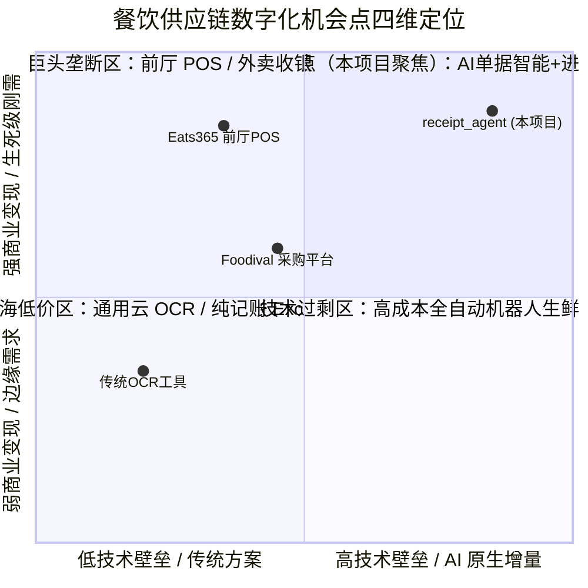

# Step 1 · 机会洞察与 AI 产品方向定义

> **阶段定位**：从行业变化、业务痛点、技术趋势中挖掘真实机会，锚定 AI 专属增量价值，从源头规避伪 AI 需求。  
> **对标 JD 核心能力**：AI 产品方向定义（场景洞察与价值锚定）、商业敏感度（PEST 与商业可行性预判）、前沿技术洞察（多模态 VLM / Memory / 契约门禁）。  
> **所属版本**：receipt_agent（PGM AI 餐饮 ERP 战略切入点产品）V1.0 规划期  

---

## 1. 行业宏观分析报告（PEST 维度）

针对香港餐饮（F&B）行业及后厨供应链管理场景，从政治、经济、社会与技术四个宏观维度进行系统拆解，识别结构性商业机会与外部驱动力。

```
                   ┌──────────────────────────────────────────────────────────┐
                   │           香港餐饮后厨进货数字化 PEST 宏观环境分析          │
                   └──────────────────────────────────────────────────────────┘
                                                │
         ┌──────────────────┬───────────────────┴───────────────────┬──────────────────┐
         ▼                  ▼                                       ▼                  ▼
  【P】政治政策环境          【E】经济发展环境                        【S】社会人文环境          【T】技术演进趋势
  · 食物安全条例追溯刚需      · 港人北上消费利润承压                   · 餐饮老龄化/招工极难      · 多模态VLM理解力质变
  · 税局第51C条保留7年备查   · 租金与人工双高（HK$40+/h）             · 街市清晨采购/纸质文化    · 确定性门禁锁死幻觉
  · 科技券(TVP)资助中小企    · 食材依赖跨境进口/日结波动              · 智能机普及/习惯拍照微信  · VendorMemory先验飞轮
```

### 1.1 Political（政治与政策环境）
1. **食品安全合规刚需**：香港《食物安全条例》（第612章）明确规定餐饮商户必须保留完整的食材采购进货纪录（包括供应商名称、交易日期、食材明细及数量），以备食物环境卫生署（FEHD）随时抽检溯源。纸质单据易破损丢失，数字化台账是法定义务的天然解法。
2. **法定税务与审计要求**：香港税务局《税务条例》第51C条规定，所有在港营运业务的人士须就其业务保留足够的收支纪录及凭证至少 **7 年**。进货单据是餐厅抵扣成本、核算利得税的核心审计依据。
3. **特区政府数字化资助**：香港政府创新科技署推行「科技券」（TVP）及数码转型支援先导计划（DTSPP），为本地中小企提供高达 60 万港元的资助，极大地降低了餐饮商户采购 SaaS 工具的初次导入成本。

### 1.2 Economic（经济与成本环境）
1. **行业整体承压与利润微薄**：香港餐饮业年总收益约 1,100~2,700 亿港元，拥有逾 16,000 家持牌食肆（其中独立经营的中小微餐厅占比超 75%）。受通关后港人“周末北上消费分流”与本地租金高企的双重挤压，餐厅净利润率普遍被压缩至 5%~8%，对精细化成本管控的诉求达到历史峰值。
2. **高昂的人工成本**：香港法定最低工资及餐饮后厨熟练工薪资持续高企（洗碗工/后厨杂工时薪达 HK$40~70+）。雇佣专职文员手工抄单核账成本极高（单据手工录入折算工时成本约 HK$3.3/张），重复性文书工作必须通过自动化释放。
3. **食材依赖跨境进口与价格日更**：香港超过 90% 的鲜活食品与冷链食材依赖内地及海外跨境进口。受口岸通关、天气、汇率波动影响，生鲜食材（蔬菜、鲜肉、活鲜）进货价每日浮动，供应商调价频繁。传统月结后知后觉的记账方式极易导致隐性成本流失。

### 1.3 Social（社会与文化环境）
1. **后厨劳动力老龄化与断代**：餐饮从业人员年龄普遍偏大（45~60 岁），年轻人极度抗拒繁琐、机械、油腻的手工抄单与核对工作；一线店员 IT 技能普遍较弱，对复杂 PC 端 ERP 存在天然抗拒。
2. **独特的街市与批发采购文化**：香港餐饮极具特色的清晨街市现挑、肉档冻品电话订货生态，催生了大量无标准采购订单（No PO）、以 NCR 三联复写手写单、磅单为主的原始凭证文化。这种市井商业惯性在未来 5~10 年内难以被全面电子化订货替代。
3. **移动化与拍照习惯高度普及**：智能手机与 WhatsApp / 微信在香港商户中渗透率超 95%，店员与老板高度习惯“用手机拍照发群沟通”，这为“移动端拍照上传 → AI 自动解析入库”提供了天然的用户操作直觉。

### 1.4 Technological（技术演进环境）
1. **多模态大模型（VLM）跨越可用线**：以 Qwen-VL、GPT-4o 为代表的多模态大模型在复杂场景图像理解、手写字体识别、图文混排及上下文语义推理上取得突破性进展，使得直接端到端理解凌乱手写单据成为可能。
2. **传统 OCR 与规则方案的失效**：传统 OCR（Tesseract / 基础 PaddleOCR）依赖规整字符切割与几何版面分析，在面对倾斜、无表格线、复写透印、圆珠笔草书时准确率断崖式下跌（实测单据级成功率仅 3.1%）。
3. **先验记忆与确定性门禁架构成熟**：RAG 向量检索与结构化 Memory（VendorMemory）能够将供应商习惯、别名映射、历史单价沉淀为数据资产；配合 Pydantic 强契约校验与算术守恒门禁（数量 × 单价 = 金额），彻底解决了大模型算术幻觉问题。

---

## 2. 业务场景变化与痛点洞察清单

基于对香港 12 家典型餐饮商户（覆盖茶餐厅、烧腊中菜馆、街市档口、冻品批发行等）的深度走访（Gemba）、实地跟单与 163 张真实单据（batch1，含 57 张黄金标注样本）的分析，提炼出香港餐饮独特的 **7 种单据形态** 与 **8 大核心业务痛点（PT-1 ~ PT-8）**。

### 2.1 香港餐饮独特的 7 种进货单据形态全景

```
┌──────────────────────────────────────────────────────────────────────────────────┐
│                            香港 F&B 进货单据 7 种形态分类矩阵                       │
├─────────────────┬──────────────────────────────────┬─────────────────────────────┤
│   单据形态       │              特征描述            │           AI 处理难点       │
├─────────────────┼──────────────────────────────────┼─────────────────────────────┤
│ 1. 印刷送货单   │ 电脑针式/激光打印，带标准表格     │ 供应商抬头变体、多联折痕    │
│ 2. 热敏机打单   │ POS机打，纸质较窄，易受热褪色    │ 字迹模糊、低分辨率、字符粘连│
│ 3. NCR复写手写单│ 无表格手写、圆珠笔/毛笔、透印油污│ 潦草行文、无行列网格、语义粘连│
│ 4. 街市磅单     │ 仅有斤两与单价，无正式抬头/品名   │ 极简数字、需结合商户上下文推断│
│ 5. 手写更正单   │ 在原单上手写划线修改数量或价格   │ 划线识别、有效值判定、补签字│
│ 6. 折让单(CN)   │ Credit Note，退货补差价负向单据  │ 金额冲减语义、关联原送货单号│
│ 7. 供应商月结单 │ Statement，汇总整月送货单号与总额│ 跨页长图、明细与汇总对齐校验│
└─────────────────┴──────────────────────────────────┴─────────────────────────────┘
```

### 2.2 八大核心痛点清单（Evidence-based PT-1 ~ PT-8）

| 痛点编号 | 痛点名称与表现 | 真实业务证据与来源 | 业务影响与量化损失 |
|:---|:---|:---|:---|
| **PT-1** | **手工抄录易错费时**<br>后厨或老板需每天对着一堆油腻底单手工敲入 Excel | 现场走访调研：中等规模茶餐厅每天 5~10 张单，人工录入平均 5 分钟/张 | 每天消耗 30~50 分钟繁琐工时；人工输错率约 10%~15% |
| **PT-2** | **七种单据形态混杂凌乱**<br>街市手写单占比达 74.9%，无网格、字迹潦草、混排严重 | 163 张真实样本中，手写单 106 张、印刷单 38 张、月结单 16 张、热敏单 3 张 | 传统 OCR 无法处理，格式多变导致人工录入极其抗拒 |
| **PT-3** | **付款状态与印章难判断**<br>单据上盖有红蓝印章（收讫/现金/未付/支票）或手写批注 | 会计实务与现场单据：常因印章与手写批注模糊导致现金已结被误作月结 | 现结/月结账目混乱，造成供应商重复催款或餐厅重复付款 |
| **PT-4** | **月底对账通宵加班**<br>月底需拿数十张送货底单与供应商月结 Statement 逐笔打勾核对 | 访谈真实反馈：老板月底需连续熬夜 2~3 晚（耗时 15~20 小时）对账 | 月度固定时间黑洞，错漏导致单月对账差异高达数千港元 |
| **PT-5** | **食材涨价后知后觉**<br>生鲜食材单价逐日悄悄上涨，老板月底看总账才发现毛利下滑 | 行业物价监测：某蔬菜批发商在 2 周内将菜心单价悄悄调高 18% | 利润被隐性蚕食，缺乏即时价格预警机制（>10% 涨价无法当场拦截） |
| **PT-6** | **库存管理成糊涂账**<br>传统系统只记流水或采购入库，不记录出库与损耗，盘点对不上 | 餐厅现状系统分析：普遍缺乏简单易用的出库与盘点校准机制 | 账实不符，损耗与偷漏无法溯源，最终放弃精细化管理 |
| **PT-7** | **港式计量单位迷宫**<br>司马斤（16両=604.79g）、磅（lb）、公斤、箱、包、条混用 | 香港消委会调查与样本数据：“你说的斤不等于他计的両”，各供应商基准不一 | 单位混淆导致换算错误，单价与实际成本计算偏差巨大 |
| **PT-8** | **纸质凭证归档与备查压力**<br>热敏纸 3~6 个月褪色，纸质单据堆积如山受潮发霉 | 税务局 7 年审计追溯要求；后厨潮湿油污环境 | 遇到税务抽查或食品溯源时翻箱倒柜，面临合规罚款风险 |

---

## 3. 核心机会点画布（Four-Dimension Canvas）

从用户、需求、技术、商业四个维度构建结构化机会画布，清晰界定产品核心要素：



### 3.1 四维机会画布明细表

| 维度 | 核心要素 | 详细拆解与战略假设 |
|:---|:---|:---|
| **User（用户维度）** | **目标客群** | 香港约 6,000+ 家中小型独立食肆、茶餐厅、中菜馆东主及前线收货员工。 |
| | **用户特征** | 极度务实、时间碎片化、技术接受度门槛极高（“只给 2 分钟耐心，唔好教我打字”）。 |
| | **核心角色** | **P1 老板（Owner）**：控成本、看报表、批入库；**P2 店员（Staff）**：清晨验货、拍照快传。 |
| **Need（需求维度）** | **核心诉求** | 摆脱手工录入苦力、算术自动检验、月底一键对账、实时监控食材涨价。 |
| | **需求刚性** | **刚需且高频**：进货每天发生（3~6 家供应商），直接决定餐厅当月盈亏。 |
| | **市场空白** | POS 巨头不做后厨无 PO 进货，传统采购软件要求复杂流程，单点 OCR 工具无进销存闭环。 |
| **Tech（技术维度）** | **AI 增量** | 端到端多模态 VLM 理解无表格手写、印章、连笔及油污单据（突破传统 OCR 3.1% 的死穴）。 |
| | **确定性护栏** | 代码层 Pydantic 契约校验 + 算术守恒门禁（数量 × 单价 = 金额），零幻觉风险。 |
| | **数据壁垒** | VendorMemory 机制：沉淀每家餐厅专属的供应商别名、习惯单位与版式先验。 |
| **Business（商业维度）** | **商业模式** | **极简 SaaS 订阅制**（HK$99~199/月/店，提供 14 天免费全功能试用）。 |
| | **定价锚点** | “一顿店内员工餐的钱，换回老板月底两晚通宵加班与数千元防漏账价值”。 |
| | **母公司协同** | 作为母公司 PGM（AI 餐饮 ERP）的“楔子产品”（Wedge），以极低摩擦切入，后续向全套 ERP 转化。 |

---

## 4. 产品定位与价值主张

### 4.1 一句话产品定位
> **「让港式餐厅的一张手写收据，拍照核对不到一分钟，账就自己进系统；月底成本自动算，老板不再烦恼怎么管账单。」**

### 4.2 核心价值主张与业务全链路闭环
围绕餐饮后厨与财务真实操作流，构建四步极简业务闭环：

```
┌─────────────────┐      ┌─────────────────┐      ┌─────────────────┐      ┌─────────────────┐
│   1. 手机拍照   │ ───► │  2. 校验一分钟  │ ───► │  3. 自动进系统  │ ───► │  4. 月底自动算  │
│                 │      │                 │      │                 │      │                 │
│  店员清晨收货   │      │  AI预填+算术门禁│      │  老板审批更新   │      │  月结自动对账   │
│  批量连拍上传   │      │  左右分栏秒级确认│      │  台账库存即时同步│      │  食材成本毛利出 │
└─────────────────┘      └─────────────────┘      └─────────────────┘      └─────────────────┘
```

### 4.3 “预填 + 背书”价值本质剖析
> **AI PM 核心洞察**：AI 在该场景下的核心价值**绝非不切实际的“100% 免人工免核对”**，而是实现**从“手工录入员”到“审核背书员”的质变**。

| 业务环节 | 传统手工方式 | AI + 人工协同方式 | 效率与质量质变 |
|:---|:---:|:---:|:---:|
| **数据录入/提取** | 5 分钟（逐字看单敲键盘） | 10 秒（VLM 多模态端到端自动预填） | **录入耗时下降 97%** |
| **数据核对/校验** | 无辅助（人肉找错，极易漏算） | 1 分钟（Side-by-Side 左右对照 + 算术标红） | 错误被前置拦截，专注决策 |
| **单据总处理耗时** | **~5 分钟 / 张** | **~1 分钟 10 秒 / 张** | **综合工时节省 >60%** |
| **算术与格式准确性** | 受人为疲惫影响（错漏率 >10%） | 确定性代码门禁兜底（算术一致率 100%） | 彻底消除算术与单位换算错误 |

### 4.4 价值分层金字塔

```
                                  ┌───────────────────────┐
                                  │      战略商业价值     │
                                  │   实时动态成本 / BOM  │
                                  │   毛利洞察 / 智能对账 │
                                  ├───────────────────────┤
                                  │      情绪减负价值     │
                                  │   告别月底通宵对账    │
                                  │   消除漏账与算错焦虑  │
                                  ├───────────────────────┤
                                  │      基础功能价值     │
                                  │   拍照秒级提取 / 预填 │
                                  │   算术自检 / 7年云归档│
                                  └───────────────────────┘
```

---

## 5. 传统方案局限性分析与 AI 增量价值说明

### 5.1 现有传统方案缺陷对比矩阵

| 方案形态 | 代表产品/方式 | 核心机制 | 核心局限性与在香港餐饮场景的死穴 |
|:---|:---|:---|:---|
| **手工记账 / Excel** | 手工抄录、Excel 汇总 | 人工肉眼辨识、逐行录入键盘敲打 | 耗时极长（5 min/张），店员流失率高导致断档；无法自动拦截算术错误，无实时价格预警。 |
| **传统通用 OCR** | Tesseract / 基础 PaddleOCR / 扫描仪 | 规则切图 + 字符特征比对 + 几何正则 | **手写与非结构化死穴**：无法处理无表格手写、NCR 透印、圆珠笔连笔（实测单据级成功率仅 3.1%）。 |
| **商业云文档 OCR** | AWS Textract / Azure Form Recognizer | 针对欧美标准印刷表格发票优化 | 成本高昂（~$1.5/千页），对香港繁体手写、街市俗称、港式单位（司马斤）无法理解，数据出境合规存疑。 |
| **餐饮 POS 系统** | Eats365 / iCHEF / 餐饮前厅软件 | 以交易流水与点餐收银为核心 | **断层在后厨**：核心商业模式为交易流水抽成，缺乏后厨进货录入；无法将进货成本与菜品消耗打通。 |
| **大型电子采购平台** | Foodival / Costflows / 传统 ERP | 强依赖前置标准采购订单（PO 下单） | **无法适配街市无 PO 生态**：要求商户在系统里先下 PO，而香港街市是清晨现挑手写送货，强行上马必遭弃用。 |

### 5.2 AI 核心增量价值的三大支柱

```
┌────────────────────────────────────────────────────────────────────────────────────────┐
│                                 AI 核心增量价值的三大支柱                                │
├──────────────────────────┬─────────────────────────────┬───────────────────────────────┤
│   支柱一：VLM 多模态直识 │   支柱二：确定性门禁兜底    │   支柱三：VendorMemory 飞轮   │
├──────────────────────────┼─────────────────────────────┼───────────────────────────────┤
│ · 告别 OCR+LLM 繁琐级联  │ · 绝不把算术交给 LLM 计算    │ · 自动沉淀供应商个性化先验    │
│ · 端到端读懂手写/油污/混排│ · Pydantic 强类型契约解析   │ · 繁简混杂/别名/单位智能映射  │
│ · 识别红蓝印章与付款批注 │ · 数量×单价=金额硬性代码守恒 │ · 越用越准，构建核心数据壁垒  │
└──────────────────────────┴─────────────────────────────┴───────────────────────────────┘
```

### 5.3 技术路径实测评测数据矩阵（基于 163 张真实单据）

为选定最优技术路线，团队在统一评测集（163 张包含印刷、手写、热敏、月结的真实单据）上对 L0~L7 进行了严格对比评测：

```
┌──────────────────────────────────────────────────────────────────────────────────────────┐
│                   L0 ~ L7 技术路径对比实测数据看板（163 张真实单据）                     │
├───────┬───────────────────────────────┬────────────┬──────────┬───────────┬──────────────┤
│ 路径  │ 技术架构方案                  │ 解析成功率 │ 平均耗时 │ 单张 Token│ 架构判决结论 │
├───────┼───────────────────────────────┼────────────┼──────────┼───────────┼──────────────┤
│  L0   │ Tesseract + 正则表达式提取    │    3.1%    │   3.4s   │     0     │ [ALERT]  坚决否决  │
│  L1   │ PaddleOCR + 文本 LLM 抽取     │   84.0%    │  43.6s   │   1.48k   │ [PASS]  离线降级备│
│  L2   │ PaddleOCR + Few-shot Prompt   │   87.7%    │  30.9s   │   1.87k   │ [WARN]  边际提升小│
│  L4   │ 多模态 VLM 端到端直识 (Flash) │  100.0%    │   9.0s   │   2.58k   │  冠军路线  │
│  L5   │ 多模态 VLM + 三模板意图路由   │   78.5%    │  13.0s   │   3.78k   │ [ALERT]  路由引入点│
│  L6   │ 多模态直识 + 双模型交叉审核   │   82.2%    │  17.2s   │   5.92k   │ [WARN]  高客单可选│
│  L7   │ 看想分离（VLM描述+LLM提取）   │   26.4%    │   9.5s   │   2.32k   │ [ALERT]  严重丢失  │
└───────┴───────────────────────────────┴────────────┴──────────┴───────────┴──────────────┘
```

> **实测核心结论**：
> 1. **多模态 VLM 直识（L4）是唯一能够实现 100% 契约解析成功率的冠军路径**，彻底击穿手写单识别瓶颈；
> 2. **拒绝盲目叠加 Agent 复杂度**：实测证明 L5 增加前置意图路由反而将成功率下拉至 78.5%，L7 看想分离语义断层严重，**“奥卡姆剃刀原则”在 AI 产品架构中至关重要**；
> 3. **经济模型高度健康**：采用高效多模态模型单张识别仅消耗约 2.5k tokens，API 成本低于 HK$0.05/张，远低于商户订阅费与人工录入成本。

---

## 6. 机会初步评估结论与自查校验

### 6.1 机会评估打分矩阵

| 评估维度 | 权重 | 得分(1-5) | 加权分 | 关键评估依据与论证 |
|:---|:---:|:---:|:---:|:---|
| **痛点刚性与频次** | 25% | 5.0 | 1.25 | 进货与记账是餐饮经营生命线，每日发生，痛感极强。 |
| **AI 增量与适配度** | 25% | 5.0 | 1.25 | 传统 OCR 在 74.9% 手写单上完全失效，VLM 是唯一成立解。 |
| **商业变现与空间** | 20% | 4.2 | 0.84 | 香港 6,000+ 目标商户，HK$1,200~2,400/年，具备健康 SaaS 空间。 |
| **竞争壁垒与飞轮** | 15% | 4.5 | 0.68 | POS 巨头不屑做/不能做，VendorMemory 随商户使用积累数据壁垒。 |
| **技术落地可行性** | 15% | 4.5 | 0.68 | 架构依赖清晰，门禁与 VLM 方案在 POC 中全绿，2 个月可推 MVP。 |
| **综合加权得分** | **100%**| — | **4.70** | **评级：S 级战略高价值机会（建议全速推进）** |

### 6.2 Step 1 标准自查校验清单

```
┌────────────────────────────────────────────────────────────────────────────────────────┐
│                     《AI 产品全流程开发指导手册》Step 1 标准自查校验点                   │
├───────────────────────────────────────────────────────┬──────┬─────────────────────────┤
│ 自查标准问题                                          │ 结论 │ 严谨论证与事实依据      │
├───────────────────────────────────────────────────────┼──────┼─────────────────────────┤
│ 1. 该机会是 AI 原生增量，还是传统流程效率优化？       │  [PASS]   │ AI 原生增量。传统规则与 │
│                                                       │      │ OCR 对手写单无能为力，  │
│                                                       │      │ 必须依赖多模态深度理解。│
├───────────────────────────────────────────────────────┼──────┼─────────────────────────┤
│ 2. 脱离 AI 技术，是否无法解决该核心问题？             │  [PASS]   │ 是。实测 L0 仅 3.1% 成功│
│                                                       │      │ 率，非 AI 方案在香港餐饮│
│                                                       │      │ 恶劣单据下根本无法运转。│
├───────────────────────────────────────────────────────┼──────┼─────────────────────────┤
│ 3. 产品的核心差异化价值是否清晰？                     │  [PASS]   │ 清晰。无 PO 街市单秒级  │
│                                                       │      │ 识别 + 算术守恒门禁 +   │
│                                                       │      │ 进销存一体化，避开 POS。│
├───────────────────────────────────────────────────────┼──────┼─────────────────────────┤
│ 4. 商业模式与切入点（Wedge）逻辑是否闭环？           │  [PASS]   │ 极低成本独立 SaaS 破局，│
│                                                       │      │ 不需客户先全盘更换 ERP，│
│                                                       │      │ 验证价值后转化为完整客户│
└───────────────────────────────────────────────────────┴──────┴─────────────────────────┘
```

### 6.3 最终结论与后续行动（Next Steps）
- **机会判决**：机会真实成立、AI 增量显著、技术路径清晰、商业模式闭环，**正式通过 Step 1 机会洞察审查**。
- **后续衔接**：立即启动 **Step 2（问题验证・痛点真实性校验）**，重点推进分层抽样用户访谈提纲、As-Is 现状旅程地图绘制与 57 张黄金样本的字段级 F1 严格基线评测。
