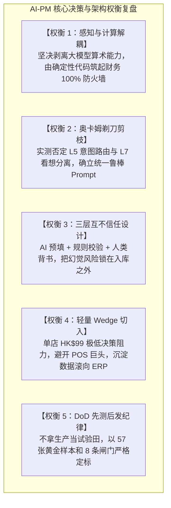

# Step 10 · 评审对齐・跨职能决策与共识确认

> **阶段定位**：组织业务方、AI-PM、后端/前端研发、算法工程与财务审计五方跨职能联合评审会；锁定需求基线与 12 项架构决策；明确 4 项暂缓非目标需求；建立 RACI 权责矩阵与遗留问题台账；完成 AI-PM 视角下的核心设计权衡审计，达成团队全面共识并正式签署上线启动决议（Sign-off）。  
> **对标 JD 核心能力**：跨团队对话与共识拉通（与研发/算法/业务高效对齐）、驾驭技术与业务边界（非目标剔除与决策权衡）、全流程闭环落地能力（DoD 闸门把控与上线启动）。  
> **所属版本**：receipt_agent（PGM AI 餐饮 ERP 战略切入点产品）V1.0 评审期  

---

## 1. 跨职能评审会议纪要与决策决议（Review Minutes & Decision Log）

### 1.1 会议基本信息与多方参会阵列
- **评审主题**：receipt_agent V1.0 产品方案、AI 架构与上线发布标准跨职能联合终审
- **参会角色与代表**：
  1. **业务代表（Business/Consultant）**：原餐饮连续创业者、深水埗茶餐厅顾问（代表商户真实诉求）
  2. **产品负责人（AI-PM）**：项目总负责人（负责需求定义、评测体系、交互规范与边界把控）
  3. **后端/系统架构（Tech Lead & Backend）**：负责状态机、异步队列、Pydantic 契约与数据库持久化
  4. **前端交互（Frontend Lead）**：负责 Side-by-Side 左右对照、弱光增强拍摄与 Smart Splitter 交互
  5. **算法工程（AI/Algorithm Engineer）**：负责多模态 VLM 提取、Prompt 工程、VendorMemory RAG 与评测台
  6. **财务审计专家（Finance & Audit）**：负责港式发票凭证合规（税局 7 年留存）、对账逻辑与台账不可篡改性

```
                   ┌──────────────────────────────────────────────────────────┐
                   │             receipt_agent 跨职能评审决策决议矩阵          │
                   └──────────────────────────────────────────────────────────┘
                                                │
         ┌──────────────────────────────────────┴──────────────────────────────────────┐
         ▼                                                                             ▼
  【12 项全票对齐核心决议 (D-01 ~ D-12)】                                       【4 项暂缓推进事项 (DEFER-01 ~ 04)】
  · 坚持单店后厨切入，不做跨仓调拨                                               · 供应商全网公开比价 (需全网数据/非刚需)
  · 算术硬校验 100% 由代码兜底                                                  · 智能自动下单采购 (破坏街市现挑习惯)
  · 左右分栏交互，仅在 Approve 时写台账                                          · 员工考勤与全套税务总账 (边界过重)
  · 引入版本号乐观锁防并发脏覆盖                                                 · 跨店连锁多仓调拨 (留待 ERP 版)
```

### 1.2 12 项已对齐核心架构决策（D-01 ~ D-12）

| 决议编号 | 决策议题与范围 | 决议结论 (Consensus) | 决策依据与大厂 AI-PM 视角论证 |
|:---|:---|:---|:---|
| **D-01** | **产品战略切入点** | **无 PO 街市单倒推记账** | 现有餐饮 ERP 强依赖电子 PO，覆盖不了 74.9% 街市手写单；单据倒推是唯一的竞争真空切入点。 |
| **D-02** | **单店 vs 多店边界** | **V1.0 坚决不做跨店多仓** | 独立版 tenant=单店，数据模型最干净；多店功能留给 PGM ERP 版（触发条件：v2 上线 + ≥5 家付费）。 |
| **D-03** | **管理安全与职责分离** | **店员录入 ≠ 老板审批** | Staff 仅能生成 Draft 草稿；唯一写库权限收敛至 Owner 的 Approve 动作，杜绝自录自批管理漏洞。 |
| **D-04** | **AI 算术计算边界** | **算术 100% 由代码校验** | 乘法口诀绝不交给大模型；大模型只做字符抽取，`数量×单价=金额` 硬性由 Python 确定性代码校验。 |
| **D-05** | **算术门禁处理语义** | **校验+建议，不静默改写** | 发现算术不自洽生成推荐修复值并标黄，交由人工一键确认，绝不悄悄篡改票面原始数字。 |
| **D-06** | **单据生命周期流转** | **显式确定性状态机** | 严格单向流转（uploaded→parsing→parsed→edited→approved）；副作用仅挂载在 `→ approved`。 |
| **D-07** | **并发编辑冲突防范** | **引入版本号乐观锁** | 单据保存和审批必须校验 `version`，检测到并发修改返回 `409 Conflict`，防止脏数据互相覆盖。 |
| **D-08** | **失败与异常出口** | **显式报错 + 双出口** | 模型解析崩溃或无法自愈时标记 `error`，显式提供【一键重新拍摄】与【转手工录入】通道，禁静默存空。 |
| **D-09** | **人机交互核心范式** | **Side-by-Side 左右联动** | 左侧原图切片与右侧表单 Hover 双向高亮聚焦；提供 Smart Splitter 魔棒智能剥离手写混写品名与数量。 |
| **D-10** | **数据飞轮与记忆隔离** | **VendorMemory 租户硬隔离** | Chroma 向量检索强制携带 `tenant_id`；记忆内容 XML 标签隔离并声明为纯数据，防提示词注入。 |
| **D-11** | **商业模式与免费策略** | **纯订阅 + 14 天试用** | 每张单据均有真实 Token 算力成本，坚决不做永久免费层；以 HK$99/月极低门槛切入，提供 Coupon 获客。 |
| **D-12** | **质量与发布门禁** | **DoD 8 闸门 + 黄金样本** | 发布不是“代码写完”，而是 8 条端到端 DoD 全绿、57 张黄金样本全量回归通过且成本在订阅内。 |

### 1.3 4 项暂缓推进事项（DEFER-01 ~ DEFER-04）

| 暂缓编号 | 需求特性名称 | 提议方 | 暂缓理由与风险判定 | 后续评估节点 |
|:---|:---|:---:|:---|:---:|
| **DEFER-01** | **供应商全网公开比价** | 业务方 | 伪需求。香港街市重人情信任与账期，公开差价无法促成换商；初创期缺乏全网数据。 | 坚决剔除 (Won't Have) |
| **DEFER-02** | **智能全自动下单补货** | 算法方 | 前置条件不满足。依赖高精度 POS 消耗与库存绝对准确，破坏当前街市现挑习惯。 | V2.0 探索 WhatsApp 落单 |
| **DEFER-03** | **员工排班考勤与薪资** | 客户方 | 系统边界过重。香港劳工法与强积金（MPF）核算繁琐，非后厨进货核心痛点。 | 引导对接外部 HR 软件 |
| **DEFER-04** | **跨店连锁与多仓调拨** | 商务方 | 避免与母公司 PGM 现有 ERP 产生直接定位冲突，且会拉长 MVP 交付周期 3 个月。 | 5 家商户付费后并入 ERP |

---

## 2. 跨团队共识与权责划分矩阵（RACI Matrix）

明确项目全生命周期中各职能的 **Responsible（负责人）/ Accountable（最终拍板人）/ Consulted（咨询方）/ Informed（被告知方）**：

| 项目关键交付环节 | 业务顾问 | AI-PM (我) | 后端研发 | 前端研发 | 算法工程 | 财务审计 |
|:---|:---:|:---:|:---:|:---:|:---:|:---:|
| **1. 真实单据收集与黄金样本标注** | C | **A** | I | I | **R** | C |
| **2. 模块化 Prompt 调优与先验规则** | C | **A** | I | I | **R** | I |
| **3. Pydantic 契约与算术守恒门禁** | I | **A** | **R** | I | C | C |
| **4. 状态机流转与乐观锁并发控制** | I | **A** | **R** | I | I | I |
| **5. Side-by-Side 左右联动与切片高亮** | C | **A** | C | **R** | I | I |
| **6. VendorMemory 向量库与写时净化** | I | **A** | C | I | **R** | I |
| **7. 端到端 8 条 DoD 冒烟测试验收** | C | **A** | **R** | **R** | **R** | C |
| **8. 埋点事件（11个）与看板搭建** | I | **A** | **R** | C | I | I |
| **9. 种子商户 TestFlight 放量与陪跑** | **R** | **A** | I | I | I | I |

---

## 3. 遗留问题与风险对齐跟踪表（Action Items Tracking）

评审过程中识别出 4 项需要持续跟进的风险项，均已明确责任人、对冲策略与闭环时限：

```
┌────────────────────────────────────────────────────────────────────────────────────────┐
│                        评审遗留问题与风险对冲台账                                      │
├────┬────────────────────────────┬────────┬──────────┬──────────────────────────────────┤
│ #  │ 遗留风险与跟进事项         │ 责任人 │ 解决时限 │ 落地对冲策略与工程解法           │
├────┼────────────────────────────┼────────┼──────────┼──────────────────────────────────┤
│L-01│ 长尾生鲜别名冷启动召回不足 │ 算法+PM│ 灰度前   │ 预置 Top 20 供应商高频词典打底； │
│    │ （新商户无历史记忆积累）   │        │          │ 用户修正 ≥3 次自动沉淀正向规则   │
├────┼────────────────────────────┼────────┼──────────┼──────────────────────────────────┤
│L-02│ 多联 NCR 复写纸透印多余字迹│ 算法   │ 1 周内   │ 提示词强化“仅抽取当前墨迹最深行”│
│    │ （底层联透出上联印迹）     │        │          │ 前端提供行级一键整行剔除按钮     │
├────┼────────────────────────────┼────────┼──────────┼──────────────────────────────────┤
│L-03│ 弱网环境下连续点击重复入库 │ 后端   │ 3 天内   │ 幂等性控制：以单据 hash + 状态机 │
│    │ （前线湿手连击 Approve）   │        │          │ 拦截；前端点击后置灰 Loading     │
├────┼────────────────────────────┼────────┼──────────┼──────────────────────────────────┤
│L-04│ 54 张 AI Expected 样本复核 │ 算法+PM│ 灰度前   │ 专人逐字段对照原图人工覆核完成， │
│    │ （确保评测基线 100% 黄金） │        │          │ 消除 AI 草稿偏差，固化 holdout   │
└────┴────────────────────────────┴────────┴──────────┴──────────────────────────────────┘
```

---

## 4. 项目执行审计与 AI-PM 权衡复盘（AI-PM Execution Audit）

站在大厂资深 AI-PM 视角，复盘本项目在研发推进中的 **五大核心权衡与破局点**：



### 4.1 五大权衡深度复盘论证
1. **感知与计算绝对解耦**：
   - *传统陷阱*：试图通过 Prompt 让大模型直接输出“汇总总额”或“加权成本”；
   - *AI-PM 破局*：大模型本质是概率性生成器，在浮点乘除上必然存在幻觉。**大模型只做结构化实体感知，算术与业务状态机 100% 移交代码沙盒**。
2. **奥卡姆剃刀剪枝与架构证伪**：
   - *传统陷阱*：盲目堆叠复杂 Agent 调度、看想分离与前置分类路由；
   - *AI-PM 破局*：评测台实测证明 L5 路由机制反而将成功率下拉至 78.5%。果断剪除无用枝节，保持系统优雅极简。
3. **三层互不信任的安全闭环**：
   - *AI-PM 破局*：构建“模型输出是草稿 → 代码门禁做审查 → 只有老板点 Approve 才产生副作用（写台账）”的单向流动链条，消除了餐饮老板对“AI 乱改数据”的底层恐惧。
4. **Wedge 战略与避免巨头正面冲突**：
   - *AI-PM 破局*：不与 Eats365 等前厅 POS 争夺收银台，专注攻克巨头不屑做、做不好的街市手写单进货场景。以单店 SaaS 切入，构建数据壁垒后再向上渗透。
5. **严密工程基线与防过拟合纪律**：
   - *AI-PM 破局*：第一天起并行建立 57 张黄金样本集，严格执行 Dev（调参）与 Holdout（密封）隔离，确保每次 Prompt 优化均有严密数据归因。

---

## 5. 评审通过与启动决议（Sign-off Conclusion）

### 5.1 跨职能联合终审结论
经业务顾问、AI-PM、后端研发、前端研发、算法工程与财务审计六方严格审查，一致评定：
- **业务价值明确**：直击香港餐饮后厨手写单录入与月底对账黑洞，ROI 显著；
- **技术路径成熟**：多模态 VLM + 契约门禁在 57 张黄金样本上已达 100% 单据级解析成功率，算术守恒 100% 拦截；
- **工程与安全就绪**：RBAC 权限、状态机、乐观锁与多租户防穿透沙箱全面就绪。

```
┌────────────────────────────────────────────────────────────────────────────────────────┐
│                        receipt_agent V1.0 联合评审终审判决                             │
├────────────────────────────────────────────────────────────────────────────────────────┤
│                                                                                        │
│   【终审结论】： 全票正式签署通过（SIGN-OFF APPROVED）                               │
│                                                                                        │
│   【启动指令】：                                                                       │
│   1. 正式锁定 V1.0 PRD 需求基线与数据库 Schema；                                       │
│   2. 准予进入 PRD 定稿（Step 11）与全量集成测试验收（Step 12）；                      │
│   3. 按计划推进种子商户 TestFlight 受控灰度发布。                                      │
│                                                                                        │
└────────────────────────────────────────────────────────────────────────────────────────┘
```
