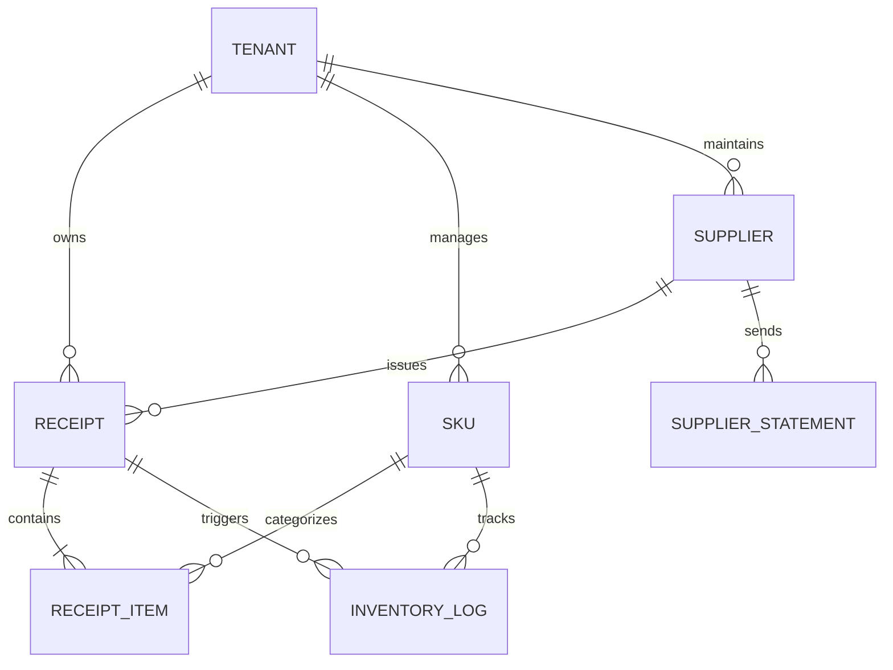

# Step 11 · PRD 定稿・产品需求规格与研发启动说明书

> **阶段定位**：输出正式、无歧义的 PRD V1.0 定稿说明书；定义标准数据模型契约与 6 大核心实体字段字典；确立严格的状态机流转规则与标准化错误码规范（Error Code Dictionary）；详述界面 5 大状态全景与 Side-by-Side 交互规范；确立 4 波研发排期、里程碑与上线发布检查清单（Launch Checklist），下达研发开工指令。  
> **对标 JD 核心能力**：大厂 PRD 编写规范（无歧义/严密逻辑/闭环规则）、数据契约与系统设计（字段字典与状态机）、项目管理与研发推动（WBS 拆解与发布门禁）。  
> **所属版本**：receipt_agent（PGM AI 餐饮 ERP 战略切入点产品）V1.0 定稿发布期  

---

## 1. 完整产品需求文档（PRD V1.0 定稿全文）

### 1.1 文档版本变更历史 (Revision History)

| 版本号 | 修订日期 | 修订人 | 变更类型 | 变更内容摘要 | 审核人 |
|:---:|:---:|:---:|:---:|:---|:---:|
| **v0.1** | 2026-06-10 | AI-PM (Ethan) | 初稿创建 | 机会洞察、核心痛点梳理与粗粒度功能边界定义 | Tech Lead |
| **v0.5** | 2026-07-02 | AI-PM (Ethan) | 架构演进 | 引入 57 张黄金样本基线、确立 L4 多模态直识与三层互不信任设计 | Tech Lead |
| **v0.9** | 2026-08-15 | AI-PM (Ethan) | 评审修订 | 增加版本号乐观锁（D-07）、Smart Splitter 魔棒、确定性状态机 | 跨职能评审委员会 |
| **v1.0** | 2026-08-21 | AI-PM (Ethan) | **正式定稿** | 锁定 6 大数据表契约、10 项标准错误码、5 大 UI 状态与上线门禁 | **全票 Sign-off** |

### 1.2 业务背景与价值主张
香港 16,000+ 家持牌食肆年采购总规模超 250 亿港元，但 74.9% 仍依赖无 PO 街市手写单、手写 NCR 复写单与红蓝印章结算，导致后厨店员录单繁琐、老板月底对账加班数天、食材价格偷涨失察。`receipt_agent` 作为 PGM AI 餐饮 ERP 的“楔子（Wedge）产品”，以“**拍照核对不到一分钟，账就自己进系统**”为核心价值主张，实现单据自动提取、算术代码门禁硬校验、左右对照秒级核对与移动加权成本自动入账。

### 1.3 用户用例全集（Use Cases UC-01 ~ UC-08）

| 用例编号 | 参与角色 | 用例名称 | 前置条件 | 主成功场景 (Main Flow) | 业务价值 |
|:---|:---:|:---|:---|:---|:---|
| **UC-01** | 店员 / 老板 | **批量拍摄上传** | 已登录系统 | 店员在弱光嘈杂后厨调起相机，连拍 5 张手写收据；系统自动等比压缩并返回异步任务 ID，店员零等待继续备料。 | 极速采集，操作耗时 <10s |
| **UC-02** | 系统 Worker | **AI 多模态直识与门禁** | 单据已上传 | Worker 异步调度 Qwen3-VL 提取结构化数据，经 Pydantic 校验与代码算术门禁自洽计算，生成待复核草稿。 | 释放 90%+ 手工录入负担 |
| **UC-03** | 前线店员 | **Side-by-Side 核对与修单** | 单据 status='parsed' | 店员打开左右对照页面，原图 Hover 联动高亮；使用 Smart Splitter 魔棒一键分离品名数量，点击保存提交。 | 降低眼力消耗，复核耗时 <30s |
| **UC-04** | 餐厅老板 | **一键审批 Approve 入库** | 单据 status='edited' | 老板查看今日进货与标红价格异动，点击 Approve；系统触发乐观锁校验，幂等写入 Append-Only 台账并更新库存均价。 | 职责分离，数据可信入库 |
| **UC-05** | 餐厅老板 | **异常标记 Flag 驳回** | 单据处于待审态 | 发现虚假单据或严重开单笔误，点击 Flag 冻结单据并填写原因；单据进入 flagged 态，绝不写入台账。 | 堵塞管理跑冒滴漏 |
| **UC-06** | 餐厅老板 | **食材档案与别名治理** | 已有入库流水 | 老板在库存中心查看 SKU 30 天价格走势，一键合并重复 SKU，系统自动将别名沉淀入供应商 `VendorMemory`。 | 越用越准，沉淀数据飞轮 |
| **UC-07** | 老板 / 财务 | **月结账单四向对账** | 月末收到对账单 | 上传供应商月结 Statement，引擎自动与当月 approved 单据比对，圈出“漏单、错价、未送折让”四向差异清单。 | 月底对账从 3 天压缩至 30 分钟 |
| **UC-08** | 系统 Worker | **失败降级与显式双出口** | 解析异常/超时 | 连续重试失败后单据标记 status='error'，前端显式呈现【重新拍摄】与【手工录入】按钮，绝不静默存空。 | 100% 财务可信度保证 |

---

## 2. 数据契约与字段字典规范（Data Schema & Data Dictionary）

系统数据库严格遵循第三范式与财务 Append-Only 台账审计规范，核心包含 6 大主表：



### 2.1 单据主表（`receipts`）

| 字段名 (Field) | 类型 (Type) | 必填 | 默认值 | 枚举值 / 范围 | 业务含义与约束规则 |
|:---|:---|:---:|:---:|:---|:---|
| `id` | INTEGER | 是 | 自增主键 | — | 单据全局唯一标识 |
| `tenant_id` | INTEGER | 是 | — | — | 租户 ID（单店硬隔离外键） |
| `receipt_number` | VARCHAR(64) | 否 | NULL | — | 票面原始印刷单号（如 NO.883921） |
| `supplier_id` | INTEGER | 否 | NULL | FK -> suppliers.id | 关联供应商档案 ID |
| `supplier_name_raw` | VARCHAR(128)| 否 | NULL | — | AI 识别出的供应商原始抬头文本 |
| `receipt_date` | DATE | 是 | 当前日期 | YYYY-MM-DD | 单据交易日期（必须合法日期格式） |
| `total_amount` | NUMERIC(10,2)| 是 | 0.00 | ≥ 0.00 | 单据总金额（强制两位小数，由代码门禁校验） |
| `status` | VARCHAR(32) | 是 | 'uploaded' | `uploaded`, `parsing`, `parsed`, `edited`, `approved`, `flagged`, `error` | 单据生命周期状态机状态 |
| `doc_form` | VARCHAR(32) | 否 | 'ncr_handwritten'| `printed_delivery`, `pos_thermal`, `ncr_handwritten`, `weight_note`, `statement` | 单据物理形态分类 |
| `payment_mark` | VARCHAR(32) | 否 | 'unmarked' | `cash_paid` (现金讫), `fps_paid` (转数快), `credit_unpaid` (月结记账), `unmarked` | 票面印章付款标记识别结果 |
| `image_url` | VARCHAR(512)| 是 | — | — | 单据原始图像存储 URI（7年合规留存） |
| `version` | INTEGER | 是 | 1 | ≥ 1 | **乐观锁版本号**（并发提交时递增校验） |
| `created_at` | TIMESTAMP | 是 | CURRENT_TIMESTAMP | ISO8601 | 记录创建时间（权威服务端时钟） |

### 2.2 单据明细行表（`receipt_items`）

| 字段名 (Field) | 类型 (Type) | 必填 | 默认值 | 约束与校验规则 | 业务含义 |
|:---|:---|:---:|:---:|:---|:---|
| `id` | INTEGER | 是 | 自增主键 | — | 明细行全局唯一标识 |
| `receipt_id` | INTEGER | 是 | — | FK -> receipts.id (CASCADE) | 所属单据主表 ID |
| `raw_item_name` | VARCHAR(128)| 是 | — | — | 票面原始提取品名（手写原貌） |
| `sku_id` | INTEGER | 否 | NULL | FK -> skus.id | 归一化绑定的标品 SKU ID |
| `quantity` | NUMERIC(10,3)| 是 | 1.000 | > 0 | 采购数量（支持小数，如 2.5 斤） |
| `unit` | VARCHAR(32) | 是 | '斤' | 斤, 兩, 公斤, kg, 磅, 箱, 包, 樽, 盒, 隻 | 计量单位（港式单位自动归一） |
| `unit_price` | NUMERIC(10,2)| 是 | 0.00 | ≥ 0 | 采购单价 |
| `line_amount` | NUMERIC(10,2)| 是 | 0.00 | **强制 `quantity * unit_price`** | 行小计金额（误差容差 ≤ 0.01） |
| `bounding_box` | JSON | 否 | NULL | `[ymin, xmin, ymax, xmax]` | 图像切片归一化像素坐标（0~1000） |
| `confidence` | NUMERIC(3,2) | 否 | 1.00 | 0.00 ~ 1.00 | 模型自报提取置信度（<0.8 标黄） |

### 2.3 标品 SKU 表（`skus`）

| 字段名 (Field) | 类型 (Type) | 必填 | 业务含义与约束规则 |
|:---|:---|:---:|:---|
| `id` | INTEGER | 是 | 标品 SKU 主键 ID |
| `tenant_id` | INTEGER | 是 | 所属商户租户 ID |
| `sku_code` | VARCHAR(64) | 是 | 内部唯一物料编码（如 `SKU_VEG_001`） |
| `sku_name` | VARCHAR(128)| 是 | 标品官方品名（如 `精选菜心苗`） |
| `category` | VARCHAR(64) | 是 | 一级品类（蔬菜 / 肉禽 / 水产 / 粮油 / 干货调料 / 水吧） |
| `base_unit` | VARCHAR(32) | 是 | 基础核算库存单位（如 `斤`） |
| `current_stock` | NUMERIC(10,3)| 是 | 当前实时库存量 |
| `avg_cost` | NUMERIC(10,2)| 是 | 当前移动平均加权单价（HKD） |
| `min_stock_warn`| NUMERIC(10,3)| 否 | 低库存警戒阈值 |
| `active` | BOOLEAN | 是 | 状态标识（`true` 启用 / `false` 软停用） |

### 2.4 库存流水不可篡改台账（`inventory_logs` - Append-Only）

| 字段名 (Field) | 类型 (Type) | 必填 | 约束与规则 | 业务含义 |
|:---|:---|:---:|:---|:---|
| `id` | INTEGER | 是 | 自增主键 | 流水唯一序号 |
| `tenant_id` | INTEGER | 是 | — | 租户 ID |
| `sku_id` | INTEGER | 是 | FK -> skus.id | 变更物料 SKU |
| `receipt_id` | INTEGER | 否 | FK -> receipts.id | 触发入库的单据 ID（盘点/调账时可空） |
| `action_type` | VARCHAR(32) | 是 | `inbound`, `outbound`, `stocktake_adjust`, `reversal` | 流水类型（入库 / 消耗 / 盘点修正 / 冲销） |
| `change_qty` | NUMERIC(10,3)| 是 | 包含正负号 | 变更数量（入库为正，冲销为负） |
| `cost_price` | NUMERIC(10,2)| 是 | ≥ 0.00 | 本次入库单价 |
| `after_stock` | NUMERIC(10,3)| 是 | — | 变更后结存库存量 |
| `after_avg_cost`| NUMERIC(10,2)| 是 | — | 变更后结存移动加权均价 |
| `created_at` | TIMESTAMP | 是 | CURRENT_TIMESTAMP | 记账时间（不可更改） |

---

## 3. 单据状态机与错误码规范（State Machine & Error Code Dictionary）

### 3.1 状态转移白名单与前置条件矩阵

| 当前状态 (From) | 目标状态 (To) | 触发动作 / API 端点 | 允许执行角色 | 触发的前置条件与副作用 (Side-effects) |
|:---|:---|:---|:---:|:---|
| `[None]` | `uploaded` | `POST /api/upload_batch` | Staff / Owner | 文件大小格式合法；推送任务至异步 Job 队列。 |
| `uploaded` | `parsing` | Worker 异步领取 Job | 系统 Worker | 锁定单据，开始多模态模型提取。 |
| `parsing` | `parsed` | VLM 提取成功 + 门禁校验 | 系统 Worker | 生成结构化草稿明细，写入预填数据。 |
| `parsing` | `error` | 重试耗尽 / 契约彻底崩溃 | 系统 Worker | 记录 `ERR_RECEIPT_003/004`，显式暴露重拍/转手工双出口。 |
| `parsed` | `edited` | `POST /api/save_edited` | Staff / Owner | 校验乐观锁 `version`；保存店员微调后的草稿数据。 |
| `edited` | `approved` | `POST /api/receipt/{id}/approve`| **Owner 独占** | 校验 `version`；**唯一写入边**：幂等写入 `inventory_logs` 台账。 |
| `parsed` / `edited`| `flagged` | `POST /api/receipt/{id}/flag` | **Owner 独占** | 填写驳回原因；冻结单据，绝不进入库存与台账。 |
| `flagged` | `edited` | `POST /api/receipt/{id}/rework`| Staff / Owner | 重新打开编辑草稿，允许修正后再次提交审批。 |
| `error` | `parsing` | `POST /api/receipt/{id}/retry` | Staff / Owner | 重置重试计数器，重新推入 Job 队列。 |
| `error` | `edited` | `POST /api/receipt/{id}/convert_manual`| Staff / Owner | 转为手工录单模式，保留原图作为对照附件。 |

### 3.2 标准错误码字典（Error Code Dictionary）

| 错误码 (Error Code) | HTTP 状态码 | 客户端用户友好提示 (User Message) | 触发原因与根因分析 | 推荐处置动作 |
|:---|:---:|:---|:---|:---|
| `ERR_RECEIPT_001` | 400 Bad Request | "单据文件格式不支持，仅支持 JPG/PNG/HEIC。" | 上传了 PDF 宏文件或未识别二进制格式。 | 提示商户调起手机相机重新拍照。 |
| `ERR_RECEIPT_002` | 413 Payload Too Large| "单据图片过大（超过 15MB），请重新拍摄。" | 原始图像未经过客户端压缩即上传。 | 前端自动启用 Canvas 等比 1600px 压缩。 |
| `ERR_RECEIPT_003` | 504 Gateway Timeout | "AI 解析响应超时，系统已自动排队重试。" | 多模态 VLM 上游推理服务偶发拥堵抖动（>15s）。| Worker 触发第 2 轮降级引擎重试。 |
| `ERR_RECEIPT_004` | 422 Unprocessable | "单据严重模糊或油污遮挡，无法提取有效文字。" | 镜头严重油污、全黑或逆光过曝。 | 引导进入 `error` 态，显式呈现双出口。 |
| `ERR_RECEIPT_005` | 400 Bad Request | "单据算术不守恒，明细加总与总额存在差异。" | 开单人手写涂改或漏记某行明细。 | 标黄提示差异金额，附带系统计算建议值。 |
| `ERR_RECEIPT_006` | 409 Conflict | "单据已被其他店员修改，请刷新获取最新内容。" | **乐观锁版本冲突**（`version` 不匹配）。 | 前端弹出刷新提示，加载最新 draft 内容。 |
| `ERR_RECEIPT_007` | 403 Forbidden | "权限不足：仅餐厅主理人（Owner）可审批入库。" | 店员试图越权调用 `approve` 或 `flag` 端点。| 隐藏前端审批按钮，API 返回 403。 |
| `ERR_RECEIPT_008` | 409 Conflict | "该单据已审批入库，不可重复提交。" | 网络抖动导致前端湿手连续点击 Approve。 | 幂等性拦截，直接返回已入库成功结果。 |
| `ERR_RECEIPT_009` | 402 Payment Required | "试用期已结束，请升级订阅以继续享受 AI 识单。"| 14 天免费试用期满或月度订阅欠费。 | 弹出极简 Stripe/FPS 续费支付弹窗。 |
| `ERR_RECEIPT_010` | 400 Bad Request | "跨租户数据访问越权拦截。" | 客户端试图请求非本店 `tenant_id` 的单据。 | 安全沙箱物理阻断并记录安全告警日志。 |

---

## 4. 交互原型与界面状态全景规范（UI State Specs）

系统在所有核心交互视图（收据列表、Side-by-Side 核对工作台、库存中心）严格落实 **5 大标准 UI 状态** 覆盖：

```
┌────────────────────────────────────────────────────────────────────────────────────────┐
│                        前端界面 5 大标准状态全景规范                                   │
├──────────────┬─────────────────────────────────────────────────────────────────────────┤
│ 1. Empty     │ 首次使用无单据：展示清新水彩线稿插画 + 醒目大按钮「 拍下今天第一张收据」│
│ (空状态)     │ 附带 30 秒上手动图演示（引导店员拍照）。                                 │
├──────────────┼─────────────────────────────────────────────────────────────────────────┤
│ 2. Loading   │ 骨架屏（Skeleton Loading）+ 进度微光扫过；                               │
│ (加载状态)   │ 异步解析显示「AI 正在逐行审读港式单据与印章... (第 1/3 张)」。          │
├──────────────┼─────────────────────────────────────────────────────────────────────────┤
│ 3. Success   │ 左右分栏完整呈现：左侧原图清晰居中，右侧表单预填完毕；                   │
│ (成功状态)   │ 顶部横幅显示「[PASS]  算术守恒 100% 吻合，已匹配 8 个标品 SKU」。            │
├──────────────┼─────────────────────────────────────────────────────────────────────────┤
│ 4. Warning   │ 发现瑕疵但可修复：算术差异行黄色三角提示；价格异动 >10% 单品红色高亮；   │
│ (告警状态)   │ 允许店员一键点击修复建议，无需打断整体核对流。                           │
├──────────────┼─────────────────────────────────────────────────────────────────────────┤
│ 5. Error     │ 极端模糊/解析失败：显式红色横幅说明根因；                                │
│ (异常状态)   │ 底部并排展示两个大按钮：【 重新清晰拍摄】 或 【 转为手工极简补录】。  │
└──────────────┴─────────────────────────────────────────────────────────────────────────┘
```

---

## 5. 研发排期、里程碑与启动检查清单（Launch Checklist）

### 5.1 4 波敏捷研发迭代规划 (Wave 1 ~ Wave 4)

```
2026 年研发推进甘特规划：
[Wave 1: M1 基础设施与管线] ──► [Wave 2: M2 核心闭环] ──► [Wave 3: M3 治理与对账] ──► [Wave 4: M4 上线交付]
    (第 1~2 周)                     (第 3~4 周)                 (第 5~6 周)                 (第 7~8 周)
```

| 研发波次 (Wave) | 时间跨度 | 核心交付里程碑 (Milestones) | 验收硬闸门 (DoD Gate) |
|:---|:---:|:---|:---|
| **Wave 1：M1 核心管线** | 第 1~2 周 | · 数据库 Schema（001~020 迁移）与 FastAPI 基础框架<br>· Qwen3-VL 多模态提取管线 + Pydantic 契约门禁 | 163 张真实单据解析合法率 100%，字段级金额 F1 ≥90%。 |
| **Wave 2：M2 交互闭环** | 第 3~4 周 | · Side-by-Side 左右对照联动前端 + Smart Splitter 魔棒<br>· 确定性状态机 + RBAC 双角色 + 版本号乐观锁 | 跑通“拍照→预填→左右核对→Approve 记账”完整单店链路。 |
| **Wave 3：M3 治理与对账**| 第 5~6 周 | · SKU 治理（内联新建/合并/加权均价）<br>· VendorMemory 读写闭环 + 30 天价格异动预警 + 月结对账引擎 | Golden Set 对账差异识别率 ≥95%，别名命中率 ≥80%。 |
| **Wave 4：M4 交付与灰度**| 第 7~8 周 | · 11 个全生命周期服务端埋点与度量看板<br>· 57 张黄金样本全量自动化回归（`--run-golden` 全绿） | 3 家种子餐厅实测连续两周录入，系统零重复记账与崩溃。 |

### 5.2 上线发布前 8 大硬性检查清单 (Launch Checklist)
- [ ] **Check 1**：8 条端到端 DoD 验收测试全量通过（自动化测试用例通过率 100%）；
- [ ] **Check 2**：57 张黄金样本基线回归通过，核心财务金额/数量字段严格 F1 ≥95%；
- [ ] **Check 3**：解析失败具备显式 `status='error'` 标记与【重拍/转手工】双出口，无静默存空；
- [ ] **Check 4**：并发乐观锁经压力测试验证，并发提交 100% 返回 `409 Conflict` 且无脏数据写入；
- [ ] **Check 5**：Chroma 向量检索与数据库查询已施加 `tenant_id` 物理硬隔离，经防穿透渗透测试验证；
- [ ] **Check 6**：11 个关键业务埋点在服务端 API 层挂载完毕，度量看板可实时查看北极星指标；
- [ ] **Check 7**：税务合规 7 年图像与台账归档策略就绪，数据库每日异地冷备脚本部署生效；
- [ ] **Check 8**：Stripe / FPS 订阅计费网关与 14 天试用期状态机联调通过。

---

## 6. PRD 定稿评审结论与自查校验

### 6.1 Step 11 标准自查校验清单

```
┌────────────────────────────────────────────────────────────────────────────────────────┐
│                     《AI 产品全流程开发指导手册》Step 11 标准自查校验点                  │
├───────────────────────────────────────────────────────┬──────┬─────────────────────────┤
│ 自查标准问题                                          │ 结论 │ 严谨论证与事实依据      │
├───────────────────────────────────────────────────────┼──────┼─────────────────────────┤
│ 1. PRD 是否覆盖了所有正常、异常与兜底场景？           │  [PASS]   │ 是。涵盖 8 大用例与     │
│                                                       │      │ 5 大标准 UI 界面状态。  │
├───────────────────────────────────────────────────────┼──────┼─────────────────────────┤
│ 2. 字段字典与数据契约是否精确无歧义？                 │  [PASS]   │ 是。6 大实体字段类型、  │
│                                                       │      │ 约束、默认值完整定义。  │
├───────────────────────────────────────────────────────┼──────┼─────────────────────────┤
│ 3. 状态机流转与错误码体系是否构建闭环？               │  [PASS]   │ 是。单向流转矩阵与 10 项│
│                                                       │      │ 标准化错误码定义明确。  │
├───────────────────────────────────────────────────────┼──────┼─────────────────────────┤
│ 4. WBS 排期与上线发布检查清单是否具备可操作性？       │  [PASS]   │ 是。4 波敏捷里程碑与    │
│                                                       │      │ 8 大发布硬闸门清晰严密。│
└───────────────────────────────────────────────────────┴──────┴─────────────────────────┘
```

### 6.2 研发正式启动决议 (Formal Sign-off)
- **定稿决议**：PRD V1.0 业务逻辑严谨、数据契约完备、安全防护严密，**正式下达研发启动令，进入 Step 12（测试验收・自动化测试与黄金集回归）**。
