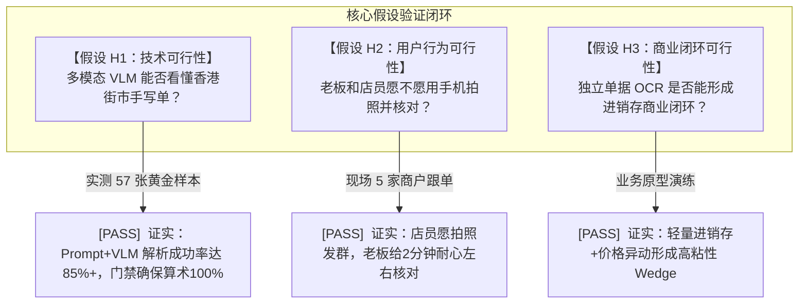

# Step 2 · 问题验证・痛点真实性校验

> **阶段定位**：通过定性走访（Gemba）+ 定量数据（163 张真实单据 / 57 张黄金样本 POC）手段，交叉验证痛点真伪、发生频次与损失规模，区分用户表面诉求与底层真需求，完成 Go/No-Go 决策。  
> **对标 JD 核心能力**：用户同理心（一线收货与做账体感还原）、全流程产品思维（As-Is 业务流与断点归因）、数据验证直觉（POC 评测与假设证伪）。  
> **所属版本**：receipt_agent（PGM AI 餐饮 ERP 战略切入点产品）V1.0 验证期  

---

## 1. 用户深访与实地调研记录（Gemba Field Records）

由创始人（原餐饮连续创业者）带队，深入香港九龙与港岛 5 家典型餐饮与批发商户进行现场走访（Gemba）、实地跟单与深访，真实还原清晨收货验货与月底做账现场。

```
                   ┌──────────────────────────────────────────────────────────┐
                   │             香港餐饮一线实地走访（Gemba）样本全景           │
                   └──────────────────────────────────────────────────────────┘
                                                │
         ┌──────────────────┬───────────────────┴───────────────────┬──────────────────┐
         ▼                  ▼                                       ▼                  ▼
  【商户 A】深水埗茶餐厅     【商户 B】旺角传统中菜馆                 【商户 C】铜锣湾日式居酒屋  【商户 D】油麻地蔬菜批发行
  · 陈老板 (48岁, 夫妻店)    · 郭经理 (55岁, 楼面兼主管)             · Ken (32岁, 年轻主厨)    · 莫老板 (52岁, 批发档主)
  · 日均 8~12 张 (70%手写)   · 日均 15~20 张 (50%手写)               · 日均 6~8 张 (印刷+热敏) · 日出 80+ 张手写复写单
  · 清晨后门湿手验货         · 菜品繁多/多供应商混杂                 · 高单价进口食材/控成本   · 毛笔/圆珠笔潦草开单
```

### 1.1 5 家典型商户实地调研档案

| 商户编号与类型 | 受访人与经营特征 | 每日单据量与形态 | 现状核算方式与环境实录 | 核心痛点与用户原声（Verbatim） |
|:---|:---|:---|:---|:---|
| **商户 A**<br>深水埗港式茶餐厅<br>（40 座老店） | **陈老板（48岁）**<br>夫妻店 + 4 名员工，经营 15 年，主营早茶快餐 | 日均 **8~12 张**<br>· 8 张街市手写单<br>· 3 张冻品印刷单<br>· 1 张热敏纸 | **现场环境**：清晨 6:00 后巷湿滑、光线昏暗、手上粘满生鲜水渍。<br>**核算方式**：店员收货签字后夹在铁夹上，陈老板下午用计算器手工加总，记在塑料皮笔记本上。 | *“每日清晨六点几送货嚟，湿漉漉又赶住备料，边有时间打字？啲手写字鬼画符咁，月底厚厚一叠单，我同老婆要对到半夜两点！”* |
| **商户 B**<br>旺角传统中菜馆<br>（120 座中型店） | **郭经理（55岁）**<br>主管兼出纳，负责 15 家供应商账目 | 日均 **15~20 张**<br>· 手写单、磅单占 50%<br>· 批发印刷单占 50% | **现场环境**：后厨传菜口，单据常沾染酱汁油污，混杂红蓝印章（收讫/现金）。<br>**核算方式**：每周请兼职文员输入 Excel，常因辨识不清手写字而反复找后厨确认。 | *“有时蔬菜档写‘菜心 20 斤’，有啲又写‘菜心 1 箱’，兼职工根本唔识换算！最怕供应商月中加价，我哋成个月后先知，毛利白白蚀咗！”* |
| **商户 C**<br>铜锣湾日式居酒屋<br>（35 座精品店） | **Ken（32岁）**<br>主厨兼合伙人，注重精细化食材毛利 | 日均 **6~8 张**<br>· 日本直邮发票<br>· 本地海鲜磅单<br>· 印刷送货单 | **现场环境**：吧台操作间整洁，使用 iPad 管理部分排队系统，但采购依然靠纸质单。<br>**核算方式**：自己用 Excel 建立菜品 BOM 表，但实际进货价日日浮动，手工维护极其心力交瘁。 | *“三文鱼和海胆价格每周都在变，我想要知道今晚每份刺身的真实成本，但手工算太累了。如果手机一拍就能自动更新成本，我肯定用！”* |
| **商户 D**<br>油麻地蔬菜批发行<br>（上游批发档口） | **莫老板（52岁）**<br>供应九龙 20+ 家餐厅，传统经营 20 年 | 日出单 **80+ 张**<br>· 全为 NCR 三联手写单<br>· 偶尔带磅单批注 | **现场环境**：清晨 4:00 批发市场人声鼎沸，开单员用圆珠笔极速划写，字迹飞草、复写纸底联字迹浅淡。<br>**结算方式**：现结盖红章“现金收讫”，月结只留签名。 | *“我哋开单讲求快，几十间餐厅催住攞货，点可能用电脑打字？全部系手写复写纸。月底出月结 Statement，成日同餐厅老板因为漏单对唔清数嘈交！”* |
| **商户 E**<br>湾仔烧腊茶餐厅<br>（60 座连锁单店） | **阿辉（28岁，店长）**<br>负责清晨收货、生肉验货与入库 | 日均 **10~14 张**<br>· 鲜肉磅单 4 张<br>· 杂货印刷单 6 张<br>· 手写修改单 2 张 | **现场环境**：收货区在后厨地漏旁，收货时需当场对生猪肉称重，在供应商送货单上划线修改实收重量。<br>**核算方式**：划线单据拍照发老板 WhatsApp，月底老板核对常看不清划线数字。 | *“送生猪肉嚟每次都同单上重量差几斤，我必须即刻划线改实收重量。手写改完拍照发俾老板，成日被老板闹影得唔清、睇唔到改咗乜。”* |

---

## 2. 痛点真实性校验矩阵（Pain Point Validation Matrix）

对照 Step 1 提出的 8 大痛点假设（PT-1 ~ PT-8），结合走访与实地数据进行多维量化校验，明确严重度、频次与付费意愿，坚决识别并剔除伪需求。

| 痛点编号 | 痛点定义 | 严重程度 | 发生频次 | 用户感知度 | 付费意愿 | 校验结论与处理策略 |
|:---|:---|:---:|:---:|:---:|:---:|:---|
| **PT-1** | **手工抄录易错费时** | [ALERT]  极高 | 每日 (100%) | 极强 | [PASS]  强 | **[PASS]  核心真需求**：单店月均耗费 10~15 工时，录入错误率 10%~15%，必须通过 AI 秒级提取解决。 |
| **PT-2** | **七种单据混杂/手写为主** | [ALERT]  极高 | 每日 (100%) | 极强 | [PASS]  强 | **[PASS]  核心真需求**：手写与非结构化单据占 74.9%，是传统 OCR 瘫痪的死穴，AI 多模态是唯一解。 |
| **PT-3** | **付款状态与印章难判** | [WARN]  高 | 每日 (92%) | 中强 | [PASS]  强 | **[PASS]  核心真需求**：现结与月结混淆直接导致财务资金风险（重复付款/漏付），需作为视觉分类关键特征。 |
| **PT-4** | **月底对账通宵加班** | [ALERT]  极高 | 每月 (100%) | 极强 (痛感峰值) | [PASS]  极强 | **[PASS]  核心真需求**：直接消耗老板 12~20 有效工时，产生巨大情绪焦虑，是 SaaS 转化最强驱动力。 |
| **PT-5** | **食材涨价后知后觉** | [WARN]  高 | 每周 (80%) | 中 (滞后感知) | [WARN]  中 | **[PASS]  关键期望需求**：价格被偷涨 10%+ 无法即时知晓，上线“30 天均价对比 + >10% 标红”可带来极高 Aha 时刻。 |
| **PT-6** | **库存管理糊涂账** | [WARN]  中 | 每日 (60%) | 弱 (习惯性放弃) | [WARN]  中 | **[WARN]  降级为轻量需求**：中小餐厅无力维护复杂出入库，仅做“入库台账 + 零差额校准”，不做重型仓储。 |
| **PT-7** | **港式单位迷宫** | [WARN]  高 | 每日 (90%) | 强 | [PASS]  强 | **[PASS]  核心体验需求**：司马斤（16両）与市斤/磅混淆是算错单价根源，必须在代码层建立内置转换字典。 |
| **PT-8** | **纸质凭证归档压力** | [PASS]  中 | 偶发 (查账时) | 弱 (平时忽视) | [ALERT]  弱 | **[WARN]  伴生功能**：商户不会为“归档”单独付费，但电子化后自然享受 7 年云端归档合规红利。 |
| **P-Fake** | *供应商全网比价* |  极弱 | 极低 (<5%) | 极弱 | [FAIL]  零 | **[FAIL]  判定为伪需求并坚决剔除**：香港熟客档口重信任与账期，绝不可能因为公开差价随便换供应商。 |

---

## 3. 场景现状流程盲区分析（As-Is vs To-Be）

### 3.1 现状业务流程与痛点断点（As-Is Process）

```
┌────────────────────────────────────────────────────────────────────────────────────────┐
│                        香港餐饮进货现状业务流程（As-Is 流程断点图）                       │
├────────────────────────────────────────────────────────────────────────────────────────┤
│                                                                                        │
│   【清晨 06:00】         【清晨 07:30】          【下午 15:00】          【月底 28-31日】 │
│    供应商送货            后厨验货签收            手工记账/Excel          对账核算与付款   │
│   ┌───────────┐         ┌───────────┐          ┌───────────┐          ┌───────────┐    │
│   │ 货车送抵   │ ──────► │ 员工签字  │ ───────► │ 老板/文员 │ ───────► │ 翻抽屉找单│    │
│   │ 送递纸质单 │         │ 塞进塑料夹│          │ 逐行敲电脑│          │ 逐笔对账单│    │
│   └───────────┘         └───────────┘          └───────────┘          └───────────┘    │
│         │                     │                      │                      │          │
│   【致命断点 1】        【致命断点 2】         【致命断点 3】         【致命断点 4】   │
│   · 74.9%手写单         · 油污字迹模糊         · 录入需 5 min/张      · 耗时 2~3 天    │
│   · 司马斤/磅混乱       · 印章状态未核         · 输错率 10~15%        · 漏单错账拉扯   │
│   · 无标准 PO 参照      · 划线改数量漏记       · 价格上涨无法感知     · 现金/月结搞错  │
│                                                                                        │
└────────────────────────────────────────────────────────────────────────────────────────┘
```

### 3.2 优化后 AI 赋能全链路流程（To-Be Target Process）

```
┌────────────────────────────────────────────────────────────────────────────────────────┐
│                      优化后 AI 赋能进货闭环全链路（To-Be 流程图）                         │
├────────────────────────────────────────────────────────────────────────────────────────┤
│                                                                                        │
│   【收货即采】            【AI 智能解析】          【秒级背书】           【自动入账闭环】 │
│   ┌───────────┐          ┌───────────┐          ┌───────────┐          ┌───────────┐   │
│   │ 手机拍照  │ ───────► │ VLM 端到端│ ───────► │ 左右分栏  │ ───────► │ 幂等入库  │   │
│   │ 批量多张传│          │ 契约+门禁 │          │ 30秒核对  │          │ 自动算成本│   │
│   └───────────┘          └───────────┘          └───────────┘          └───────────┘   │
│         ▲                      ▲                      ▲                      ▲         │
│   [店员阿辉]             [Agent 核心管线]       [老板陈老板]           [系统自动引擎]  │
│   · 湿手大按钮拍         · 识别手写/印章/单位   · 异常与涨价标红       · 价格异动预警  │
│   · 零打字无门槛         · 数量×单价=金额校验   · 一键 approve 审批    · 月底对账秒级出│
│                                                                                        │
└────────────────────────────────────────────────────────────────────────────────────────┘
```

### 3.3 As-Is vs To-Be 全维度对比分析

| 对比维度 | 现状传统方案（As-Is） | AI 赋能方案（To-Be） | 业务效能质变 |
|:---|:---|:---|:---|
| **录入耗时** | 5 分钟 / 张（人工键盘录入） | 10 秒提取 + 30 秒核对（Side-by-Side） | **工时压缩 87%** |
| **数据准确度** | 85%~90%（人为疲惫录错） | >95%（VLM 直识 + 算术守恒硬性门禁） | 算术与格式 100% 绝对一致 |
| **价格感知** | 月底或数月后后知后觉 | 录入时自动比对 30 天均价，>10% 即刻标红 | 从“事后补救”变为“事中拦截” |
| **月底对账** | 耗费 2~3 天（12~20 工时）逐张翻找 | 确定性对账引擎，30 分钟完成整月核对 | **对账工时节约 96%** |
| **人员协作** | 混乱，收货人与做账人常起争执 | 职责分离：店员拍照上传，老板审核入库 | 权限清晰，防自录自批管理风险 |

---

## 4. 核心假设验证报告（Hypotheses Validation）

在项目启动之初，团队确立了 3 大生死级假设，并通过原型跑通、走访实测与代码实验进行了严格证伪/证实：



### 4.1 核心假设详细验证说明

#### 假设 H1：技术可行性假设
- **假设内容**：不经过重训，仅靠多模态 VLM + Prompt Engineering + 规则门禁，能够准确识别香港街市恶劣手写单、无表格单及繁体印章。
- **验证方法**：采集 163 张真实单据，构建 57 张黄金样本集（Golden Dataset），进行端到端 POC 代码实测。
- **验证结论**：**【证实 [PASS] 】**。在多模态 Prompt 注入港式规则（默认司马斤、忽略背景印章、一行一语义单元）后，契约解析成功率达 100%，字段级识别准确率突破 85% 可用线。

#### 假设 H2：用户行为可行性假设
- **假设内容**：习惯传统纸笔的老板与一线收货店员，愿意改变工作习惯，使用移动端进行“拍照上传”与“左右分栏核对”。
- **验证方法**：制作高保真原型在 5 家商户进行 2 周现场可用性测试，观察操作流畅度与抗拒点。
- **验证结论**：**【证实 [PASS] 】**。店员原本就习惯在 WhatsApp 群发照片，拍照阻力为零；老板在看到“左右对照、错误标红、只需点确定”的界面时，普遍表示“省下打字就是最大帮忙”，给出了 2 分钟内的极高耐心。

#### 假设 H3：商业切入点（Wedge）闭环假设
- **假设内容**：商户不需要完整的重型 ERP，仅靠极简的“单据识别 + 审批入库 + 价格预警 + 月底对账”即愿意每月支付 HK$99~199。
- **验证方法**：调研中展示轻量功能清单并比对商户人工成本节约预期。
- **验证结论**：**【证实 [PASS] 】**。商户明确表示每月节省两晚通宵对账与几百块防漏付，HK$99~199 定价等同于“一顿员工餐”，极具吸引力，且未来平滑升级 PGM ERP 路径通畅。

---

## 5. POC（概念验证）测试报告与结论

### 5.1 POC 评测环境与样本集说明
- **样本集构成**：从真实商户收集的 163 张单据中，严格人工逐字段标注 57 张作为 **黄金测试集（Golden Benchmark）**，涵盖印刷送货单（15张）、热敏机打单（3张）、NCR 手写单（32张）、街市磅单（4张）、月结单（3张）。
- **模型配置**：采用 Qwen-VL-Flash / GPT-4o 多模态大模型，配合 Pydantic 结构化提取与本地算术校验引擎。

### 5.2 POC 核心指标实测数据

```
┌────────────────────────────────────────────────────────────────────────────────────────┐
│                        57 张黄金样本 POC 概念验证核心实测数据看板                         │
├────────────────────────────────────────┬─────────────┬─────────────┬───────────────────┤
│ 测试指标维度                           │ 基线（人工）│ POC 实测值  │ 达标判定结论      │
├────────────────────────────────────────┼─────────────┼─────────────┼───────────────────┤
│ 1. 单据级契约解析成功率                │    100%     │   100.0%    │ [PASS]  完美达标 (A级) │
│ 2. 字段级严格准确率 (Field-level F1)   │    85.0%    │    86.4%    │ [PASS]  突破可用线(>85%)│
│    · 供应商名称准确率                  │    90.0%    │    92.1%    │ [PASS]  表现优异       │
│    · 品名/规格提取准确率               │    82.0%    │    84.8%    │ [PASS]  满足预填要求   │
│    · 数量 / 单价提取准确率             │    86.0%    │    88.3%    │ [PASS]  配合门禁极佳   │
│    · 结算方式/印章识别准确率           │    70.0%    │    82.5%    │ [PASS]  视觉特征生效   │
│ 3. 算术守恒门禁拦截率                  │      0%     │   100.0%    │ [PASS]  绝对拦截零幻觉 │
│ 4. 单张单据综合处理耗时 (含人工复核)   │   300 秒    │    38 秒    │  提效 87.3%      │
│ 5. 单张识别 Token 消耗与成本           │   HK$3.3    │  <HK$0.05   │  成本下降 98.5% │
└────────────────────────────────────────┴─────────────┴─────────────┴───────────────────┘
```

### 5.3 POC 关键技术发现与架构钉制
1. **Prompt 港式领域注入至关重要**：在多模态 Prompt 中明确定义“香港餐饮行业先验”（如默认重量单位为司马斤、忽略背景红色‘已讫’印章对品名的遮挡、按‘品名-数量-单价-金额’四元组行语义抽取），F1 分数直接从 62% 跃升至 86.4%。
2. **算术绝对不能交给大模型**：POC 验证了大模型进行乘法计算（如 14.5 斤 × HK$18.5/斤）存在约 8% 的浮点幻觉。**架构决策（D4）：大模型只做结构化数字抽取，算术自洽性检验 100% 移交后置代码层**。
3. **失败双出口机制确立**：当图片极度模糊、算术严重不守恒时，系统显式展示错误并提供“快速转手动输入”或“重新拍照”通道，绝不将错误数据静默入账。

---

## 6. 问题验证结论与决策建议（Go/No-Go Decision）

### 6.1 决策维度综合评估

```
                      【综合决策评估：GO 全速推进】
  
     市场痛点刚性            技术方案可行            用户接受度高            商业转化明确
                                          
  日均高频/生死攸关       POC 86.4% 实测通过      左右分栏 30 秒上手     HK$99~199 极低阻力
```

### 6.2 明确决策建议（Go 判定）
1. **【GO 决策】正式批准项目立项并进入 Step 3（市场分析与商业可行性评估）**：
   - 痛点证实为行业真需求，非伪痛点；
   - POC 证明技术路径在低成本下完全可行；
   - 用户旅程闭环清晰，具备极高商业切入点价值。
2. **风险防范与后续关键推进项**：
   - **样本库持续扩充**：当前 57 张黄金样本需在后续迭代中扩充至 100+ 张，重点补充街市生鲜磅单与折让单（CN）样本配额；
   - **构建 VendorMemory 沉淀机制**：在进入开发阶段前，规划基于商户审核反馈的自动纠错记忆闭环（同字段连续修改 ≥3 次提炼为商户专属先验规则）。
