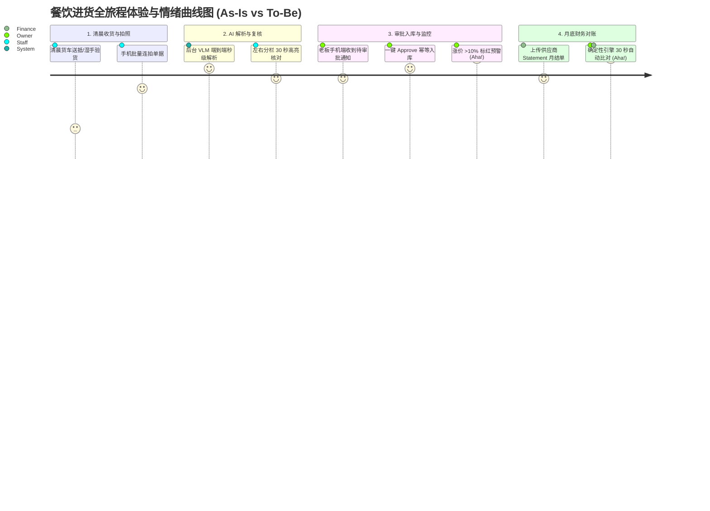

# Step 4 · 用户画像・多角色需求拆解

> **阶段定位**：建立具象化用户角色认知，深度拆解决策者、操作者与财务核对者的目标、约束与心理阻抗，绘制端到端全旅程体验地图（CJM），消解多角色协同冲突，奠定以人为中心的 AI 交互与权限底座。  
> **对标 JD 核心能力**：用户同理心（一线湿手与老旧手机环境体感还原）、系统分析能力（RBAC 权限与多角色工作流拆解）、AI 交互体验设计（Aha Moment 与置信度信任设计）。  
> **所属版本**：receipt_agent（PGM AI 餐饮 ERP 战略切入点产品）V1.0 规划期  

---

## 1. 核心用户角色档案（多角色全景分层）

在香港餐饮（F&B）场景中，进货到记账涉及三类核心角色：**付费决策人（老板/主理人）**、**高频数据采集人（收货店员/厨师）** 与 **对账核算人（出纳/财务经理）**。

```
                   ┌──────────────────────────────────────────────────────────┐
                   │               香港餐饮后厨与财务多角色协同架构图            │
                   └──────────────────────────────────────────────────────────┘
                                                │
         ┌──────────────────────────────────────┼──────────────────────────────────────┐
         ▼                                      ▼                                      ▼
  【角色 1：P0 决策与管理核心】           【角色 2：P0 高频操作端】              【角色 3：P1 财务核对端】
  单店老板 / 餐厅主理人                  前线收货店员 / 厨师长                  兼职出纳 / 财务经理
  (Owner - 付费决策与审批)               (Staff - 拍照上传与复核)               (Finance - 月结对账与审计)
  ───────────────────────                ──────────────────────                 ─────────────────────
  · 掌控成本/审批入库                    · 清晨后巷湿手验货                     · 处理月结 Statement 对账
  · 价格异动监控/看毛利                  · 批量拍照/极简点选                    · 追溯发票缺失与四向差异
```

### 1.1 角色 1（P0 决策核心）：单店餐饮老板 / 主理人

```
┌────────────────────────────────────────────────────────────────────────────────────────┐
│  Persona 1 · 单店餐饮老板 · Owner（核心决策者与付费人）                                │
├────────────────────────────────────────────────────────────────────────────────────────┤
│  基本背景                                                                              │
│  · 代表人物：深水埗茶餐厅 陈老板（48岁，夫妻店+4名员工，经营15年）                      │
│  · 技术素养：熟练使用 WhatsApp / 微信，对复杂 PC 端 ERP 有天然戒心，“只给 2 分钟耐心”    │
│  · 核心诉求：“影张相就搞掂，唔好教我打字；钱花喺边度、边个食材加价，我要一眼睇清。”   │
│                                                                                        │
│  核心目标（Goals）                                                                     │
│  1. 堵住后厨跑冒滴漏，精准掌握每天花了多少钱进货；                                    │
│  2. 供应商暗中抬价（>10%）能当场知晓，不再做冤大头；                                   │
│  3. 月底不再通宵熬夜对底单，半小时内确认整月应付账款。                                │
│                                                                                        │
│  关键约束（Constraints）                                                               │
│  · 时间高度碎片化，白天落场才有空翻手机看数；                                          │
│  · 严防店员自录自批，对系统自动乱改数据极度戒备；                                      │
│  · 对价格极度敏感，要求 ROI 立竿见影（投入等同于一顿员工餐）。                        │
│                                                                                        │
│  AI 信任与心理顾虑                                                                     │
│  · 顾虑：“大模型算数会不会算错？会不会私自帮我写进库存？”                            │
│  · 产品回应：AI 仅负责预填，老板拥有最终审批权（approve 触发入账），算术门禁绝对守恒。 │
└────────────────────────────────────────────────────────────────────────────────────────┘
```

### 1.2 角色 2（P0 操作端）：前线收货店员 / 后厨厨师长

```
┌────────────────────────────────────────────────────────────────────────────────────────┐
│  Persona 2 · 前线收货店员 / 厨师长 · Staff（高频数据录入者，留存关键）                  │
├────────────────────────────────────────────────────────────────────────────────────────┤
│  基本背景                                                                              │
│  · 代表人物：湾仔烧腊店店长 阿辉（28岁，负责清晨 6:00 开门收货验货与备料）             │
│  · 操作环境：后厨地漏旁、光线昏暗、手上沾满生鲜生肉水渍、多台中低端 Android 手机       │
│  · 核心诉求：“清晨几间货车一齐到，快啲影完相搞掂，千祈咪叫我喺手机上面打字！”         │
│                                                                                        │
│  核心目标（Goals）                                                                     │
│  1. 收货后 1 分钟内完成拍照上传，不耽误后厨洗切备料；                                  │
│  2. 如果单据有划线改重量或折让，系统能自动识别，别让自己背锅；                        │
│  3. 操作极其省事，点几个大按钮就能完成任务。                                          │
│                                                                                        │
│  关键约束（Constraints）                                                               │
│  · 湿手操作屏幕，精细输入极易误触；                                                    │
│  · 缺乏财务和电脑知识，遇到复杂字段填报必然直接放弃使用；                              │
│  · 担心因录错数字被老板责骂扣薪。                                                      │
│                                                                                        │
│  AI 信任与心理顾虑                                                                     │
│  · 顾虑：“如果 AI 识别错了算谁的？我会不会被骂？”                                     │
│  · 产品回应：左右分栏高亮预填项，错误修改留痕，店员只需确认原图与预填无误后提交复核。 │
└────────────────────────────────────────────────────────────────────────────────────────┘
```

### 1.3 角色 3（P1 财务端）：兼职出纳 / 连锁财务经理

```
┌────────────────────────────────────────────────────────────────────────────────────────┐
│  Persona 3 · 兼职出纳 / 财务经理 · Finance（月结对账与合规审计者）                     │
├────────────────────────────────────────────────────────────────────────────────────────┤
│  基本背景                                                                              │
│  · 代表人物：旺角中菜馆 郭经理（55岁，负责 15 家供应商月结对账与支票开具）             │
│  · 工作习惯：注重单据凭证合规（税局 7 年备查），依赖计算器与月结 Statement 逐笔打勾   │
│  · 核心诉求：“月结单同送货底单成日对唔上，漏单、错价、退货折让，要查得清清楚楚！”   │
│                                                                                        │
│  核心目标（Goals）                                                                     │
│  1. 上传供应商月结对账单（Statement），系统自动与当月已入库单据四向匹配；              │
│  2. 自动标记“单据缺失”、“金额不一致”、“未送货退款”等差异项；                        │
│  3. 一键生成符合香港会计审记要求的进货明细汇总表。                                    │
│                                                                                        │
│  关键约束（Constraints）                                                               │
│  · 对每一笔差异必须有据可查（能随时调取原始照片凭证）；                                │
│  · 对现结（现金/FPS）与月结（支票/转账）分类极度敏感，严防重复付款。                   │
└────────────────────────────────────────────────────────────────────────────────────────┘
```

---

## 2. 用户画像与同理心地图（Empathy Map）

通过深入真实场景，透视核心角色陈老板（Owner）与阿辉（Staff）的言、行、思、感：

```
┌────────────────────────────────────────────────────────────────────────────────────────┐
│                     单店老板陈老板（Owner）同理心地图（Empathy Map）                    │
├──────────────────────────────────────────┬─────────────────────────────────────────────┤
│ 【Says 说的】                            │ 【Does 做的】                               │
│ · “餐饮毛利得返几粒米，食材加少少就蚀本”│ · 清晨把厚厚一叠油污单据夹在铁夹上          │
│ · “我都想管好啲账，但邊有咁多時間！”    │ · 下午抽 10 分钟用计算器按几下，凭感觉估算 │
│ · “系统最紧要简单，唔好搞咁多花臣！”    │ · 月底连续两晚在收银台翻底单对账到凌晨      │
├──────────────────────────────────────────┼─────────────────────────────────────────────┤
│ 【Thinks 想的】                          │ 【Feels 感受与焦虑】                        │
│ · “供货商系咪睇我唔得闲，偷偷摸摸加咗价？”│ · 焦虑：月底看银行账户才知道这个月赚没赚钱 │
│ · “店员成日写错字，入错系统账仲衰过唔入”│ · 烦躁：最怕面对油腻模糊的手写字和对账单   │
│ · “我要掌控权，账目改动必须我先批”      │ · 掌控感渴望：希望能有一眼看清的实时成本盘  │
└──────────────────────────────────────────┴─────────────────────────────────────────────┘
```

```
┌────────────────────────────────────────────────────────────────────────────────────────┐
│                     前线收货人阿辉（Staff）同理心地图（Empathy Map）                    │
├──────────────────────────────────────────┬─────────────────────────────────────────────┤
│ 【Says 说的】                            │ 【Does 做的】                               │
│ · “车到即刻要落货，后厨催住要用猪肉”    │ · 湿着手在手写单上打勾签字                  │
│ · “手机屏幕成日有水，好难打字”          │ · 发现短送时，在单子上直接划线改重量        │
│ · “我只负责收货，算账咪揾我”            │ · 拍个照随手发到 WhatsApp 群里交差          │
├──────────────────────────────────────────┼─────────────────────────────────────────────┤
│ 【Thinks 想的】                          │ 【Feels 感受与焦虑】                        │
│ · “千祈咪叫我逐行入电脑，我宁愿去斩叉烧”│ · 恐惧：怕录错价格或称重被老板责怪罚款     │
│ · “如果影张相就完事，咁就最好不过”      │ · 疲惫：清晨 6 点又困又忙，抗拒多余操作    │
│ · “改咗重量老板睇唔到，唔好赖我”        │ · 渴望：大按钮、秒传、免打字、快速完事     │
└──────────────────────────────────────────┴─────────────────────────────────────────────┘
```

---

## 3. 用户全旅程体验地图（Customer Journey Map）

全景还原阿辉（Staff）收货与陈老板（Owner）审批、对账的完整端到端生命周期，标注关键情绪曲线与 AI 增益节点（Aha Moments）：



### 3.1 用户全旅程全景分解矩阵

| 旅程阶段 | 用户行为与接触点（Touchpoint） | 用户心理与痛点 | AI 赋能与系统机制 | 情绪分 (1-10) | Aha Moment（惊喜时刻） |
|:---|:---|:---|:---|:---:|:---|
| **1. 清晨送货签收** | 供应商到货，店员阿辉核对生鲜并签收纸质单 | 后厨忙乱、手湿、赶时间，容易遗失单据 | 移动端原生大按钮，提供批量连续拍摄模式，支持自动倾斜校正与弱光增强 |  7.5 | 连拍 5 张单据一键批量上传，0 等待直接返回备料。 |
| **2. AI 解析与预填** | 图像上传至后端 Agent 处理管线 | 担心手写单识别不准、漏掉划线修改 | VLM 多模态端到端直识，自动识别手写、印章、批注；代码层算术守恒门禁自检 |  9.0 | 无表格的潦草手写 NCR 单，10 秒内完整提取品名、单价与重量。 |
| **3. 左右分栏核对** | 店员/老板在手机端打开待复核列表 | 最烦逐个输入，改错操作麻烦 | **Side-by-Side 左右对照视图**：左边原图高亮，右边结构化字段；算术不合规强提示 |  8.5 | 发现划线修改的地方，AI 已准确预填修改后的实收数字。 |
| **4. 审批与台账入库** | 老板陈老板在后台收到待办并审核 | 怕店员乱改数据，要求账目可信 | 职责分离机制：店员仅提交，老板一键 approve 触发写库，台账基于 append-only 留痕 |  9.5 | 点一下“批准”，今日进货总额与库存台账秒级自动同步。 |
| **5. 价格异动预警** | 系统在单据批准时自动比对历史价格 | 平时生鲜悄悄涨价无法即时察觉 | 自动拉取该品类过去 30 天均价，若涨价幅度 >10%，单品以醒目橙红色标签告警 |  10.0 | **【Aha Moment】** “菜心今日加价 15%”，老板当场在微信找菜档质问并扣回差价！ |
| **6. 月底自动对账** | 月底收到供应商月结单，进行对账 | 传统翻箱倒柜找底单，需连续熬夜两晚 | 拍照上传月结单，确定性对账引擎瞬间拉平当月所有送货单，自动圈出漏单与错价 |  10.0 | **【终极 Aha Moment】** 原本需要 3 天的人肉对账，现在 30 秒生成完整四向差异报告！ |

---

## 4. 多角色需求分层与冲突消解矩阵

### 4.1 角色需求冲突与消解设计

```
┌────────────────────────────────────────────────────────────────────────────────────────┐
│                        核心冲突：老板想要“精细管控” vs 店员想要“极简省事”             │
├────────────────────────────────────────────────────────────────────────────────────────┤
│                                                                                        │
│   【店员诉求：极简省事】                                  【老板诉求：精准管控】       │
│   · 拒绝复杂录入与打字                                    · 必须每笔数字准确无误       │
│   · 拍照完就想走人                                        · 必须防范私改与自录自批     │
│   · 怕担责、怕扣钱                                        · 必须有完整的审计追溯履历   │
│                                                                                        │
│                                           │                                            │
│                                           ▼                                            │
│   ┌────────────────────────────────────────────────────────────────────────────────┐   │
│   │                         【产品消解方案：端到端职责解耦】                       │   │
│   ├────────────────────────────────────────────────────────────────────────────────┤   │
│   │ 1. 采集端彻底极简化：店员端 UI 仅保留“批量拍照 + 左右核对点选”，绝无必填打字框    │   │
│   │ 2. 审批权绝对集中：库存台账只在老板 Approve 时写入，店员操作仅生成 Draft 草稿     │   │
│   │ 3. 责任清晰可溯源：审计日志完整记录“原图 vs AI预填 vs 店员修改”，杜绝甩锅推诿     │   │
│   └────────────────────────────────────────────────────────────────────────────────┘   │
└────────────────────────────────────────────────────────────────────────────────────────┘
```

### 4.2 基于角色的访问控制（RBAC）与权限隔离模型

| 业务功能模块 | 平台运维 (Admin)<br>*(内部系统角色)* | 餐厅老板 (Owner)<br>*(核心管理角色)* | 收货店员 (Staff)<br>*(前线操作角色)* | 财务出纳 (Finance)<br>*(核对审计角色)* |
|:---|:---:|:---:|:---:|:---:|
| **单据拍照与批量上传** | [FAIL]  (不参与业务) | [PASS]  | [PASS]  (主要操作) | [PASS]  |
| **Side-by-Side 复核与修正** | [FAIL]  | [PASS]  | [PASS]  (草稿保存) | [PASS]  |
| **单据最终审批入库 (Approve)** | [FAIL]  | **[PASS]  (独占审批权)** | [FAIL]  (不可自批) | [FAIL]  |
| **单据异常标记 (Flag/Reject)** | [FAIL]  | [PASS]  | [FAIL]  | [PASS]  |
| **供应商新建与别名确认** | [FAIL]  | [PASS]  | [FAIL]  | [PASS]  |
| **价格历史与涨价异动查看** | [FAIL]  | [PASS]  | [FAIL]  (避免前线议论) | [PASS]  |
| **月底 Statement 对账与导出** | [FAIL]  | [PASS]  | [FAIL]  | [PASS]  (主要操作) |
| **系统订阅与账单管理** | [FAIL]  | [PASS]  (独占决策) | [FAIL]  | [FAIL]  |
| **AI 引擎评测与灰度配置** | **[PASS]  (独占运维)** | [FAIL]  | [FAIL]  | [FAIL]  |

---

## 5. 用户研究结论与产品设计原则

基于上述多角色深度画像与场景调研，确立本项目产品交互与功能架构的 **五大不可动摇设计原则**：

```
┌────────────────────────────────────────────────────────────────────────────────────────┐
│                              receipt_agent 五大产品设计铁律                             │
├────────────────────────────────────────────────────────────────────────────────────────┤
│                                                                                        │
│  【原则 1：零打字原则（Zero Typing）】                                                 │
│  · 界面操作以“点击、勾选、滑动确认”为主，移动端尽可能消除键盘弹出频率。               │
│                                                                                        │
│  【原则 2：两分钟耐心门槛（Two-Minute Rule）】                                          │
│  · 从打开 App 拍照到完成一单核对，单次交互时长必须死死控制在 1 分钟以内。             │
│                                                                                        │
│  【原则 3：左右对照可信原则（Side-by-Side Trust）】                                    │
│  · 任何 AI 预填数据必须与原始单据切片并排展示，标红低置信度项，建立肉眼可见的信任感。 │
│                                                                                        │
│  【原则 4：职责分离与管理安全（Separation of Duties）】                                │
│  · 录入的人永远不能拥有最终入账审批权，单据状态机严格由 Draft → Approved 转移。       │
│                                                                                        │
│  【原则 5：失败显式出口（Explicit Fallback Exit）】                                    │
│  · AI 遇到极度模糊无法解析时，坚决显式报错并提供“一键重拍”或“转极简手工”，绝不伪装。 │
│                                                                                        │
└────────────────────────────────────────────────────────────────────────────────────────┘
```

### 5.1 下一步推进指引
- **研究结论**：用户画像具象清晰、多角色权限与旅程闭环严密，**正式准予进入 Step 5（优先级判定・MVP 范围定义）**。
- **承接要点**：依据本阶段梳理的 17 个业务场景与角色核心诉求，运用 KANO 模型与 MoSCoW 法则划定 V1.0 首期开发边界。
