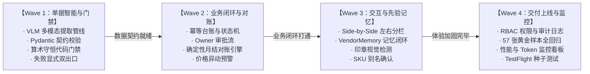

# Step 5 · 优先级判定・MVP 范围定义

> **阶段定位**：建立结构化需求池（Product Backlog），运用 KANO 模型与 MoSCoW 优先级矩阵严格界定首期 MVP 边界；以“正确性先于智能，智能先于闭环”的工程纪律制定四阶段研发波次规划（Wave 1~4），确立端到端交付验收标准（DoD），从源头杜绝功能蔓延。  
> **对标 JD 核心能力**：产品落地能力（MVP 范围边界划定与版本规划）、逻辑与系统分析能力（MoSCoW 需求分级与 Feature-Value 映射）、跨团队工程推进（波次依赖图谱与严密 DoD 设计）。  
> **所属版本**：receipt_agent（PGM AI 餐饮 ERP 战略切入点产品）V1.0 MVP 规划期  

---

## 1. MVP 核心目标与边界界定

```
                   ┌──────────────────────────────────────────────────────────┐
                   │             receipt_agent V1.0 MVP 核心目标与边界        │
                   └──────────────────────────────────────────────────────────┘
                                                │
         ┌──────────────────────────────────────┴──────────────────────────────────────┐
         ▼                                                                             ▼
  【MVP 核心价值承诺】                                                          【明确边界（Non-Goals）】
  “拍照上传 → AI 预填 → 左右核对不到一分钟                                       · 坚持单店后厨闭环，不做跨店多仓调拨
   → 审批入库 → 月底成本自动算”                                                  · 不做前厅点餐收银（避免与 POS 巨头竞争）
  ──────────────────────────────────────                                        · 不做供应商全网比价与重型供应链撮合
  跑通后厨进货数字化最小可行商业闭环                                             · 不做员工考勤与全套总账税务会计
```

### 1.1 MVP 核心目标
1. **跑通单店进货端到端闭环**：实现“手机拍照 → 多模态 VLM 提取 → 算术守恒门禁自检 → 左右分栏核对 → 老板一键审批入库 → 实时库存与单价更新”核心链路；
2. **释放月底通宵对账痛点**：通过供应商月结单 OCR 与确定性对账引擎，将整月中菜馆/茶餐厅对账耗时从 2~3 天（15~20 小时）压缩至 30 分钟以内；
3. **建立数据先验壁垒（Wedge）**：在单店场景内沉淀每家餐厅独有的供应商别名、习惯单位与版式先验（VendorMemory），为后续向 PGM 全套 ERP 升级提供高粘性抓手。

### 1.2 明确产品边界与非目标（Out of Scope）

| 明确不做的事项（Non-Goals） | 坚决不做的战略与工程理由 | 替代方案或长期归属 |
|:---|:---|:---|
| **跨店连锁与多仓调拨** | 单店数据模型最干净、验证阻力最小；多店权限与调拨复杂度会拖慢 MVP 上线周期 3 个月以上。 | 并入母公司 PGM 完整 ERP 版图（触发条件：v2 上线 + ≥5 家付费）。 |
| **前厅点餐与收银 POS** | 前厅是 Eats365、iCHEF 等巨头红海，非我们核心优势；后厨进货才是巨头遗漏的真空地带。 | 独立售卖版保持纯后厨定位，通过标准 API 与外部 POS 对接销售消耗。 |
| **供应商全网公开比价** | 香港餐饮极其依赖熟客信用与账期，公开差价无法促成换商；且初创期无全网数据。 | 专注店内“纵向历史比价”（30 天价格异动预警），帮老板抓偷涨价。 |
| **智能自动下单与采购撮合** | 破坏“无 PO 街市现挑”场景的轻量切入优势；增加商户运营负担。 | 远期版本可探索 WhatsApp 极简落单，V1.0 坚决不做。 |
| **员工考勤与税务总账会计** | 复杂度极高，且香港会计事务所流程固定，非餐饮老板最痛痛点。 | 只输出标准进货台账 CSV / PDF 报表，交由外部会计系统处理。 |

---

## 2. 需求优先级评估模型（MoSCoW 模型）

结合 KANO 需求分类（基本型 M / 期望型 O / 兴奋型 A）与 RICE 得分，将全量需求池收敛为结构化 MoSCoW 优先级矩阵：

```
┌────────────────────────────────────────────────────────────────────────────────────────┐
│                        receipt_agent 需求优先级 MoSCoW 矩阵                            │
├──────────────────────────────────────────┬─────────────────────────────────────────────┤
│ 【Must Have（必须有，MVP 核心骨架）】    │ 【Should Have（应该有，重要体验增强）】     │
│ · R-01 手机拍照/批量上传进货单据         │ · R-14 价格异动预警（30天均价>10%标红）     │
│ · R-02 多模态 VLM 端到端识别（七形态）   │ · R-20 VendorMemory 别名与单位先验记忆      │
│ · R-04 算术守恒代码门禁（数量×单价=金额）│ · R-09 印章付款状态打标（现金/月结/支票）   │
│ · R-03 Side-by-Side 左右分栏复核         │ · R-21 RBAC 权限隔离（Owner审批/Staff录入） │
│ · R-05 老板审批入库（幂等台账）          │ · R-26 历史单据快速检索与云端归档           │
│ · R-08 识别失败转手工录入兜底            │                                             │
│ · R-11/12 实时库存台账与加权成本更新     │                                             │
│ · R-17 供应商月结单自动对账引擎          │                                             │
├──────────────────────────────────────────┼─────────────────────────────────────────────┤
│ 【Could Have（可以有，后续迭代扩展）】   │ 【Won't Have（本次坚决不做，非目标）】     │
│ · R-18 部门/成本中心花销拆分             │ · 供应商全网公开比价与撮合                  │
│ · R-13 损耗与员工餐出库登记              │ · 智能全自动下单补货                        │
│ · R-25 会计专用报表一键导出 (PDF/Excel)  │ · 员工考勤排班与薪酬核算                    │
│ · R-24 双模型交叉审核 Agent              │ · 粤语语音直接记账识别                      │
└──────────────────────────────────────────┴─────────────────────────────────────────────┘
```

---

## 3. MVP 核心功能清单与价值映射表（Feature-Value Mapping）

为确保每一行代码都直击用户痛点，建立“用户痛点 → 核心功能 → 价值实现”一一映射表：

| 需求编号 | 功能模块 | 具体功能特性（Feature） | 解决的用户痛点 | 创造的核心价值（Value） | 优先级 |
|:---|:---|:---|:---|:---|:---:|
| **PR-01** | 单据采集 | **批量拍照与弱光增强上传** | PT-1 录入耗时、PT-8 纸张易丢 | 清晨 1 分钟连拍 5~10 张单据，无需手抄，即拍即传。 | **Must** |
| **PR-02** | 智能解析 | **多模态 VLM 七形态端到端直识** | PT-2 单据形态混乱、无表格手写 | 彻底击穿 74.9% 街市手写单识别瓶颈，秒级提取品名与金额。 | **Must** |
| **PR-03** | 门禁防护 | **确定性代码算术守恒校验** | PT-1 录入易错、PT-7 单位迷宫 | 强制 `数量 × 单价 = 金额` 校验，前置拦截大模型乘法幻觉。 | **Must** |
| **PR-04** | 人机交互 | **Side-by-Side 左右对照复核视图** | PT-1 复核疲惫、缺乏信任感 | 原图切片与预填字段并排高亮，异常项标红，30 秒完成背书。 | **Must** |
| **PR-05** | 资产管理 | **Owner 审批入库与幂等台账** | PT-6 库存糊涂账、防私改账目 | 职责分离，仅老板批准后写入只增台账（append-only），账目可信。 | **Must** |
| **PR-06** | 异常兜底 | **失败显式双出口（重拍/转手工）** | 极端恶劣单据识别失败 | 绝不静默存空，提供一键重拍与极简手工补录通道。 | **Must** |
| **PR-07** | 财务闭环 | **供应商月结单确定性对账引擎** | PT-4 月底对账熬夜加班 2~3 天 | 30 秒自动匹配整月送货单与 Statement，自动圈出四向差异。 | **Must** |
| **PR-08** | 成本风控 | **30 天食材价格异动预警（>10%）** | PT-5 供应商暗中抬价后知后觉 | 单品涨幅超 10% 醒目标红，当场挽回被蚕食毛利。 | **Should** |
| **PR-09** | 先验沉淀 | **VendorMemory 别名与单位知识库** | PT-7 港式单位与街市俗称迷宫 | 沉淀供应商特定简称（如“菜心”=司马斤），越用越准。 | **Should** |
| **PR-10** | 状态分类 | **红蓝印章与付款标记视觉检测** | PT-3 付款状态难判、现结月结混 | 准确判定“现金收讫/未付”，防供应商重复催款或重复付款。 | **Should** |

---

## 4. 研发波次规划与交付定义（Wave DoD）

严格遵循“**Wave 1 核心识别与门禁 → Wave 2 业务闭环与库存财务 → Wave 3 体验升级与记忆治理 → Wave 4 部署上线与监控**”的依赖纪律：



### 4.1 各波次交付目标与 Definition of Done (DoD)

```
┌────────────────────────────────────────────────────────────────────────────────────────┐
│                     receipt_agent 端到端上线验收八大闸门（DoD）                        │
├────────────────────────────────────────────────────────────────────────────────────────┤
│                                                                                        │
│  【闸门 1：真实单据解析】真实繁体/街市手写/司马斤单据解析成功率达 100%，契约合法。     │
│  【闸门 2：SKU 自动匹配】≥80% 常见食材明细自动匹配已有 SKU，支持别名映射。             │
│  【闸门 3：手写行语义】无表格手写单按行语义正确抽取（一行 = 品名+数量+单价+金额）。     │
│  【闸门 4：印章防污染】红蓝现金印章正确判定 payment_mark=stamp，印章文字不污染明细。  │
│  【闸门 5：审批精确入库】无修改直接点 Approve，对应 SKU 账目精确增加换算后数量。        │
│  【闸门 6：绝对幂等入账】同一单据重复保存/审批，台账绝对不重复累加；修改留冲销记录。   │
│  【闸门 7：涨价即时标红】历史均价对比生效，单品涨幅 >10% 触发显著红色告警标签。        │
│  【闸门 8：月结差异对账】上传月结单，30 秒内与整月留底单完成对齐，输出四向差异清单。   │
│                                                                                        │
│   闸门 1~7 全绿 ＝「拍照 → 实时库存」单点打通；闸门 8 绿 ＝「财务对账」商业闭环成立。│
└────────────────────────────────────────────────────────────────────────────────────────┘
```

---

## 5. MVP 核心风险与对冲策略表

在产品落地推进中，预判可能出现的 5 大核心风险，并在产品与架构设计中构建完备的对冲机制：

| 风险类别 | 风险描述与潜在后果 | 触发概率 | 影响程度 | 核心对冲策略与产品工程解法 |
|:---|:---|:---:|:---:|:---|
| **R1：AI 识别置信度不足** | 极端恶劣单据（严重油污、透印反光）导致字段提取错误。 | 中 | 高 | **① 失败显式双出口**：置信度不足直接报错并引导重拍，绝不静默存空；**② Side-by-Side 标红**：低分字段高亮提示人工核实。 |
| **R2：手写单算术歧义** | 街市单据本身存在开单员算错或笔误（如 10×5=52）。 | 中 | 高 | **算术门禁“校验+建议，不静默改写”**：系统提示算术不一致，标出计算建议值，交由人工一键确认选择。 |
| **R3：商户放弃复核习惯** | 店员使用几天后偷懒，不看原图直接快速点通过。 | 高 | 中 | **强制首屏关键差异校验**：若存在未识别供应商或重大价格异动，弹窗阻断一键通过，强制滑动确认。 |
| **R4：并发编辑与状态冲突** | 老板与店员同时在两台手机上打开同一张单据进行修改。 | 低 | 高 | **引入乐观锁（Optimistic Locking）**：版本号 version 校验，检测到并发修改返回 409 Conflict 并提示重新加载。 |
| **R5：Token 成本意外失控** | 复杂单据多轮重试或大图反复调用导致 API 账单超标。 | 低 | 中 | **单单成本硬性配额（D31）**：限制单张单据最多重试 2 次；图片前端统一压缩至 1600px/q85；主备模型梯次降级。 |

---

## 6. MVP 评审结论与自查校验

### 6.1 Step 5 标准自查校验清单

```
┌────────────────────────────────────────────────────────────────────────────────────────┐
│                     《AI 产品全流程开发指导手册》Step 5 标准自查校验点                   │
├───────────────────────────────────────────────────────┬──────┬─────────────────────────┤
│ 自查标准问题                                          │ 结论 │ 严谨论证与事实依据      │
├───────────────────────────────────────────────────────┼──────┼─────────────────────────┤
│ 1. MVP 是否覆盖了核心用户的核心痛点？                  │  [PASS]   │ 是。完整覆盖拍照提取、  │
│                                                       │      │ 算术门禁、入库与对账。  │
├───────────────────────────────────────────────────────┼──────┼─────────────────────────┤
│ 2. 是否坚决剔除了低价值与伪需求？                     │  [PASS]   │ 是。剔除了全网比价、    │
│                                                       │      │ 自动补货、多店调拨等。  │
├───────────────────────────────────────────────────────┼──────┼─────────────────────────┤
│ 3. 首期交付能否验证产品核心价值假设？                 │  [PASS]   │ 能。端到端 DoD 八条闭环 │
│                                                       │      │ 可直接量化工时与防漏账。│
├───────────────────────────────────────────────────────┼──────┼─────────────────────────┤
│ 4. 研发依赖路径与波次是否清晰无返工风险？             │  [PASS]   │ 是。严格按 Wave 1~4 推进│
│                                                       │      │ 正确性与门禁置于最前。  │
└───────────────────────────────────────────────────────┴──────┴─────────────────────────┘
```

### 6.2 下一步推进指引
- **评审结论**：MVP 范围边界清晰、MoSCoW 分级明确、研发波次与 DoD 严密，**正式准予进入 Step 6（技术可行性・AI 边界判定）**。
- **承接要点**：重点梳理多模态大模型与确定性规则代码的分工边界，输出技术路线对比、AI 可做/不可做能力清单与架构选型依据。
