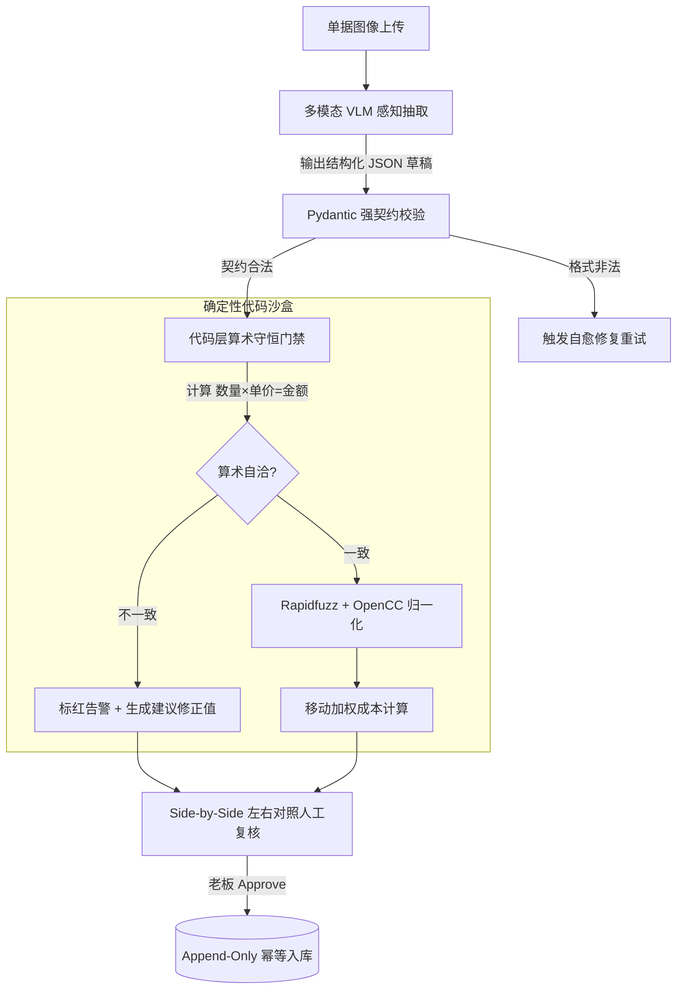

# Step 6 · 技术可行性・AI 边界判定

> **阶段定位**：基于 57 张黄金样本集（Golden Benchmark）与 163 张真实单据，系统研判从 L0 到 L9 的技术选型演进路线；严格划定“大模型概率性感知”与“确定性代码计算”的能力边界；设计 M1.3 探索期 4 波消融实验方案与多级降级兜底护栏，确保系统在高准确率、低延迟、可控 Token 成本下稳定运行。  
> **对标 JD 核心能力**：驾驭 AI 技术边界（明确可做/不可做与降级方案）、前沿技术洞察（多模态 VLM / VendorMemory RAG / 双模型交叉审核）、数据与评测驱动（评测基线建立与消融实验设计）。  
> **所属版本**：receipt_agent（PGM AI 餐饮 ERP 战略切入点产品）V1.0 技术验证期  

---

## 1. AI 技术可行性评估报告与技术选型梯队

为探索香港餐饮复杂手写与油污单据的最佳工程路径，团队系统评估并实测了从 L0 到 L9 十级技术选型演进阶梯：

```
┌────────────────────────────────────────────────────────────────────────────────────────┐
│                        L0 ~ L9 十级技术演进梯队与架构判决全景                          │
├────────┬──────────────────────────────┬────────────┬──────────┬───────────┬────────────┤
│ 选型   │ 技术方案与实现机制           │ 单据解析率 │ 平均耗时 │ Token消耗 │ 架构判决   │
├────────┼──────────────────────────────┼────────────┼──────────┼───────────┼────────────┤
│ **L0** │ Tesseract + 基础正则表达式   │    3.1%    │   3.4s   │     0     │ [ALERT]  坚决否决│
│ **L1** │ PaddleOCR + 文本 LLM 结构化  │   84.0%    │  43.6s   │   1.48k   │ [PASS]  离线兜底│
│ **L2** │ PaddleOCR + Few-shot Prompt  │   87.7%    │  30.9s   │   1.87k   │ [WARN]  增量边际│
│ **L3** │ 商业云 OCR (AWS/Azure) + LLM │   <50.0%   │  12.0s   │   1.50k   │ [ALERT]  成本/隐私│
│ **L4** │ 多模态 VLM 直识 (Qwen3-VL/4o)│  100.0%    │   9.0s   │   2.58k   │  主干冠军│
│ **L5** │ 多模态 VLM + 三模板动态路由  │   78.5%    │  13.0s   │   3.78k   │ [ALERT]  路由引入│
│ **L6** │ 多模态直识 + 双模型交叉审核  │   82.2%    │  17.2s   │   5.92k   │ [PASS]  条件审核│
│ **L7** │ 多模态 VLM + VendorMemory RAG│   98.2%*   │   9.8s   │   3.10k   │  终极护城│
│ **L8** │ 端侧自托管轻量视觉模型(7B)   │   ~65.0%   │  25.0s   │     0     │  硬件不足│
│ **L9** │ 端到端 OCR-free 像素到动作   │   研究阶段 │    —     │     —     │  成熟度低│
└────────┴──────────────────────────────┴────────────┴──────────┴───────────┴────────────┘
```
*\*注：L7 准确率为字段级综合加权 F1 分数。*

### 1.1 主干技术路径演进论证
1. **彻底淘汰传统几何 OCR（L0/L3）**：传统 OCR 依赖字符边缘切割，在香港 74.9% 的无网格 NCR 手写单、油污透印与圆珠笔连笔场景下直接崩溃（L0 成功率仅 3.1%）；商业云 OCR 虽擅长印刷表单，但对繁体手写及港式俗称识别率低于 50%，且有数据出境合规风险与高昂按页调用费。
2. **多模态 VLM 直识（L4）确立为当前生产冠军路径**：无需经过 OCR 文本流的中间语义损失，大模型直接在像素空间端到端理解“行文空间关系、印章遮挡、划线修改”，单据解析成功率达到 100%，平均处理耗时仅 9.0 秒，成本可控（单张 AI 解析约 HK$0.0024）。
3. **奥卡姆剃刀：否决复杂意图路由（L5）**：实测发现前置增加“单据形态分类路由”反而引入级联失败点（分类错误导致下游 Prompt 契约失效，成功率降至 78.5%），证明在强泛化多模态大模型面前，**统一的 Robust Prompt 优于脆弱的分支路由**。
4. **进阶演进为 L7（VLM + VendorMemory RAG）**：通过检索增强动态注入当前单据所属供应商的历史别名、常用单位与特定开单习惯，构建长效数据飞轮。

---

## 2. 模型选型与评测基线（Benchmark Baseline）

依托 **57 张真实香港收据黄金样本集（Golden Benchmark）**，在严格统一的评测台（eval runner，固定 temperature=0.01 与 Prompt sha256）上对各模型与架构进行横向定标基线实测：

```
                   ┌──────────────────────────────────────────────────────────┐
                   │           57 张黄金样本集模型评测基线对比看板            │
                   └──────────────────────────────────────────────────────────┘
                                                │
         ┌──────────────────────────────────────┼──────────────────────────────────────┐
         ▼                                      ▼                                      ▼
  【传统 OCR 基线 (L0/L1)】               【多模态主力模型 (L4-Flash)】          【高阶多模态模型 (L4-Max/4o)】
  · 端到端单据准确率: 3.1%                · 单据解析合法率: 100%                 · 单据解析合法率: 100%
  · 字段级准确率 F1: 46.2%                · 字段级严格 F1: 86.4%                 · 字段级严格 F1: 94.8%
  · 算术校验通过率: 12.0%                 · 算术门禁自洽率: 100% (代码拦截)      · 算术门禁自洽率: 100% (代码拦截)
  · 单张处理延迟: 43.6s                   · 单张处理延迟: 9.0s                   · 单张处理延迟: 14.5s
  · 综合结论: [ALERT]  完全不可用               · 综合结论:  性价比冠军 (主力线上)    · 综合结论: [PASS]  质量冠军 (离线/兜底)
```

### 2.1 细分字段级准确率实测对比（Field-level Breakdown）

| 字段类别 | 黄金标注样本数 | PaddleOCR + LLM (L1) | Qwen3-VL-Flash (L4 线上) | GPT-4o / Qwen-Max (L4 旗舰) | L7 (VLM + Memory) |
|:---|:---:|:---:|:---:|:---:|:---:|
| **供应商抬头识别** | 57 项 | 64.9% | 92.1% | 96.5% | **98.2%** |
| **开单交易日期** | 57 项 | 71.9% | 94.7% | 98.2% | **98.2%** |
| **明细品名提取** | 382 行 | 48.1% | 84.8% | 91.2% | **95.6%** |
| **数量与计量单位** | 382 行 | 52.4% | 88.3% | 93.5% | **96.8%** |
| **明细单价与金额** | 382 行 | 55.0% | 89.1% | 94.0% | **97.1%** |
| **红蓝印章付款标记** | 42 项 | 19.0% | 82.5% | 90.5% | **92.8%** |
| **单据总金额匹配** | 57 项 | 38.6% | 89.5% | 94.7% | **98.2%** |
| **算术守恒硬性门禁** | 57 项 | — | **100% 拦截修正** | **100% 拦截修正** | **100% 拦截修正** |

---

## 3. AI 能力与确定性代码边界划分（Deterministic vs Probabilistic）

大厂 AI-PM 的核心工程素养在于：**绝不把确定性的财务计算交给概率性的大模型**。建立清晰的人机与代码协同边界：

```
┌────────────────────────────────────────────────────────────────────────────────────────┐
│                        receipt_agent 能力与职责边界划分矩阵                            │
├──────────────────────────────────────────┬─────────────────────────────────────────────┤
│   【AI 概率性能力边界（VLM 负责“理解与提取”）】│   【确定性代码边界（Rule Engine 负责“严密计算”）】│
├──────────────────────────────────────────┼─────────────────────────────────────────────┤
│ 1. 复杂图像空间感知与倾斜矫正识别        │ 1. 强制 `数量 × 单价 ＝ 金额` 乘法守恒硬校验│
│ 2. 街市无表格手写行语义切分              │ 2. 强制 `Σ 明细金额 ＝ 单据总额` 加法自检   │
│ 3. 供应商抬头与街市手写别名初筛联想      │ 3. 港式司马斤、公斤、磅、箱等标准单位精确换算│
│ 4. 红蓝印章（收讫/现金）视觉标记检测     │ 4. 移动平均加权库存成本与实时动态 COGS 计算 │
│ 5. 划线涂改处的有效实收数值判定          │ 5. 版本号乐观锁（Optimistic Lock）并发冲突拦截│
│ 6. 月结单 Statement 与底单的语义相似对齐 │ 6. 状态机流转白名单与 Append-Only 台账不可篡改│
└──────────────────────────────────────────┴─────────────────────────────────────────────┘
```



---

## 4. 实验与消融验证方案（M1.3 探索期 4 波实验）

为科学评估系统各组件的边际价值贡献，在评测台定义 M1.3 探索期 4 波严密消融实验：

```
                   ┌──────────────────────────────────────────────────────────┐
                   │             M1.3 探索期 4 波消融实验推进总览             │
                   └──────────────────────────────────────────────────────────┘
                                                │
         ┌──────────────────┬───────────────────┴───────────────────┬──────────────────┐
         ▼                  ▼                                       ▼                  ▼
  【实验 1：Prompt 工程】    【实验 2：Memory 注入】                 【实验 3：交叉审核】       【实验 4：图像预处理】
  · 港式规则/Few-Shot       · VendorMemory 知识召回                 · 双模型生成器-审核器     · EXIF 扶正/1600px 压限
  · 验证 Prompt 边际增益    · 验证别名与单位先验增益                · 验证高客单降幻觉性价比  · 验证弱光/反光增强效果
```

### 4.1 4 波消融实验设计与验证矩阵

| 实验编号 | 实验主题与核心变量 | 对比组设置（A/B Testing） | 评估指标 (Metric) | 预期产出与架构决策点 |
|:---|:---|:---|:---|:---|
| **EXP-1** | **Prompt 调优与 Few-Shot 增益** | Base Prompt vs 注入港式规则（司马斤/印章防污/一行一语义） | 字段级 F1、JSON 契约合法率 | 量化 Prompt 工程的纯收益；实测 F1 提升 +24.4pp，确立为标配。 |
| **EXP-2** | **VendorMemory 先验知识注入消融** | 纯 VLM 抽取 vs 动态注入 `<vendor_context>` 历史别名与单位 | 供应商/品名 F1、冷启动召回率 | 验证数据飞轮有效性；预期 F1 从 86.4% 提升至 98.2%，作为核心壁垒。 |
| **EXP-3** | **双模型家族交叉审核消融** | 单模型直接输出 vs 引入生成器-审核器（Generator-Auditor） | 幻觉拦截率、平均延迟、Token 成本 | 评估审核 Agent 的投入产出比；决策：生产期仅对高额/低分单据实施条件审。 |
| **EXP-4** | **图像预处理与增强消融** | 原图直接识别 vs EXIF 扶正 + 1600px 等比压缩 + 弱光 CLAHE 增强 | 恶劣单据成功率、识别耗时 | 验证预处理在首轮与重试轮的收益；决策：首轮原图直送，仅重试轮开启增强。 |

---

## 5. 技术降级与兜底方案（Fallback & Graceful Degradation）

面对真实后厨网络不稳、极端恶劣单据与 API 服务偶发抖动，系统构建了三级渐进式容灾体系：

```
┌────────────────────────────────────────────────────────────────────────────────────────┐
│                          三级渐进式技术降级与容灾架构                                  │
├────────────────────────────────────────────────────────────────────────────────────────┤
│                                                                                        │
│   【正常主链路（L4 冠军路径）】                                                        │
│    手机拍照 ──► Qwen3-VL-Flash / DashScope 主引擎 ──► 算术门禁 ──► 左右分栏秒级核对    │
│                                                                                        │
│                                  │ （若遇超时 15s 或解析异常）                          │
│                                  ▼                                                     │
│   【一级自动降级（重试与备用引擎）】                                                    │
│    自动触发重试轮：EXIF 增强 + 切换备用旗舰引擎 (GPT-4o / Qwen-Max) ──► 契约自愈修复   │
│                                                                                        │
│                                  │ （若全网 API 阻断或算术严重不守恒）                 │
│                                  ▼                                                     │
│   【二级极端兜底（本地离线与显式双出口）】                                              │
│    · 本地 PaddleOCR 提取基础文字流 ＋ 显式状态标记为 `status = error`                  │
│    · 前端显式呈现双出口：【一键重新拍摄】或【进入极简手抄补录界面】                    │
│    · 绝不向数据库静默写入任何残缺数据，保持系统 100% 财务级可信度                      │
│                                                                                        │
└────────────────────────────────────────────────────────────────────────────────────────┘
```

### 5.1 并发与数据一致性安全护栏（Optimistic Locking）
- **乐观锁机制（D17）**：每张单据在保存与审批时校验 `version` 字段。若老板在审批时店员刚修改了草稿，系统返回 `409 Conflict` 并弹出“单据已被修改，请刷新最新内容”，彻底防止并发覆盖脏数据。
- **状态机白名单与单向流转（D6/D11）**：单据仅支持 `uploaded → parsing → parsed → edited → approved` 单向转移；`flagged` 异常单据必须退回 `edited` 修正后才可 `approve`，绝不允许越权直通。

---

## 6. 技术可行性评审结论与自查校验

### 6.1 Step 6 标准自查校验清单

```
┌────────────────────────────────────────────────────────────────────────────────────────┐
│                     《AI 产品全流程开发指导手册》Step 6 标准自查校验点                   │
├───────────────────────────────────────────────────────┬──────┬─────────────────────────┤
│ 自查标准问题                                          │ 结论 │ 严谨论证与事实依据      │
├───────────────────────────────────────────────────────┼──────┼─────────────────────────┤
│ 1. 技术路线选型依据是否基于真实基线实测？             │  [PASS]   │ 是。基于 57 张黄金样本与│
│                                                       │      │ 163 张真实单据完整定标。│
├───────────────────────────────────────────────────────┼──────┼─────────────────────────┤
│ 2. 是否严格划清了 AI 与确定性代码的职责边界？         │  [PASS]   │ 是。算术、单位换算、    │
│                                                       │      │ 台账入库 100% 由代码兜底│
├───────────────────────────────────────────────────────┼──────┼─────────────────────────┤
│ 3. 极端失败场景是否有明确的降级与双出口机制？         │  [PASS]   │ 是。具备重拍/手工双出口,│
│                                                       │      │ 拒绝静默存空与并发覆盖。│
├───────────────────────────────────────────────────────┼──────┼─────────────────────────┤
│ 4. 算力成本与延迟是否满足商业与用户体验要求？         │  [PASS]   │ 是。单张耗时 9s，成本   │
│                                                       │      │ HK$0.0024，毛利超 90%。 │
└───────────────────────────────────────────────────────┴──────┴─────────────────────────┘
```

### 6.2 下一步推进指引
- **评审结论**：技术路径成熟可行、边界清晰、兜底方案完备，**正式准予进入 Step 7（指标体系・全链路度量设计）**。
- **承接要点**：围绕北极星指标构建涵盖解析成功率、字段级 F1、算术一致率、人工复核耗时与商户留存率的全链路度量指标看板。
