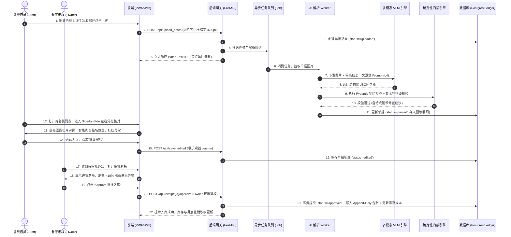

# Step 8 · 产品方案・功能规格与 AI 原生交互设计

> **阶段定位**：将前序机会、验证与 MVP 范围具象化为高可用产品方案。构建四层分层架构与四大工作台信息架构；设计以“Side-by-Side 左右对照 + 生成式预填”为核心的 AI 原生交互规范；确立严格的单据状态机与端到端时序流；制定详尽功能规格与边缘异常容错机制，交付大厂标准产品方案说明书（PRD）。  
> **对标 JD 核心能力**：AI 产品交互体验设计（人机协同界面与信任设计）、系统分析与架构设计（四层架构与状态机闭环）、严密功能规格定义（PRD 规格与边缘异常防护）。  
> **所属版本**：receipt_agent（PGM AI 餐饮 ERP 战略切入点产品）V1.0 实施期  

---

## 1. 产品架构图与信息架构图（Information Architecture）

系统采用 **“表现层交互解耦、业务层确定性编排、AI 层感知抽取、数据层安全隔离”** 的四层分层架构体系：

```
┌────────────────────────────────────────────────────────────────────────────────────────┐
│                        receipt_agent 系统四层总体产品架构图                            │
├────────────────────────────────────────────────────────────────────────────────────────┤
│                                                                                        │
│  【1. 表现层 / 交互终端】                                                              │
│   · 移动端 PWA / 响应式 Web（清晨收货大按钮拍照、批量上传抽屉、极简左右分栏）         │
│   · 桌面端 / Pad 运营工作台（老板审批流、实时库存看板、月结对账差异视图、成本下钻）   │
│                                                                                        │
│  【2. 业务与编排层 (Business & Supervisor Layer)】                                     │
│   · 确定性状态机（State Machine）：严格白名单驱动单据生命周期转移                     │
│   · 异步 Job 任务队列：上传与解析解耦，支持批量单据并发调度与进度轮询                │
│   · 权限与安全网关（RBAC）：Owner 独占审批/计费，Staff 专注采集，数据租户硬隔离        │
│                                                                                        │
│  【3. AI 与算法引擎层 (AI & Algorithmic Layer)】                                      │
│   · 多模态 VLM 感知管线：Qwen3-VL-Flash (主力线上) / GPT-4o (质量兜底) 端到端提取     │
│   · VendorMemory 知识图谱：基于 Chroma 租户硬隔离的供应商别名、习惯单位先验 RAG 检索  │
│   · 确定性门禁防护引擎：Pydantic 强契约校验 + `validate_and_fix_arithmetic` 算术自洽 │
│   · Smart Splitter 智能剥离引擎：确定性正则分离手写单混写的品名、数量与复合规格       │
│                                                                                        │
│  【4. 持久化与数据层 (Persistence & Data Layer)】                                      │
│   · 事务数据库：PostgreSQL / SQLite（Receipts, SKUs, Suppliers, Payments, Events）    │
│   · 只增不可篡改台账（Append-Only InventoryLog）：每次入库与冲销严格留痕               │
│   · 审计与事件流：`analytics_events`（度量埋点）+ `receipt_audit_logs`（合规审计）    │
│                                                                                        │
└────────────────────────────────────────────────────────────────────────────────────────┘
```

### 1.1 四大核心 Tab 信息架构（IA）

系统围绕餐饮后厨与财务两大主线，规划四大核心一级功能工作台：

```mermaid
graph TD
    ROOT[receipt_agent 核心导航] --> TAB1[1. 收据识别工作台]
    ROOT --> TAB2[2. 实时库存与 SKU]
    ROOT --> TAB3[3. 供应商与对账]
    ROOT --> TAB4[4. 成本报表与花销]

    TAB1 --> T1_1[批量拍照上传与弱光增强]
    TAB1 --> T1_2[待复核列表 / 优先级排序]
    TAB1 --> T1_3[Side-by-Side 左右对照核对]
    TAB1 --> T1_4[老板一键审批 Approve 流]
    TAB1 --> T1_5[失败双出口: 重拍 / 转手工]

    TAB2 --> T2_1[SKU 档案与内联快捷建档]
    TAB2 --> T2_2[多维度加权平均成本核算]
    TAB2 --> T2_3[SKU 合并与同义别称沉淀]
    TAB2 --> T2_4[30 天价格异动监控看板]
    TAB2 --> T2_5[实盘 vs 账面零差额校准]

    TAB3 --> T3_1[供应商档案与别名管理]
    TAB3 --> T3_2[红蓝印章付款登记 Cash/FPS]
    TAB3 --> T3_3[月结 Statement 对账引擎]
    TAB3 --> T3_4[四向差异清单: 漏单/错价/折让]

    TAB4 --> T4_1[部门/成本中心打标拆分]
    TAB4 --> T4_2[月度食材支出走势与下钻]
    TAB4 --> T4_3[会计专用 CSV/PDF 导出]
```



---

## 2. 核心业务全链路时序图与状态机（State Machine）

### 2.1 单据生命周期确定性状态机

严格定义状态转移白名单，**副作用（写库存与台账）仅挂载在 `→ approved` 唯一转移边**，非法转移一律返回 `409 Conflict`：

```
┌────────────────────────────────────────────────────────────────────────────────────────┐
│                        单据生命周期确定性状态机流转图                                  │
├────────────────────────────────────────────────────────────────────────────────────────┤
│                                                                                        │
│                  ┌──────────────────────┐                                              │
│                  │  1. uploaded (已上传) │                                              │
│                  └──────────┬───────────┘                                              │
│                             │ Worker 异步拉取解析                                      │
│                             ▼                                                          │
│                  ┌──────────────────────┐   解析异常/严重模糊                          │
│                  │  2. parsing (解析中)  │ ──────────────────────┐                      │
│                  └──────────┬───────────┘                       │                      │
│                             │ 契约与门禁自检通过                 │                      │
│                             ▼                                   ▼                      │
│                  ┌──────────────────────┐             ┌──────────────────┐             │
│   ┌─────────────►│  3. parsed (待核对)  │             │ 9. error (失败)  │             │
│   │              └──────────┬───────────┘             └─────────┬────────┘             │
│   │                         │ 人工复核保存 (save_edited)        │ 显式双出口           │
│   │ 驳回返工                ▼                                   ├─► 重试: error→parsing │
│   │ (flagged→edited) ┌──────────────────────┐                   └─► 转手工: manual_entry│
│   │                  │  4. edited (已复核)  │                                          │
│   │                  └──────────┬───────────┘                                          │
│   │                             │                                                      │
│   │             ┌───────────────┴───────────────┐                                      │
│   │             │ 老板 Approve (唯一写库边)     │ 发现异常/供应商存疑                  │
│   │             ▼                               ▼                                      │
│   │  ┌──────────────────────┐        ┌──────────────────────┐                          │
│   │  │ 5. approved (已入库) │        │ 6. flagged (已冻结)  │                          │
│   │  └──────────────────────┘        └──────────┬───────────┘                          │
│   │   · Append-Only 写台账                      │                                      │
│   │   · 更新 SKU 移动加权成本                   └──────────────────────────────────────┘
│   │   · 记录审计日志                                                                   │
│   └────────────────────────────────────────────────────────────────────────────────────┘
```

### 2.2 核心业务全链路端到端时序图



---

## 3. AI 原生交互设计规范（Side-by-Side Trust Interface）

在 AI 产品设计中，“可信度（Trust）”不是靠模型自称准确，而是**通过透明的人机协同界面让用户一眼完成背书**：

```
┌────────────────────────────────────────────────────────────────────────────────────────┐
│                   Side-by-Side 左右对照可信核对交互界面（核心 UI 原型）                │
├──────────────────────────────────────────┬─────────────────────────────────────────────┤
│  【左侧：原始单据高亮视窗 (Original Image)】│  【右侧：AI 结构化预填表单 (Verified Form)】│
├──────────────────────────────────────────┼─────────────────────────────────────────────┤
│  ┌────────────────────────────────────┐  │  供应商: [ 新记蔬菜批发 (已匹配 98%)  ▼ ]  │
│  │  2026-08-20  单号: NO.883921     │  │  日  期: [ 2026-08-20 ]  结算: (●)现金 (○)月结 │
│  │ ────────────────────────────────── │  │  ────────────────────────────────────────── │
│  │ 菜心苗 ........... 20斤 × $8.5 = 170 │  │  明细行:                                    │
│  │ ┌────────────────────────────────┐ │  │  1. [菜心苗 ]  [20.0] [斤▼] × [$8.50] = [$170.00]│
│  │ │ 特级生菜 .... 10斤 × $6.0 = 60 │ │◄─┼──► (Hover 联动高亮左侧原图第 2 行切片)      │
│  │ └────────────────────────────────┘ │  │  2. [特级生菜]  [10.0] [斤▼] × [$6.00] = [$60.00] │
│  │ 番茄一箱 ......... 1箱 × $95 = 95  │  │  3. [番茄 (箱)] [ 1.0] [箱▼] × [$95.0] = [$95.00] │
│  │ ────────────────────────────────── │  │  ────────────────────────────────────────── │
│  │ 合计金额: $325.00  [现金收讫章[ALERT] ]   │  │  【算术校验】: [PASS]  数量×单价=金额 100% 吻合  │
│  └────────────────────────────────────┘  │  【价格异动】: [WARN]  菜心苗较30日均价上涨 +12% │
│  [  放大 ] [  旋转 ] [  局部裁剪 ]   │  总金额: HK$ 325.00   [ 付款标记: 现金收讫章 ] │
├──────────────────────────────────────────┴─────────────────────────────────────────────┤
│  [ [FAIL]  标记异常 Flag ]              [  保存草稿 ]              [  老板一键批准 Approve ] │
└────────────────────────────────────────────────────────────────────────────────────────┘
```

### 3.1 关键 AI 交互规范细节
1. **双向 Hover 视觉聚焦联动（Visual Anchoring）**：
   - 鼠标悬停或手指点按右侧表单某行明细时，左侧原图视窗自动平滑居中并以半透明黄框高亮单据对应区域，彻底消灭“在密密麻麻的手写字里找数字”的眼力消耗；
2. **Smart Splitter 品名-数量-单位智能剥离魔棒（ 一键解耦）**：
   - 针对街市手写单品名混写（如“大豆油 5L*2樽”），点击行内小魔棒 ，前端内置确定性正则引擎瞬间将其剥离为：品名 `大豆油 5L`、数量 `2.0`、单位 `樽`，并自动重算单价 `单价 = 金额 / 数量`；
3. **明细行内联快捷新建 SKU（Inline SKU Creation）**：
   - 下拉搜索未收录的新食材时，列表底部常驻 `+ 为当前品名新建 SKU「xxx」`，弹出 3 字段极简弹窗，保存后乐观更新（Optimistic UI），无需跳页打断核对流；
4. **算术不自洽强提示横幅（Non-Silent Math Warning）**：
   - 若手写单存在开单人笔误（如 10 斤 × $5 = $55），系统在行内以醒目黄色三角告警提示“算术不吻合（计算应为 $50.00）”，并提供【采纳计算值 $50】或【保留票面值 $55】一键修复开关，绝不静默改写。

---

## 4. 完整功能规格清单与详细交互说明（Feature Specifications）

| 功能模块 | 功能名称 | 详细业务逻辑与交互规则 | 权限归属 | 对应端点 API |
|:---|:---|:---|:---:|:---|
| **M1 采集管理** | **批量多张连拍** | 支持移动端调起相机连续拍摄 1~20 张单据；自动应用 EXIF 旋转扶正与等比 1600px 压缩；弱光环境下启用 CLAHE 自动增益。 | Staff / Owner | `POST /api/upload_batch` |
| | **手工补录兜底** | 针对单据彻底丢失或口头补货场景，提供极简手动新建单据入口（标记为 `manual_entry` 形式）。 | **Owner 独占** | `POST /api/receipts/manual` |
| **M2 智能解析** | **多模态直识** | 调用 Qwen3-VL 提取 7 种单据形态与红蓝印章；动态注入当前租户的 VendorMemory 先验别称；产出严格 Pydantic JSON。 | 系统 Worker | `POST /api/ocr/parse` |
| | **算术守恒门禁** | 代码层执行 `数量 × 单价 = 金额` 与 `Σ明细 = 总额` 校验，误差 >0.05 触发拦截并生成推荐值。 | 系统 Worker | 内部 Rule Engine |
| **M3 复核审批** | **Side-by-Side 复核** | 左右联动核对界面；支持行内改词、删行、加行；支持单据分类（现结/月结）与印章确认。 | Staff / Owner | `POST /api/save_edited` |
| | **老板审批入库** | 检查版本号乐观锁；校验必填项；触发 Append-Only `InventoryLog` 台账写入，实时增加 SKU 库存与重算均价。 | **Owner 独占** | `POST /api/receipt/{id}/approve` |
| | **异常标记驳回** | 发现虚假单据或严重错单，点击 Flag 冻结单据并记录原因，单据状态变为 `flagged`，绝不写入台账。 | **Owner 独占** | `POST /api/receipt/{id}/flag` |
| **M4 库存治理** | **SKU 别名自学习** | 用户在复核时将“菜心苗”绑定至“特级菜心”SKU，系统自动将别名沉淀入该供应商的 `VendorMemory` 映射表。 | Staff / Owner | 自动触发写回 |
| | **SKU 治理与合并** | 支持勾选重复 SKU 进行合并，自动将历史进货台账外键迁移至主 SKU，并将副 SKU 软停用（`active=0`）。 | **Owner 独占** | `POST /api/inventory/skus/merge` |
| | **移动加权均价** | 每次审批入库自动重算：$\text{NewAvgCost} = \frac{\text{OldQty}\times\text{OldCost} + \text{InQty}\times\text{InCost}}{\text{OldQty} + \text{InQty}}$。 | 系统引擎 | 内部 Calculation Engine |
| **M5 财务闭环** | **30 天价格异动预警** | 单品单价较该 SKU 过去 30 天加权均价上涨 >10% 时，行内与看板打上醒目红色 `Price Surge` 徽章。 | Staff / Owner | `GET /api/price_history/{sku_id}` |
| | **月结单差异对账** | 上传供应商月结 Statement，引擎自动按单号与金额匹配当月已入库单据，圈出“漏单、错价、未送折让”四向差异。 | **Owner / Finance** | `POST /api/reconciliation/match` |
| | **部门花销拆分** | 单据或明细行支持打标至不同成本中心（厨房/点心/楼面水吧），月度成本报表支持按部门多维下钻。 | **Owner 独占** | `GET /api/cost_report` |

---

## 5. 异常流程与容错分支设计（Edge Cases & Exception Handling）

针对香港后厨复杂环境，系统在工程与交互层面构建了完备的异常防御体系：

```
┌────────────────────────────────────────────────────────────────────────────────────────┐
│                        五大核心异常场景与工程防御对冲方案                              │
├──────────────────────┬──────────────────────────────────┬──────────────────────────────┤
│ 异常场景与边缘 Case  │ 触发特征与潜在风险               │ 系统对冲与工程处理解法       │
├──────────────────────┼──────────────────────────────────┼──────────────────────────────┤
│ **E1：极端模糊/全黑**│ 镜头油污、光线过暗导致无法辨识   │ 图像预检拦截，提示重拍；若强行│
│                      │                                  │ 上传进入 `error` 态，显式双出口│
├──────────────────────┼──────────────────────────────────┼──────────────────────────────┤
│ **E2：算术严重不守恒**│ 供应商手写总额与明细加总差几十块 │ 算术门禁拒绝自动修正，以黄色横│
│                      │ （开单员涂改或漏记明细）         │ 幅告警，强制人工在界面做裁决  │
├──────────────────────┼──────────────────────────────────┼──────────────────────────────┤
│ **E3：多联复写透印** │ NCR 红色底联透出上联字迹，导致   │ 提示词注入“仅提取当前墨迹最深│
│                      │ 重复识别多余行项目               │ 笔触”，行编辑支持一键整行删除 │
├──────────────────────┼──────────────────────────────────┼──────────────────────────────┤
│ **E4：并发版本冲突** │ 老板审批时，店员刚在另一台手机修 │ 引入版本号乐观锁（version_id）；│
│                      │ 改了草稿并提交                   │ 后提交者拦截并返回 `409` 提示 │
├──────────────────────┼──────────────────────────────────┼──────────────────────────────┤
│ **E5：多租户越权穿透**│ 恶意请求或 RAG 混淆查询其他门店   │ Chroma 强制携带 `tenant_id`   │
│                      │ 进货私有协议价                   │ 物理过滤；输出经 Pydantic 契约│
└──────────────────────┴──────────────────────────────────┴──────────────────────────────┘
```

---

## 6. 产品方案评审结论与自查校验

### 6.1 Step 8 标准自查校验清单

```
┌────────────────────────────────────────────────────────────────────────────────────────┐
│                     《AI 产品全流程开发指导手册》Step 8 标准自查校验点                   │
├───────────────────────────────────────────────────────┬──────┬─────────────────────────┤
│ 自查标准问题                                          │ 结论 │ 严谨论证与事实依据      │
├───────────────────────────────────────────────────────┼──────┼─────────────────────────┤
│ 1. 是否具备完整清晰的产品架构与四大 Tab 信息架构？    │  [PASS]   │ 是。四层架构解耦完备，  │
│                                                       │      │ 4 大核心 Tab 闭环严密。 │
├───────────────────────────────────────────────────────┼──────┼─────────────────────────┤
│ 2. 单据状态机流转是否绝对确定，无越权与重复写库漏洞？  │  [PASS]   │ 是。副作用仅挂载在      │
│                                                       │      │ approve 一条边，支持幂等│
├───────────────────────────────────────────────────────┼──────┼─────────────────────────┤
│ 3. AI 交互是否落实 Side-by-Side 左右对照与零打字设计？ │  [PASS]   │ 是。原图 Hover 联动高亮,│
│                                                       │      │ 智能剥离魔棒消除打字。  │
├───────────────────────────────────────────────────────┼──────┼─────────────────────────┤
│ 4. 边缘异常与并发冲突是否有完备的工程兜底机制？       │  [PASS]   │ 是。乐观锁 409 防并发， │
│                                                       │      │ 算术门禁绝不静默存空。  │
└───────────────────────────────────────────────────────┴──────┴─────────────────────────┘
```

### 6.2 下一步推进指引
- **评审结论**：功能规格定义详尽、AI 原生交互体验卓越、状态机与安全防护严密，**正式准予进入 Step 9（AI 技术方案・算法工程与架构设计）**。
- **承接要点**：深化多模态大模型 Prompt 工程结构、VendorMemory 向量检索拓扑、算术门禁代码实现与 API 接口契约设计。
