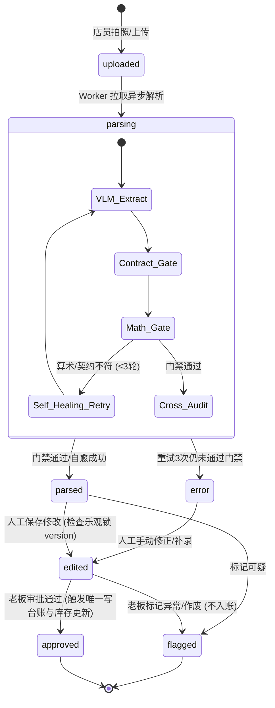
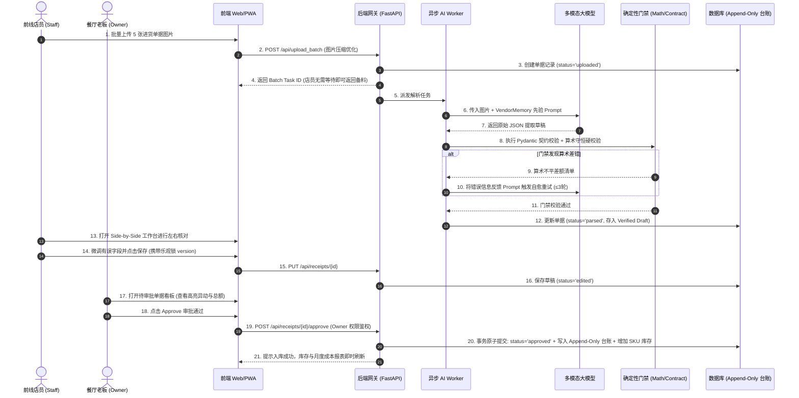

# 00 · AI 产品体系总纲与产品 PRD 主架构 (Master PRD & Architecture)

> **文档定位**：receipt_agent 系统全景产品需求文档（PRD）与架构总纲。基于 `docs/01-产品方案(14步)` 深度提炼，贯穿机会洞察、问题验证、用户画像、指标体系、四层架构、单据状态机与端到端全链路业务流。  
> **版本**：receipt_agent V1.0 生产基线  

---

## 1. 业务背景与战略定位

### 1.1 香港餐饮（F&B）市场痛点与 7 类单据形态
香港拥有超过 18,000 家餐饮场所（茶餐厅、冰室、酒楼、快餐、西餐等）。通过对 50+ 家真实餐厅（深水埗、旺角、湾仔、中环等）的深度走访与实证调研，传统餐饮进货管理存在严重的数字化断层：

```
┌────────────────────────────────────────────────────────────────────────────────────────┐
│                               香港餐饮进货 7 大单据形态                                │
├────────────────────────────────────────────────────────────────────────────────────────┤
│  1. 传统印刷送货单：格式规范但带手写复核勾选/划线涂改                                  │
│  2. 街市手写单：繁体字/草书/粤语俗称，无网格排版，品名数量规格混写                     │
│  3. 电子磅单：生鲜/海鲜/冻肉，含毛重、皮重、净重与折算                                  │
│  4. POS 热敏纸打单：易褪色、折痕遮挡、长条折叠                                        │
│  5. 现场更正单：送货实物与原单不符，在纸单上直接手写涂改                                │
│  6. 信用折让单 (Credit Note / CN)：退货、损耗或价格补偿扣减单                          │
│  7. 月结对账单 (Statement)：月终汇总流水，要求与当月散单逐笔核对                       │
└────────────────────────────────────────────────────────────────────────────────────────┘
```

**8 大核心管理痛点**：
1. **手抄易错**：每日录单耗时 45~60 分钟，人工敲入 Excel 算错率达 8%；
2. **七类单据并存**：排版各异，传统规则与 OCR 模板完全失效；
3. **印章与付款难判**：“已付款 CASH”红色印章/手写签名无法自动转化为付款事实；
4. **月底对账加班**：应付账款对着几十张皱巴巴的散单逐笔核对；
5. **食材涨价后知后觉**：食材偷偷涨价（如菜心从 4.2 → 5.0 元/斤）缺乏实时预警；
6. **库存糊涂账**：进货量 ≠ 实际结余，盘点靠猜，损耗无法量化；
7. **单位迷宫**：司马斤（1斤=16两=600g）、公斤、磅、箱、包、罐混用；
8. **归档备查难**：纸质单据积压成山，历史查单耗费大量精力。

### 1.2 产品定位与核心价值主张
- **产品定位**：以“收据数字化”为切入点的轻量级餐饮进销存与成本管理 SaaS。
- **价值主张**：**让老板放下对账单的操心——拍照核对不到一分钟，账进系统，知成本问一句即可**。

---

## 2. 北极星指标体系 (North Star Metrics Framework)

```
                              【北极星指标】
                    每周每店成功入库单据数 (张/周/店)
                                    │
       ┌────────────────────────────┼────────────────────────────┐
       ▼                            ▼                            ▼
 【业务价值指标】             【产品体验指标】             【AI 感知与算法指标】
 · 单店日均录单耗时: ≤1min     · Side-by-Side 核对完成率: >98%· 关键字段抽取准确率: ≥96%
 · 月结对账时间下降: 85%       · 首屏与图片加载延迟: <1.5s   · 算术门禁拦截准确率: 100%
 · 30天用户留存率: ≥60%       · 乐观锁并发冲突拦截率: 100%  · 大模型计算幻觉率: <0.1%
```

---

## 3. 用户画像与权限角色 (RBAC)

系统针对香港餐饮前线与管理分工，构建 3 级 RBAC 权限体系（[`auth.py`](file:///Users/ethan/Documents/GitHub/receipt-agent-interview/demo/app/auth.py)）：

```
┌────────────────────────────────────────────────────────────────────────────────────────┐
│                                   RBAC 权限角色矩阵                                    │
├──────────────────────┬──────────────────────┬──────────────────────────────────────────┤
│ 角色                 │ 典型用户场景         │ 核心系统权限与边界                       │
├──────────────────────┼──────────────────────┼──────────────────────────────────────────┤
│ **店员 (Staff)**     │ 清晨 6:00 厨房大厨、  │ · 拍照与批量上传单据                     │
│                      │ 水吧雄哥             │ · Side-by-Side 界面查阅与修正草稿        │
│                      │                      │ · [FAIL]  严禁审批入库 / [FAIL]  屏蔽进货单价/财务 │
├──────────────────────┼──────────────────────┼──────────────────────────────────────────┤
│ **老板 (Owner)**     │ 旺角茶餐厅老板阿强、  │ · 单据最终审批 (Approve) —— 独占写台账   │
│                      │ 门店经营决策人       │ · 标记可疑单据 (Flagged)                 │
│                      │                      │ · 查看实时库存、价格异动、部门成本与对账 │
├──────────────────────┼──────────────────────┼──────────────────────────────────────────┤
│ **系统管理员 (Admin)**│ 平台运营/技术支持    │ · 切换多模型引擎 (Opencode/CodeBuddy/API)│
│                      │                      │ · 灰度发布策略配置与 57 张黄金样本集评测 │
└──────────────────────┴──────────────────────┴──────────────────────────────────────────┘
```

---

## 4. 四层总体架构体系 (Four-Tier Architecture)

```
┌────────────────────────────────────────────────────────────────────────────────────────┐
│                        receipt_agent 四层总体架构设计                                  │
├────────────────────────────────────────────────────────────────────────────────────────┤
│                                                                                        │
│  【1. 表现与交互层 (Presentation Layer)】                                              │
│   · 移动端 PWA / 响应式 Web：清晨极简连拍、批量上传、弱光增强                         │
│   · 桌面/Pad 工作台：Side-by-Side 左右原图对照视窗、实时库存、月结对账、成本看板      │
│                                                                                        │
│  【2. 业务与编排层 (Business & Supervisor Layer)】                                     │
│   · 状态机管理：严格白名单驱动单据生命周期转换                                         │
│   · 异步 Job 任务队列：上传与解析解耦，多并发调度                                     │
│   · RBAC 鉴权网关：Owner 独占审批，Staff 专注采集，数据租户硬隔离                      │
│                                                                                        │
│  【3. AI 与确定性算法层 (AI & Algorithmic Layer)】                                     │
│   · 多模态感知：Qwen-VL / MiMo / MiniMax / GPT-4o 端到端抽取                          │
│   · VendorMemory 动态 RAG：基于 Chroma 租户硬隔离的供应商别名、习惯单位先验注入        │
│   · 确定性门禁：Pydantic Schema 强约束 + `math_engine.py` 算术零 Token 硬校验          │
│   · 交叉审核 Agent：双独立模型原图比对，分歧自动 Flag                                  │
│                                                                                        │
│  【4. 持久化与数据层 (Persistence & Ledger Layer)】                                    │
│   · 关系型数据库：PostgreSQL / SQLite（单据表、SKU 表、供应商表、付款表）              │
│   · Append-Only 财务台账 (`inventory_logs`)：每次入库、消耗、损耗只增不可篡改          │
│   · 审计与事件流：`audit_logs` 操作留痕与 Diff 追溯                                    │
│                                                                                        │
└────────────────────────────────────────────────────────────────────────────────────────┘
```

---

## 5. 单据生命周期状态机 (State Machine)



---

## 6. 端到端全链路业务时序流 (Sequence Diagram)



---

## 7. 模块规格说明书索引目录

| 组件文档编号与链接 | 模块名称 | 核心职责 |
| :--- | :--- | :--- |
| **[Spec 01](file:///Users/ethan/Documents/GitHub/receipt-agent-interview/docs/05-AI产品体系与模块Spec/01-组件Spec-收据智能采集与Side-by-Side复核工作台.md)** | **收据采集与复核工作台** | 弱光连拍、Side-by-Side 左右联动、Smart Splitter、乐观锁并发控制 |
| **[Spec 02](file:///Users/ethan/Documents/GitHub/receipt-agent-interview/docs/05-AI产品体系与模块Spec/02-组件Spec-实时库存与SKU生命周期中心.md)** | **实时库存与 SKU 生命周期** | 核心词匹配算法、Append-Only 流水台账、移动加权成本、价格暴涨预警 |
| **[Spec 03](file:///Users/ethan/Documents/GitHub/receipt-agent-interview/docs/05-AI产品体系与模块Spec/03-组件Spec-供应商协同与月结对账引擎.md)** | **供应商协同与月结对账** | 供应商档案别名归一、红蓝印章付款检测、AP 应付账款、月结总单差异核销 |
| **[Spec 04](file:///Users/ethan/Documents/GitHub/receipt-agent-interview/docs/05-AI产品体系与模块Spec/04-组件Spec-部门成本核算与智能分析中心.md)** | **部门成本与智能分析** | 多部门花销自动归集、环比异动分析、AI 对话式查账 Agent (粤语/俗称) |
| **[Spec 05](file:///Users/ethan/Documents/GitHub/receipt-agent-interview/docs/05-AI产品体系与模块Spec/05-组件Spec-三层互不信任AI原生感知引擎与编排管线.md)** | **AI 感知引擎与编排管线** | 三层互不信任架构、Supervisor 线性编排、算术门禁自愈、交叉审核 Agent |
| **[Spec 06](file:///Users/ethan/Documents/GitHub/receipt-agent-interview/docs/05-AI产品体系与模块Spec/06-组件Spec-动态RAG与供应商记忆知识飞轮.md)** | **动态 RAG 与 VendorMemory** | 供应商知识图谱、Chroma 向量沉淀、租户硬隔离、越用越准数据飞轮 |
| **[Spec 07](file:///Users/ethan/Documents/GitHub/receipt-agent-interview/docs/05-AI产品体系与模块Spec/07-组件Spec-AI治理、多模型灰度发布与评测控制台.md)** | **AI 治理与评测控制台** | 引擎统一接口、单据概率/供应商 Hash 灰度分流、57 张黄金样本自动化评测 |
| **[Spec 08](file:///Users/ethan/Documents/GitHub/receipt-agent-interview/docs/05-AI产品体系与模块Spec/08-组件Spec-安全合规、隐私保护与系统运维保障.md)** | **安全合规与运维保障** | 香港 PDPO 合规、多租户物理/逻辑隔离、敏感数据脱敏、不可篡改审计日志 |
| **[Spec 09](file:///Users/ethan/Documents/GitHub/receipt-agent-interview/docs/05-AI产品体系与模块Spec/09-组件Spec-AB测试与全链路灰测分流体系.md)** | **A/B 测试与灰测分流体系** | 四级分流路由、参数物理隔离、统计显著性检验 (p-value)、一键推全与快照回滚 |
| **[Spec 10](file:///Users/ethan/Documents/GitHub/receipt-agent-interview/docs/05-AI产品体系与模块Spec/10-组件Spec-Admin端AB测试与脱敏观测大盘方案.md)** | **Admin A/B 测试脱敏观测大盘** | 数据脱敏中间件、A/B 实时看板、显著性裁决卡片、脱敏抽样下钻与秒级回滚 |
| **[Spec 11](file:///Users/ethan/Documents/GitHub/receipt-agent-interview/docs/05-AI产品体系与模块Spec/11-OCR全链路Gap治理与逐项修复计划.md)** | **OCR 全链路 8 大 Gap 治理计划** | 8 大 Gap 逐轮闭环交付计划、四角色标准工作流、实施历史与可观测留证 |
| **[Spec 12](file:///Users/ethan/Documents/GitHub/receipt-agent-interview/docs/05-AI产品体系与模块Spec/12-阶段性产品方向回顾与架构校准报告.md)** | **阶段性产品方向与架构审查报告** | 对标 FR-1~12 与 NFR-1~6 的产品架构深度校准、全景契合度审查与技术把关 |
| **[Spec 13](file:///Users/ethan/Documents/GitHub/receipt-agent-interview/docs/05-AI产品体系与模块Spec/13-OCR全链路Workflow与架构全景Spec.md)** | **OCR 全链路 Workflow 与架构全景** | 端到端 6 阶段流水线、三层互不信任架构体系、确定性线性编排对比图编排 |
| **[Spec 14](file:///Users/ethan/Documents/GitHub/receipt-agent-interview/docs/05-AI产品体系与模块Spec/14-OCR全链路8大Gap与零散问题深度复盘(STAR模式).md)** | **OCR 8 大 Gap 与零散问题复盘 (STAR)** | 8 大 Gap + iPhone HEIC/EXIF + SKU 流水号剥离的 STAR 深度解构复盘 |
| **[Spec 15](file:///Users/ethan/Documents/GitHub/receipt-agent-interview/docs/05-AI产品体系与模块Spec/15-AI产品经理OCR面试高频攻防与实战金句库.md)** | **AI PM 面试高频攻防与实战金句库** | 面试官必问 4 大核心题、标准回答脚本、降维打击金句与业务深度解析 |
| **[Spec 16](file:///Users/ethan/Documents/GitHub/receipt-agent-interview/docs/05-AI产品体系与模块Spec/16-香港餐饮进货单OCR全链路与面试备战总览.md)** | **OCR 全链路与面试备战总览** | 全模块文档矩阵导航、核心技术与业务成果一览表、面试通关学习路径 |
