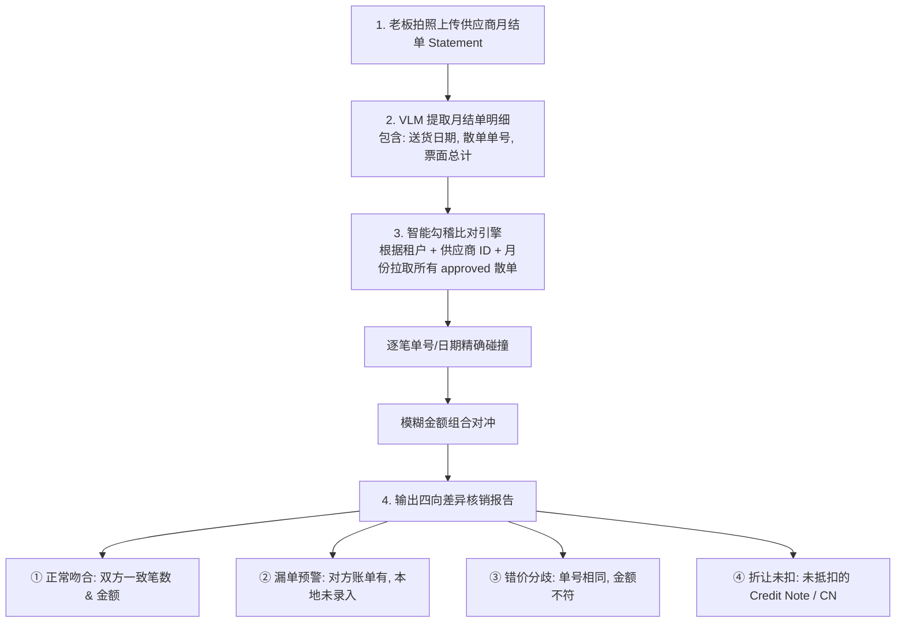

# 03 · 组件 Spec · 供应商协同与月结对账引擎

> **模块定位**：餐饮供应链连接与资金流出把关中枢。承载供应商全景档案建立、多称谓别名归一、红蓝“已付款/CASH”印章智能核销、应付账款（AP）全生命周期台账，以及核心的 **月结对账单 (Statement) 自动勾稽比对引擎**。  
> **对标 14 步方案**：`step1-机会洞察`、`step8-产品方案`、`step11-PRD定稿`。  
> **实现代码**：[`api_suppliers.py`](../../../demo/app/api_suppliers.py)、[`templates/index.html`](../../../demo/templates/index.html) (Tab 3)  

---

## 1. 业务场景与核心痛点

- **供应商别名泛滥**：
  - 一家“新记蔬菜批发”，在手写单上可能写“新记”、“新记菜栏”、“新记（湾仔分行）”，人工建档极易造成应付账款分散。
- **付款印章事实遗漏**：
  - 香港街市许多单据为“送货即付现”，司机在单据上盖红色“现金收讫”或“PAID”印章。传统系统无法识别印章语义，导致老板重复付款或漏记现金账。
- **月底对账苦不堪言**：
  - 供应商月底寄来一张总账单（Statement，汇总当月几十笔送货金额），老板需要在一大盒纸质散单中一张张挑出来算总和，常因漏单、错价、未扣除折让单（Credit Note / CN）产生账目纠纷。

---

## 2. 核心功能规格 (Functional Spec)

### 2.1 供应商数字档案与别名智能归一
1. **档案信息沉淀**：
   - 记录供应商全称、联系人、电话、主营品类（蔬菜/肉类/粮油/餐具等）、默认账期（现结 / 周结 / 月结 30 天 / 月结 60 天）。
2. **多别名一键合并 (Supplier Merge)**：
   - 支持将历史多个分散供应商档案一键合并为主档案，系统自动将所有历史单据、应付流水与 VendorMemory 别名知识图谱迁移至主供应商。

---

### 2.2 红蓝印章/手写付款状态自动识别与核销
- **多模态印章检测**：
  - VLM 提取时专门扫描红色/蓝色椭圆章、方章及手写“已付 / CASH / 支票号 / FPS”等字样；
  - 命中印章时，单据 `is_paid` 自动预填为 `True`，付款方式标记为 `cash` 或 `fps`；
- **审批联动付款台账**：
  - 当带有已付款标记的单据经 Owner Approve 时，系统在写入进货台账的同时，**自动生成一条已支付的付款流水**，应付未结余额即时冲销为 0。

---

### 2.3 智能月结对账引擎 (Statement Reconciliation Engine)



#### 四向差异判定规则（4-Way Discrepancy Rules）：
1. **完全吻合 (Matched)**：单号、日期与金额完全一致，标记为可一键批量核销；
2. **本地缺漏 (Missing Inbound)**：供应商账单列出的单据在本地系统中不存在，高亮提示“可能存在漏拍照或货未送到”；
3. **金额分歧 (Price Discrepancy)**：单号匹配但金额存在差额（如因现场更正或单价调增），展示双方金额差额；
4. **未扣折让 (Unapplied CN)**：自动检索该供应商当月未关联核销的 Credit Note（退货单/折让单），提示从应付款中抵扣。

---

## 3. 数据库表结构设计 (Technical Spec)

### 3.1 `suppliers`（供应商档案表）
```sql
CREATE TABLE suppliers (
    supplier_id VARCHAR(64) PRIMARY KEY,
    tenant_id VARCHAR(64) NOT NULL,
    supplier_name VARCHAR(128) NOT NULL,
    category VARCHAR(64),                  -- 蔬菜/肉类/海鲜/水吧/杂货
    payment_terms VARCHAR(32) DEFAULT 'monthly_30', -- cash / weekly / monthly_30
    contact_phone VARCHAR(64),
    aliases JSONB DEFAULT '[]',            -- 别名列表 ["新记", "新记菜栏"]
    outstanding_balance NUMERIC(12, 2) DEFAULT 0.00, -- 当前未结应付余额
    created_at TIMESTAMP DEFAULT CURRENT_TIMESTAMP
);
```

### 3.2 `supplier_payments`（付款流水表）
```sql
CREATE TABLE supplier_payments (
    payment_id VARCHAR(64) PRIMARY KEY,
    tenant_id VARCHAR(64) NOT NULL,
    supplier_id VARCHAR(64) NOT NULL,
    receipt_id VARCHAR(64),                -- 关联单据 ID (若为单笔结款)
    amount NUMERIC(12, 2) NOT NULL,
    payment_method VARCHAR(32) NOT NULL,   -- cash / fps / cheque / bank_transfer
    payment_date DATE NOT NULL,
    status VARCHAR(32) DEFAULT 'completed',-- completed / pending
    created_at TIMESTAMP DEFAULT CURRENT_TIMESTAMP
);
```

---

## 4. API 接口契约一览

| 方法 | 路径 | 入参 | 返回 / 行为 | 权限 |
| :--- | :--- | :--- | :--- | :--- |
| `GET` | `/api/suppliers` | `search, page` | 获取供应商列表、各家当前应付账款未结余额 | Staff / Owner |
| `POST` | `/api/suppliers` | `SupplierCreatePayload` | 新建供应商档案 | **Owner 独占** |
| `POST` | `/api/suppliers/merge` | `source_id, target_id` | 合并供应商档案与别名映射库 | **Owner 独占** |
| `POST` | `/api/suppliers/pay` | `supplier_id, amount, method, receipts` | 登记付款流水，批量核销对应单据应付余额 | **Owner 独占** |
| `POST` | `/api/suppliers/reconcile` | `supplier_id, statement_file / json` | 上传月结单，执行智能勾稽比对并输出差异报告 | **Owner 独占** |
