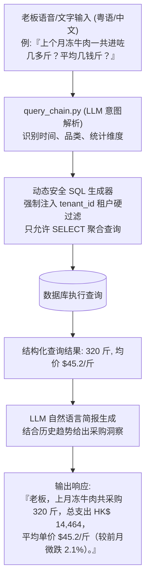

# 04 · 组件 Spec · 部门成本核算与智能分析中心

> **模块定位**：餐饮经营管理者的决策大脑。承载进货成本按部门/成本中心自动拆解归集、月度采购支出趋势下钻分析、TOP 采购品类环比波动监控，以及基于自然语言对话（支持粤语/俗称）的 **AI 智能查账与经营决策 Agent**。  
> **对标 14 步方案**：`step4-用户画像`、`step8-产品方案`、`step11-PRD定稿`。  
> **实现代码**：[`api_finance.py`](../../../demo/app/api_finance.py)、[`chains/query_chain.py`](../../../demo/app/chains/query_chain.py)、[`templates/index.html`](../../../demo/templates/index.html) (Tab 4)  

---

## 1. 业务场景与用户痛点

- **成本中心混杂，难以精准核算毛利**：
  - 一张综合批发单据上往往同时混杂着厨房食材（排骨、生抽）、水吧饮品（黑白淡奶、红茶包）和楼面清洁耗材（洗洁精、垃圾袋）。
  - 传统记账直接按整单总额记在“餐饮进货”，无法得知厨房出菜成本与水吧出杯成本的真实毛利比例。
- **外聘会计做账周期长**：
  - 兼职会计 Mary 每月仅来店里 1-2 天，需对着成沓纸质单据手工录入凭证，单据丢失或字迹不清时沟通成本极高。
- **老板想查数据门槛高**：
  - 老板想知道“上个月冻牛肉一共进了多少斤？平均每斤几多钱？”，传统软件需要层层点击报表、配置筛选器，耗时费力。

---

## 2. 核心功能规格 (Functional Spec)

### 2.1 多维度成本中心自动归集 (Department Allocation)
系统在单据审批入库时，根据 SKU 归属品类或行内智能分类规则，自动将花销分摊至各成本中心：

```
┌────────────────────────────────────────────────────────────────────────────────────────┐
│                               四大核心成本中心归集体系                                 │
├──────────────┬──────────────────────────┬──────────────────────────────────────────────┤
│ 成本中心代码 │ 部门名称                 │ 包含典型食材与品类                           │
├──────────────┼──────────────────────────┼──────────────────────────────────────────────┤
│ `kitchen`    │ **后厨部 (Kitchen)**     │ 蔬菜、肉类、海鲜、禽蛋、粮油调味、干货       │
├──────────────┼──────────────────────────┼──────────────────────────────────────────────┤
│ `bar`        │ **水吧部 (Bar / Drinks)**│ 黑白淡奶、炼奶、茶餐厅专用红茶、咖啡豆、糖浆 │
├──────────────┼──────────────────────────┼──────────────────────────────────────────────┤
│ `floor`      │ **楼面部 (Floor)**       │ 一次性餐具、餐巾纸、吸管、外卖打包盒、打包袋 │
├──────────────┼──────────────────────────┼──────────────────────────────────────────────┤
│ `cleaning`   │ **清洁与耗材 (Cleaning)**│ 洗洁精、漂白水、洗手液、抹布、垃圾袋、拖把   │
└──────────────┴──────────────────────────┴──────────────────────────────────────────────┘
```

---

### 2.2 月度经营成本看板与环比异动分析

1. **宏观支出趋势图**：
   - 展现过去 12 个月进货成本总额柱状图，叠加各部门花销占比堆叠图；
2. **品类花销 TOP 10 榜单与环比波动**：
   - 自动计算本月采购金额前 10 位食材品类（如冻肉类、蔬菜类、乳制品类），并与上月进行环比比对：
     $$\text{环比变动} = \frac{\text{本月花销} - \text{上月花销}}{\text{上月花销}} \times 100\%$$
   - 对涨幅超过 $+20\%$ 的品类高亮显示，并自动拆解归因为“采购量增加导致”还是“供应商单价上涨导致”。

---

### 2.3 AI 智能查账与经营决策 Agent (`query_chain.py`)

系统内置针对香港餐饮口语深度优化的自然语言查账 Agent：



---

### 2.4 会计专属数据导出 (Accounting Export)
- 提供符合香港财务记账规范的月度进货凭证报表导出功能；
- 支持 **CSV / Excel** 格式明细导出（包含单据日期、供应商、单号、发票代码、部门科目、金额、付款状态、原图追溯链接）。

---

## 3. API 接口契约一览

| 方法 | 路径 | 入参 | 返回 / 行为 | 权限 |
| :--- | :--- | :--- | :--- | :--- |
| `GET` | `/api/finance/monthly_report` | `year_month: str` | 返回指定月份总支出、部门拆解占比、TOP 品类花销 | **Owner 独占** |
| `GET` | `/api/finance/department_costs`| `start_date, end_date` | 多部门成本走势与对比明细数据 | **Owner 独占** |
| `POST` | `/api/finance/query_agent` | `query: str` | 自然语言智能查账，返回文字答复与对应图表数据 | **Owner 独占** |
| `GET` | `/api/finance/export_csv` | `year_month: str` | 导出供会计使用的标准月度进货凭证 CSV 文件 | **Owner 独占** |
