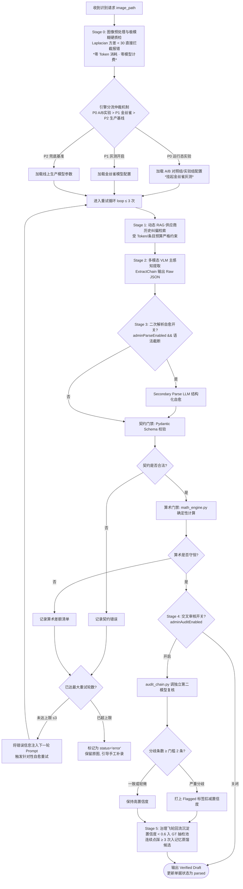

# 05 · 组件 Spec · 三层互不信任 AI 原生感知引擎与编排管线

> **模块定位**：系统 AI 感知与算法安全核心中枢。承载多模态 VLM 感知抽取、Pydantic 契约门禁、确定性代码算术硬校验、双模型交叉审核 Agent，以及“确定性线性编排 + 自愈重试阶梯”管线。  
> **对标 14 步方案**：`step6-技术可行性`、`step9-AI技术方案`、`step10-评审对齐`、`step12-测试验收`。  
> **实现代码**：[`chains/supervisor.py`](../../../demo/app/chains/supervisor.py)、[`chains/extract_chain.py`](../../../demo/app/chains/extract_chain.py)、[`chains/audit_chain.py`](../../../demo/app/chains/audit_chain.py)、[`services/contract.py`](../../../demo/app/services/contract.py)、[`services/math_engine.py`](../../../demo/app/services/math_engine.py)  

---

## 1. 架构哲学：三层互不信任体系 (3-Tier Zero-Trust)

在涉及真金白银的餐饮财务与库存场景中，**“概率模型绝不能单独决定账目”**。系统确立了如下严密防线：

```
┌────────────────────────────────────────────────────────────────────────────────────────┐
│                     receipt_agent 三层互不信任安全架构体系 (Zero-Trust)                │
├────────────────────────────────────────────────────────────────────────────────────────┤
│                                                                                        │
│   【第 1 层：多模态 VLM 概率感知层 (Probabilistic Perception)】                         │
│    · 执行者：Qwen3-VL / GLM-4.5V / 第三方中转与公益站 API                               │
│    · 职责：像素级空间布局理解、手写字与繁体识别、红色已付款印章检测                   │
│    · 纪律：允许自报置信度，但输出全部视为“不可信草稿”，绝不直接写库                   │
│                                                                                        │
│                                          │ （输出 Raw JSON 草稿）                      │
│                                          ▼                                             │
│   【第 2 层：确定性代码契约与算术门禁层 (Deterministic Gate)】                          │
│    · 执行者：Pydantic Schema (contract.py) + Canary Token 验签 + math_engine.py         │
│    · 职责：① 验证 Canary Token 防上游篡改；② 阻断 Schema 外部字段；③ 强制算术勾稽守恒 │
│    · 纪律：校验并提供建议，不静默改写；发现不一致反馈至 Prompt 触发自愈重试            │
│                                                                                        │
│                                          │ （输出 Verified Draft）                     │
│                                          ▼                                             │
│   【第 3 层：人类背书与可信持久化层 (Human-In-The-Loop & Ledger)】                      │
│    · 执行者：前线店员/老板 (Side-by-Side 核对) + 乐观锁 (Version 409) + Approve 按钮   │
│    · 职责：左右原图比对确认；老板点击 Approve 触发唯一的台账写入                       │
│    · 纪律：只有 approve 状态能写入 Append-Only `InventoryLog`；修改必须留痕冲销        │
│                                                                                        │
└────────────────────────────────────────────────────────────────────────────────────────┘
```

---

## 2. 识别管线编排与自愈重试阶梯 ([`supervisor.py`](../../../demo/app/chains/supervisor.py))

### 2.1 为什么采用“确定性线性编排”而非图编排 Agent
进货单据的识别流程在本质上是 **“确定性的流水线 + 局部的错误反馈自愈”**。使用纯 Python 函数实现线性编排，相较于复杂的自主 Agent 图框架具有极大的工程优势：
- **完全可解释、可单测**；
- **消除不可控死循环与 Token 意外爆炸**；
- **状态流转确定，排查故障秒级定界**。

### 2.2 编排流程与多阶段协同全景图



### 2.3 引擎配置规则优先级与多阶段协同仲裁

当系统在“系统与引擎配置”中同时启用多项配置项时，底层运行管线遵循严格的层次与时序关系：

1. **流量分流优先级仲裁 (Traffic Hierarchy)**：
   - **P0（最高优先级 · 运行态 A/B 科学实验）**：只要存在处于运行态（`running`）的实验，系统强制由该实验主导分配（如 50:50 划分 Control/Treatment），并**强制挂起金丝雀灰测**，防止双重概率叠加造成样本群体漂移与因果推断失真；
   - **P1（次高优先级 · 金丝雀灰度发布）**：在无运行态实验且开启灰测时生效，按单据概率（`receipt`）或供应商哈希（`supplier`）进行渐进放量；
   - **P2（基线兜底 · 常规生产引擎）**：未命中任何实验或灰度规则时，走稳定版本常规生产引擎。

2. **单据生命周期 6 阶段时序矩阵 (Execution Stages)**：
   - **Stage 0 预处理与极模糊质检**：优先级最高，在任何 LLM API 调用前执行。Laplacian 方差 < 30 立即阻断，0 Token 成本；
   - **Stage 1 动态 RAG 检索**：推理前受 Token/条目预算限制提取供应商纠偏先验；
   - **Stage 2 多模态 VLM 主识别**：由 P0~P2 仲裁出的引擎进行核心感知抽取；
   - **Stage 3 二次解析自愈**：主输出出现语法截断时条件触发；
   - **Stage 4 交叉审核复核**：双盲独立复核，严重分歧 $\ge 2$ 条打标预警；
   - **Stage 5 治理飞轮回流**：低置信度（< 0.6）自动沉淀至 GT 抽检池，连续点踩（$\ge 3$ 次）流转至经验蒸馏池。


---

## 3. 核心门禁组件技术规格

### 3.1 Pydantic 契约门禁 ([`services/contract.py`](../../../demo/app/services/contract.py))
- **`extra = "forbid"` 强约束**：杜绝大模型在 JSON 中自由发挥注入多余字段；
- **类型与格式门禁**：
  - 日期格式强制正则校验 `^\d{4}-\d{2}-\d{2}$`；
  - 数量 `quantity > 0`，单价 `unit_price >= 0`；
  - 拒绝 `NaN`、`Infinity` 或空明细列表。

### 3.2 确定性算术校验引擎 ([`services/math_engine.py`](../../../demo/app/services/math_engine.py))
**算术计算坚决不消耗 LLM Token，全部由 Python 确定性代码执行**：
1. **明细行乘法校验**：
   $$|\text{quantity} \times \text{unit\_price} - \text{amount}| \le 0.05$$
2. **整单总额求和校验**：
   $$\left|\sum_{i=1}^{n} \text{amount}_i - \text{total\_amount}\right| \le 0.05$$
3. **建议值生成而非静默覆盖**：
   - 若校验不通过，引擎计算出推荐修正值并生成差额说明（如“第 2 行 10 × 130 票面为 130，计算建议为 1300”），将该信息注入重试 Prompt 或在前端 UI 呈现。

---

### 3.3 双模型交叉审核 Agent ([`chains/audit_chain.py`](../../../demo/app/chains/audit_chain.py))
- **设计原理**：不同大模型家族（如 Qwen 系列 vs GPT 系列 vs MiniMax 系列）具有不同的空间感知盲点与识别偏置。
- **审核逻辑**：
  - 主模型完成初次提取后，审核 Agent 调用第二模型对照原图对**供应商名称、总金额、关键明细**进行独立二次审验；
  - 若两模型一致，置信度标记为高；若两模型发生分歧，系统**绝不武断裁决，而是在前端明细行打上 Flag 标记**，将争议项置顶提醒人类复核。
