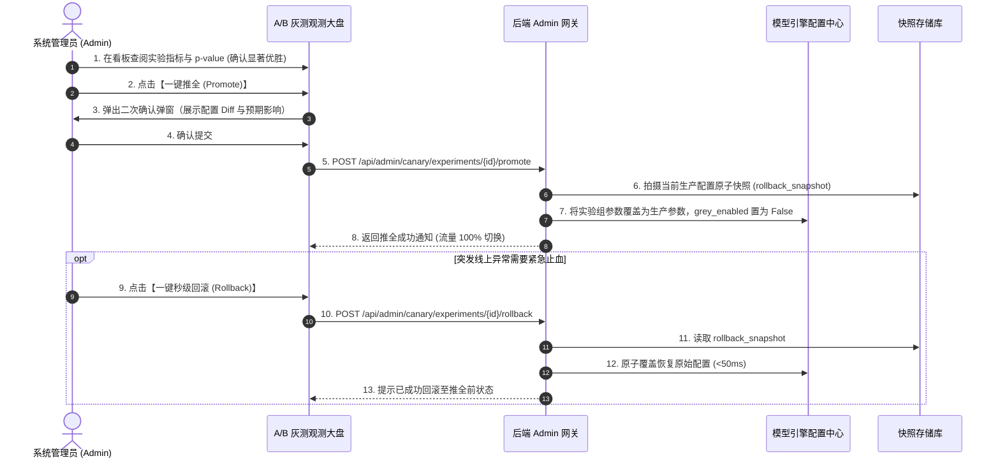

# 10 · 组件 Spec · Admin 端 A/B 测试与数据脱敏观测大盘方案

> **模块定位**：面向平台管理员（Admin）与算法工程师的实验观测与决策控制台。在严格遵循香港《个人资料（私隐）条例》(PDPO) 与多租户商业数据隔离的前提下，提供**端到端数据脱敏（Data Desensitization/Masking）、A/B 实验组指标实时对比、统计学显著性判定、单据抽样下钻以及一键推全/秒级回滚控制台**。  
> **对标 14 步方案**：`step7-指标体系`、`step8-产品方案`、`step9-AI技术方案`、`step13-安全合规`、`step14-上线迭代`。  
> **实现代码**：[`app/api_admin.py`](file:///Users/ethan/Documents/GitHub/receipt-agent-interview/demo/app/api_admin.py)、[`ai_registry/canary/`](file:///Users/ethan/Documents/GitHub/receipt-agent-interview/ai_registry/canary/)、`templates/index.html` (Admin A/B 实验大盘视图)  

---

## 1. 业务背景与隐私安全约束

### 1.1 为什么 Admin 观测必须经过严格脱敏？
在多租户 SaaS 架构与餐饮供应链场景下，系统管理员和算法工程师主要关注**模型泛化能力、抽取准度、门禁拦截率与 Token 成本**，但严禁侵犯门店商家的私有商业秘密与客户隐私：

```
┌────────────────────────────────────────────────────────────────────────────────────────┐
│                                Admin 观测权限与隐私红线                                │
├──────────────────────────────────────────┬─────────────────────────────────────────────┤
│ [FAIL]  严禁明文暴露给 Admin 的敏感数据      │ [PASS]  允许并必须向 Admin 展示的算法观测数据    │
├──────────────────────────────────────────┼─────────────────────────────────────────────┤
│ · 真实供应商全称与私有协议底价           │ · 算法抽取准确率 (Accuracy) 与 CER 字符错误率│
│ · 供应商联系人电话、私人手机号、银行账号 │ · 算术门禁拦截率与自愈重试轮数 (≤3轮)       │
│ · 带有真实公章、签名的原始高清图片切片   │ · 店员人工复核修改率 (Edit Rate) 与审批时延 │
│ · 单店月度真实总利润与经营涉税金额       │ · 双模型交叉审核分歧率 (Flag Rate)          │
│ · 顾客/店员香港身份证号 (HKID)           │ · 统计学 p-value 显著性与 Z 分数决策建议    │
└──────────────────────────────────────────┴─────────────────────────────────────────────┘
```

---

## 2. 数据脱敏引擎设计规范 (Data Desensitization Engine)

系统在数据从服务端向 Admin 端输出前，内置流水线式 **脱敏中间件 (Data Masking Pipeline)**：

```mermaid
flowchart LR
    RawDB[(原始单据与实验数据)] --> MaskPipe[脱敏处理管道 DataMasker]
    
    MaskPipe --> M1[1. 供应商匿名化: 泛化为类别 + 掩码 ID<br/>例: 新记蔬菜批发 -> 蔬菜供应商_A89]
    MaskPipe --> M2[2. 金额与价格指数化: 隐藏绝对金额<br/>例: HK$ 1343.0 -> HK$ 1,3**.*0 或 涨跌百分比]
    MaskPipe --> M3[3. 敏感 PII 抹除: 正则屏蔽<br/>例: 手机号/身份证 -> [HKID_MASKED]]
    MaskPipe --> M4[4. 图片局部马赛克: 自动遮蔽<br/>印章/手写签名/电话区域]
    
    M1 & M2 & M3 & M4 --> AdminUI[Admin A/B 观测控制台]
```

#### 脱敏前后字段映射字典（Masking Dictionary）：
| 字段类型 | 原始生产数据 (Raw Data) | 脱敏后输出给 Admin (Masked Data) |
| :--- | :--- | :--- |
| **供应商名称** | `新记蔬菜批发（湾仔分行）` | `蔬菜批发商_#V092` |
| **单据单号** | `NO.883921008` | `NO.8839****` |
| **单品价格** | `$8.50 / 斤` | `价格指数: 100 (涨跌: +12%)` 或 `$8.**` |
| **整单总计** | `HK$ 3,450.00` | `HK$ 3,4**.*0` |
| **联系人电话** | `9123 4567` | `91****67` |
| **香港身份证** | `A123456(7)` | `[HKID_MASKED]` |

---

## 3. 前端 A/B 灰测观测大盘 UI/UX 交互设计方案

在系统前端为 Admin 角色提供独立的 **「A/B 实验与灰测观测大盘 (Canary & Experiment Console)」**。

```
┌────────────────────────────────────────────────────────────────────────────────────────────────────────┐
│                        receipt_agent A/B 实验与灰测观测大盘 (Admin Dashboard)                          │
├────────────────────────────────────────────────────────────────────────────────────────────────────────┤
│ 【实验总览与流量路由卡片】                                                                             │
│  当前实验: [exp_202608_hk_vlm_v110 (香港街市手写与印章专项灰测)  ▼]   状态: [PASS]  RUNNING (第 6 天)        │
│  假设描述: 引入 v1_1_0_hk 提示词与 Qwen3-VL 视觉增强后，手写单准度提升 >5%，人工修改率下降 >50%      │
│  分流模式: (●) 供应商 Hash (确定性)  (○) 单据随机抽样    当前灰度比例: [ 30% ] ──●───────── [保存调权]│
├────────────────────────────────────────────────────────────────────────────────────────────────────────┤
│ 【A/B 对照指标实时看板与显著性裁决 (Variant Comparison)】                                              │
│  ┌─────────────────────────────────┬─────────────────────────────────┬──────────────────────────────┐ │
│  │ 对照组 A (线上常规组: VLM Base) │ 实验组 B (Canary 灰测组: VLM HK)│ 指标变动 (Delta / Lift)      │ │
│  ├─────────────────────────────────┼─────────────────────────────────┼──────────────────────────────┤ │
│  │ 样本量: 150 单 (70% 流量)       │ 样本量: 150 单 (30% 流量)       │ 样本均衡 (N_A = N_B)         │ │
│  │ 字段提取准确率: 88.0%           │ 字段提取准确率: 95.5%           │ [PASS]  +7.5pp (相对提升 +8.52%)   │ │
│  │ 人工复核修改率: 28.5%           │ 人工复核修改率: 6.2%            │ [PASS]  -22.3pp (大幅减负 78%)    │ │
│  │ 算术门禁重试率: 18.0%           │ 算术门禁重试率: 2.5%            │ [PASS]  -15.5pp (一次通过率 97.5%)│ │
│  │ 平均解析时延: 36.5s             │ 平均解析时延: 31.0s             │ [PASS]  -5.5s (效率提升 15%)      │ │
│  │ 单据平均 Token: 620 tokens      │ 单据平均 Token: 780 tokens      │ [WARN]  +160 tokens (在预算内)    │ │
│  └─────────────────────────────────┴─────────────────────────────────┴──────────────────────────────┘ │
│  【统计学显著性决策卡片】:                                                                              │
│   双比例 Z 检验: Z = 2.36 | p-value = 0.05 | 置信区间: [95% CI: +3.2% ~ +11.8%]                        │
│    决策建议: 实验组 B 在准确率与修改率上均达到显著优胜水平 (p <= 0.05)！                             │
├────────────────────────────────────────────────────────────────────────────────────────────────────────┤
│ 【脱敏单据抽样对比视窗 (Desensitized Sample Inspector)】                                               │
│  ┌── 抽样单号 #S-1049 (手写街市单) ──────────────────────────────────────────────────────────────────┐ │
│  │ 【对照组 A 提取】: 品名: 菜心苗 / 数量: 20 / 单价: 8.0 ([FAIL]  误读) / 小计: 160 ([FAIL]  算术被打回)     │ │
│  │ 【实验组 B 提取】: 品名: 菜心苗 / 数量: 20 / 单价: 8.5 ([PASS]  精准识别) / 小计: 170 / 印章: CASH     │ │
│  │ 【脱敏原图切片】: [  菜心苗 20斤 × $8.5 = 170 (签名已脱敏) ]                                  │ │
│  └───────────────────────────────────────────────────────────────────────────────────────────────────┘ │
├────────────────────────────────────────────────────────────────────────────────────────────────────────┤
│ 【操作与风控控制台】                                                                                   │
│  [  一键推全 (Promote to 100%) ]      [ [WARN]  终止实验 (Abort) ]      [  一键秒级回滚 (Rollback) ]   │
└────────────────────────────────────────────────────────────────────────────────────────────────────────┘
```

---

## 4. 后端 API 接口契约一览

| 方法 | 路径 | 入参 | 返回内容 (全部经过脱敏过滤) | 鉴权 |
| :--- | :--- | :--- | :--- | :--- |
| `GET` | `/api/admin/canary/experiments` | 无 | 获取所有实验列表、当前状态与流量分配比例 | **Admin 独占** |
| `GET` | `/api/admin/canary/experiments/{id}/stats` | `id: str` | 对照组 vs 实验组指标汇总、Delta、p-value 及统计结论 | **Admin 独占** |
| `GET` | `/api/admin/canary/experiments/{id}/samples` | `page: int, limit: int` | 获取脱敏后的单据抽样对比列表（含脱敏切片与两组结果） | **Admin 独占** |
| `POST` | `/api/admin/canary/experiments/{id}/traffic` | `percent: int, mode: str` | 动态无级调整灰度比例 (0~100%) 与分流策略 | **Admin 独占** |
| `POST` | `/api/admin/canary/experiments/{id}/promote` | `id: str` | **一键推全**：自动备份当前配置快照并将灰测组推至生产 | **Admin 独占** |
| `POST` | `/api/admin/canary/experiments/{id}/rollback` | 无 | **秒级回滚**：从最近一次快照恢复生产参数 (<50ms) | **Admin 独占** |

---

## 5. 推全与回滚安全工作流 (Safety Workflow)


