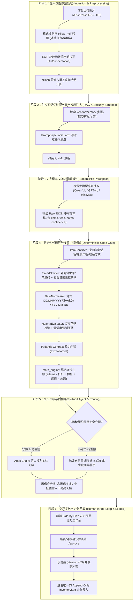

# 13 · 组件 Spec：OCR 全链路工作流与架构全景 (End-to-End OCR Architecture & Workflow)

> **文档定位**：面向 AI 产品经理/技术面试的 OCR 核心架构与端到端工作流解析。  
> **核心思想**：三层互不信任体系 (3-Tier Zero-Trust)、双重保险防御（Prompt 结构化感知 + Python 确定性硬门禁）、闭环自愈与人机协同。

---

## 一、OCR 全链路端到端工作流 (End-to-End Workflow)



---

## 二、架构哲学：三层互不信任体系 (3-Tier Zero-Trust)

在涉及真金白银的餐饮供应链、库存台账与月结对账场景中，**“概率模型绝不能单独决定账目”**。

```
┌────────────────────────────────────────────────────────────────────────────────────────┐
│                     receipt_agent 三层互不信任安全架构体系 (Zero-Trust)                │
├────────────────────────────────────────────────────────────────────────────────────────┤
│                                                                                        │
│   【第 1 层：多模态 VLM 概率感知层 (Probabilistic Perception)】                         │
│    · 执行者：Qwen3-VL / MiMo-V2.5 / MiniMax-M3 / GPT-4o                                │
│    · 职责：像素级空间布局理解、手写字与繁体识别、红色已付款印章检测                   │
│    · 纪律：允许自报置信度，但输出全部视为“不可信草稿”，绝不直接写库                   │
│                                                                                        │
│                                          │ （输出 Raw JSON 草稿）                      │
│                                          ▼                                             │
│   【第 2 层：确定性代码契约与算术门禁层 (Deterministic Gate)】                          │
│    · 执行者：Pydantic Schema (contract.py) + 纯 Python 算术引擎 (math_engine.py)       │
│    · 职责：① 阻断 Schema 外部字段；② 强制 `数量 × 单价 = 金额` 与 `∑明细 = 总额` 守恒 │
│    · 纪律：校验并提供建议，不静默改写；发现不一致反馈至 Prompt 触发自愈重试            │
│                                                                                        │
│                                          │ （输出 Verified Draft）                     │
│                                          ▼                                             │
│   【第 3 层：人类背书与可信持久化层 (Human-In-The-Loop & Ledger)】                      │
│    · 执行者：前线店员/老板 (Side-by-Side 核对) + 乐观锁 (Version 409) + Approve 按钮   │
│    · 职责：左右原图比对确认；老板点击 Approve 触发唯一的台账写入                       │
│    · 纪律：只有 approve 状态能写入 Append-Only `InventoryLog`；修改必须留痕冲销        │
│                                                                                        │
└────────────────────────────────────────────────────────────────────────────────────────┘
```

---

## 三、确定性线性编排对比自主图编排 (Why Deterministic Linear Pipeline?)

### 面试核心论点：
- **为什么不使用 AutoGPT / LangGraph 等自主循环图 Agent？**
  1. **状态可解释性与单测保障**：餐饮进货业务是高吞吐、强确定性的流水线，线性流水线每一阶段的输入输出完全可验证、可写单元测试。
  2. **消除不可控死循环与 Token 意外爆炸**：自主图 Agent 在遇到模糊手写单时容易陷入发散思考或无限反思，导致单据识别耗时突破 2 分钟、API 成本失控。
  3. **线上故障秒级定界**：线性编排中的每个 Gate（契约门禁、算术门禁、清洗工具）职责单一，出错时能立刻定位是模型感知层（S3）还是代码后处理层（S4）的问题。
