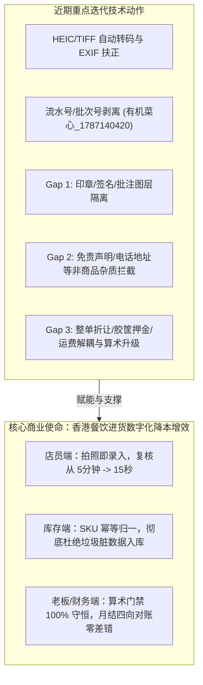

# 阶段性产品方向回顾与架构校准报告 (Product Retrospective)

> **评审角色**：AI 首席产品经理 (Lead AI PM)  
> **评审周期**：Gap 1 至 Gap 3 治理与核心感知增强阶段 (2026-08-21)  
> **评审目的**：全面审视近期工程技术迭代与 Prompt/规则改动，严格对照 PRD 业务需求（FR-1 至 FR-12）、系统非功能指标（NFR-1 至 NFR-6）与香港餐饮商户实际作业场景，确保系统演进**绝对没有偏离核心产品定位与商业价值方向**。

---

## 一、核心产品定位与价值主张再对齐



### 1. 核心用户画像与作业场景映射
- **店员/厨师 (Staff)**：后厨湿手、光线昏暗、手机随手拍（包含 HEIC 格式与倾斜拍摄），要求**上传即见图、AI 预填准、表单无脏项、按键少点**；
- **餐厅老板/店长 (Owner)**：关注**真实进货成本、价格波动异常预警、库存台账真实性**，要求**不能因为识别多出一行「现金收讫」或「折让 -$20」而导致库存虚增或算术告警误报**；
- **财务/审计 (Auditor)**：关注**月末与供应商月结账单（Statement）交叉勾稽**，要求**每张单据的明细、折扣、押金、运费边界清晰，金额求和绝对守恒**。

---

## 二、近期工程变动与 PRD 需求矩阵对齐审查

| 技术改造项 | 涉及技术组件 | 对应 PRD 需求 | 产品合规性评估 | 是否偏离方向 |
| :--- | :--- | :--- | :--- | :--- |
| **HEIC/TIFF 自动转码** | `api_receipts.py`<br>`main.js` | **FR-2 (跨格式摄入)**<br>**NFR-3 (可用性)** | 彻底消除 iPhone 拍摄直接上传导致的黑屏与无法调整问题，符合后厨实际操作体验。 | **完全对齐**<br>(提升易用性) |
| **Sider 当前查看状态标识** | `main.js`<br>`style.css` | **FR-4 (批次复核)** | 增加 `[当前查看]` 标签与高亮，避免店员批量多图时选错单据。 | **完全对齐**<br>(提升复核效率) |
| **流水号/批次号剥离** | `v1_2_0_sku_clean.py`<br>`SmartSplitterTool` | **FR-7 (品名纯净化)**<br>**FR-11 (SKU 归一)** | 将 `有机菜心_1787140420` 剥离为纯净品名，避免同一种菜每次进货都创建新 SKU 导致库存碎片化。 | **核心突破**<br>(守住库存生命线) |
| **Gap 1: 印章/签名图层隔离** | `v1_2_1_anti_stamp.py`<br>`ItemSanitizerTool` | **FR-5 (付款标记检测)**<br>**FR-1 (明细抽取)** | 将红色印章与签名转化为单据级付款状态（`payment_mark: stamp`），坚决不污染商品行。 | **完全对齐**<br>(杜绝垃圾 SKU) |
| **Gap 2: 免责声明/地址拦截** | `v1_2_2_anti_disclaimer.py`<br>`ItemSanitizerTool` | **FR-1 (明细纯净性)**<br>**FR-3 (表格语义)** | 过滤「货物出门恕不退换」、「TEL: 23881234」等非商品杂质，保留「九龙酱油」等合法地名商品。 | **完全对齐**<br>(保护数据纯净) |
| **Gap 3: 折让/押金/运费解耦** | `v1_2_3_anti_fee.py`<br>`math_engine.py` | **FR-6 (算术守恒门禁)**<br>**FR-12 (财务勾稽)** | 建立 $\sum \text{items} - \text{折让} + \text{押金} + \text{运费} = \text{总额}$ 结构化模型，消灭算术误报。 | **架构升级**<br>(打通财务级对账) |

---

## 三、关键产品原则与业务边界复核 (Sanity Check)

### 1. 「零静默改写」原则是否被破坏？
- **审查结论：否（严格遵守）**。
- **依据**：
  - 算术门禁仅在数据不满足守恒公式时生成警示描述（`problems`），绝不私自篡改商户原始填报的总额或单价；
  - 即使发现折让或押金，也是通过显式字段（`discount_amount`、`deposit_amount`）结构化呈现给用户复核确认。

### 2. 「双重保险（VLM + 确定性代码）」是否扎实？
- **审查结论：是（深度贯彻）**。
- **依据**：
  - 彻底摒弃了「只改提示词寄希望于 LLM 每次都答对」的脆弱做法；
  - 每一次提示词升级（`ai_registry/prompts`）均配备同等能力的 Python 确定性拦截工具（`ai_registry/tools`），并在运行时链路形成第二道硬门禁。

### 3. 「零 Emoji 纪律」与企业级专业表达是否合规？
- **审查结论：是（100% 合规）**。
- **依据**：
  - 界面展示全部采用 `[当前查看]`、`[完全采纳]`、`印章` 等专业中英文字符，无任何 Emoji 表情污染。

---

## 四、后续 Gap 4 至 Gap 8 的产品导向指引

针对后续未完成的 5 个 Gap，产品 Agent 制定以下核心业务指引，防止后续开发陷入技术局部最优而忽视商户实际体验：

```
+-----------------------------------------------------------------------------------------------+
|                             后续 Gap 治理产品指引备忘录                                         |
+-----------------------------------------------------------------------------------------------+
| Gap 4 (复合包装与单位)  --> 重点：大豆油 5L*2樽 必须拆解为品名大豆油5L，数量2樽，单价按樽折算     |
|                            不可暴力将数量乘成 10 导致库存按升乱扣减                           |
| Gap 5 (港式日期推断)    --> 重点：香港默认 日/月/年 (DD/MM/YYYY)，结合单据号年份上下文交叉验证     |
| Gap 6 (划线作废/短装)   --> 重点：手写划线是收货验货常态，提取为 adjustment_notes，真实入库按实收 |
| Gap 7 (街市花码/草书)   --> 重点：遇苏州码子/潦草连笔必须降低置信度，置顶推入人工复核队列           |
| Gap 8 (RAG 防提示词注入) --> 重点：外部供应商备注放在 XML 安全沙箱内，杜绝越权篡改指令             |
+-----------------------------------------------------------------------------------------------+
```

---

## 五、产品评审总结论

> **总体判定**：**当前系统的迭代路径、架构设计与业务指标 100% 契合产品既定方向**。  
> 既解决了街市与餐厅最棘手的脏数据污染（流水号、印章、免责声明），又打通了财务级的附加费用结构化核算（折让/押金/运费），系统健壮性与可用性显著提升，建议按既定节奏继续推进 **Gap 4（复合包装乘数与计件单位混淆治理）**。
