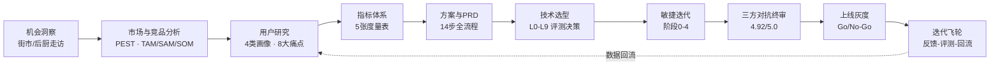
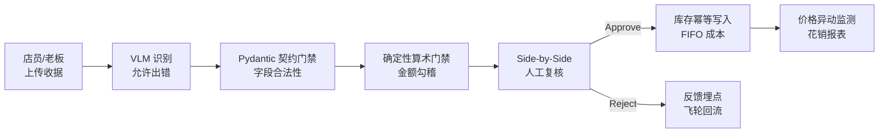
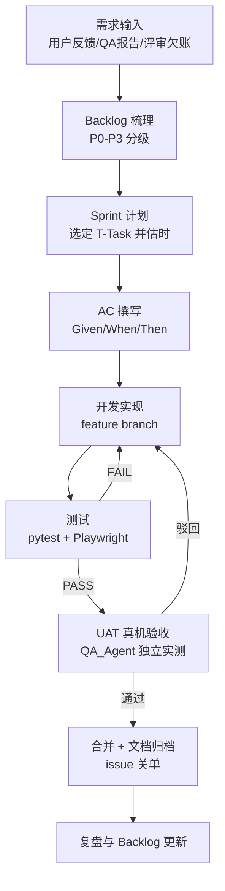

# 01 · Workflow / Process Flow（工作流程与流程图）

> 本文档梳理项目端到端交付流程：宏观的「产品研发全流程」与微观的「迭代执行流程」两条线，每个环节标注产出物（Artifact）与责任角色。

---

## 1. 端到端产品研发全流程（Discover → Deliver → Iterate）

**对应文档**：`docs/01-产品方案(14步)/step1-机会洞察.md` 至 `step14-上线迭代.md`，每一步都有独立 PRD 级产出，是「从洞察到上线」的完整工作流证据。

---

## 2. 核心业务流程（产品主线：收据 → 库存）

产品本身采用「三层互不信任」架构，这条业务流程也是 AC 与测试用例设计的骨架：

**设计原则**：AI 可以错，但错误必须被门禁拦截或在人工复核时暴露；库存只在审批时写入（幂等），杜绝重复入账。

---

## 3. 迭代执行流程（每个 Sprint 内）

---

## 4. 角色与 RACI（关键环节）

| 环节 | 产品/PM（本人） | 开发 | QA | 用户 |
| :--- | :-- | :-- | :-- | :-- |
| 需求梳理与 PRD | **A/R** | C | I | C（走访调研） |
| AC 定义 | **A/R** | C | C | I |
| Sprint 排期 | **A** | C（估时） | C（估测试量） | I |
| 开发实现 | C（跟进答疑） | **R** | I | – |
| UAT 签收 | **A** | C（修缺陷） | **R**（实测） | C |
| 上线决策 | **A/R**（Go/No-Go 主持） | C | C | I |
| 缺陷复盘 | **A** | R（根因） | R（复验） | I |

---

## 5. 交付物清单（每个环节留痕）

| 阶段 | 产出物 | 仓库证据 |
| :--- | :--- | :--- |
| 洞察 | 机会洞察、竞品剖析 | `docs/03-专项技术与业务方案/01-业务背景与竞品剖析.md` |
| 需求 | 14 步 PRD、17 场景清单 | `docs/01-产品方案(14步)/`、`docs/03-.../02-17个核心业务场景清单.md` |
| 设计 | 模块 Spec、设计文档 | `docs/05-AI产品体系与模块Spec/` |
| 计划 | 实施计划、任务台账 | 特性级实施计划（已随仓库清理移除，过程留痕见 git 提交史） |
| 开发 | feature commit + review | git 提交史（2026-08-21 ~ 09-05） |
| 测试 | 测试报告（PASS/FAIL 结论） | `docs/09-测试与UAT报告/`（QA Round 2 复验报告） |
| 验收 | UAT 报告、终审报告 | `docs/03-专项技术与业务方案/receipt_agent_pm_acceptance_report.md` |
| 上线 | Go/No-Go 检查单、回滚 Runbook | `docs/01-产品方案(14步)/step14-上线迭代.md` |
| 运营 | Issue 工单 | `docs/issues/` |

---

## 面试叙事要点

- **流程不是模板套用**：14 步流程中的每一步都能落到具体决策（如 step7 指标体系直接决定了后来 A/B 实验的双比例双尾 z 检验门禁）。
- **两条流程并行的挑战**：宏观产品流程与微观迭代流程并行时，用「阶段终审」作为同步点，避免迭代跑偏。
- **流程的可验证性**：所有环节产出物都在仓库可查，这是「流程真实执行过」的最强证据。
