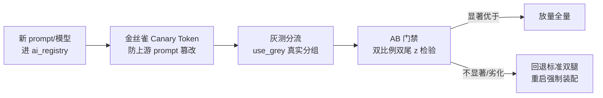

# 08 · 上线 / Rollout / Iteration（上线、灰度与迭代）

> 上线治理的证据核心：`docs/01-产品方案(14步)/step14-上线迭代.md`（Go/No-Go 检查单、灰度 Rollout Plan、<60s 回滚 Runbook、监控告警矩阵、扩张触发门槛）与治理侧 `docs/05-AI产品体系与模块Spec/03-治理运维与AB实验Spec/07/09/10`（灰度发布、AB 分流、观测大盘）。

---

## 1. 上线决策：Go/No-Go 机制

`step14-上线迭代.md` 定义了发布检查单，实际执行记录为终审报告：

| 检查项 | 闸门 | 实际值 |
| :--- | :--- | :--- |
| 端到端测试 | 全量回归绿 | 730 passed / 58 skipped |
| 真实数据评测 | 基准达标 | 163 张真实单据识别 100%，P50 9.0s |
| UAT 签收 | QA 独立实测 PASS | Round 1 PASS / Round 2 驳回后复验 PASS |
| 安全合规 | 治理专项通过 | 多租户隔离、PDPO 隐私红线、SSRF/注入防护 |
| 终审签署 | PM 终审 ACCEPT | 4.92/5.0，「准予全量上线」（v2.6） |

---

## 2. 灰度 Rollout（AI 产品特有的灰测分流）

区别于传统功能开关，本项目灰度对象是 **AI 模型与 prompt 版本**：



**关键机制**（均有 commit/测试背书）：
- **灰测分配读真实列 `use_grey`**，不做 `id%2` 伪造（P0 治理后）；无预填样本如实标 `no_prefill`。
- **AB 门禁**：p 值用标准库 erf 计算（修复了 p=1.1064 的越界缺陷），不显著不放量。
- **管理台临时切换不跨重启保留**（commit `536785f`/`64325bd`）：临时试验永远回退到注册表标准版本，防止试验状态泄漏成生产默认。

---

## 3. 回滚 Runbook（<60s）

`step14` 定义的回滚路径，工程上落地为三条：
1. **模型层**：重启即回「标准双腿」（Qwen-VL 识别 + GLM-4.5V 审核），不读 DB 旧值（commit `1170333`）。
2. **prompt 层**：ai_registry SemVer 版本化，回滚 = 指回上一版本号，Canary Token 校验确保上游未被篡改。
3. **数据层**：库存只在 Approve 时幂等写入，回滚不产生脏数据；导出/报表为只读旁路。

**监控告警矩阵**（step14 + 治理观测台）：识别延迟 P50/P95、门禁拦截率、复核采纳率、点赞/点踩比、异常预警数（>10% 价格异动），任何指标越界先回滚再排查。

---

## 4. 迭代机制：自进化飞轮

上线不是终点，飞轮把线上数据变成迭代燃料：

```
用户反馈（点赞/点踩 + 一句话）
   → 低置信样本四信号自动入队（T6）
   → GT 抽检台人工确认（--require-confirmed 闸门）
   → 评测集更新（train/val/test 三分）
   → run_eval + 元评测（temperature=0）
   → prompt/模型迭代 → 回到灰测分流
```

**迭代实录**（真实迭代周期）：
- **迭代 1**：opencode CLI 引擎退役，全面 SiliconFlow 化（commit `a29a43a`）——供应商降本与稳定性。
- **迭代 2**：审核腿 GLM-4.5V 视觉化（用户指正驱动，见 06 文档案例一）。
- **迭代 3**：纯 OpenAI 兼容配置收敛 + 遗留字段自动同步（2026-09-05 commit 组）——降低配置面复杂度。

每次迭代都走「设计 spec → 实施计划 → E2E 回归 → 文档同步」的同一闭环（如 commit `d7d0f94 → 74a1a5c → 8efa9aa → 6d11116`）。

---

## 5. 扩张触发门槛（指标驱动下一步）

`step14` 定义：当识别准确率、复核采纳率、单均成本（HK$0.0024）持续达标，且价格异动预警/飞轮回流样本量过阈值，才扩张新模块（餐品成本、报表中心、治理观测台均按此节奏进入）。

---

## 面试叙事要点

- **AI 产品灰度 ≠ 功能开关**：灰度对象是模型/prompt，门禁是统计显著性 + 真实灰测数据——能讲清这一点即可与纯互联网 PM 拉开差异。
- **回滚设计前置**：「重启必回标准双腿」这种语义级回滚，是 PM 在需求阶段就要求的设计，不是事故后的补丁。
- **迭代燃料**：反馈 → 回流 → 评测 → 迭代的飞轮闭环有 T1-T7 全链路 commit 证据，不是 PPT 概念。
