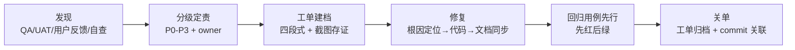

# 09 · Bug / Issue Tracking（缺陷与问题管理）

> 缺陷管理的证据：`docs/issues/` 下 4 份真实工单 + 根目录 3 份测试报告中的缺陷清单 + commit 史中的修复记录。缺陷全生命周期为「发现 → 分级 → 工单（四段式）→ 修复 → 回归用例 → 关单留痕」。

---

## 1. 缺陷分级与 SLA

| 级别 | 定义 | 响应/修复目标 | 实例 |
| :-- | :--- | :--- | :--- |
| P0 | 数据失真 / 安全穿透 / 核心流程阻断 | 当日修复，带回归用例 | 灰测指标伪造（观测台）、SKU 爆炸（B-P0-1）、糊图 30s 死等（D-P0-1） |
| P1 | 功能错误 / 权限错位 / 账目偏差 | 48h 内 | AB p 值越界、review 场景被 gitignore 吞掉、跨租户 BOM 泄露 |
| P2 | 体验缺陷 / 一致性问题 | 本 Sprint 内 | 币种混杂（DEFECT-02）、recognition-summary 无租户过滤 |
| P3 | 打磨类 / 防御加固 | 排期 | XSS 转义缺口、金额掩码边界值 |

**一票否决联动**：P0/P1 未清零时，对应模块 UAT 不予放行（见 04/05 文档）。

---

## 2. Issue 工单四段式模板（团队规范）

```markdown
# 工单标题（日期-主题）
- 日期 / 来源（用户反馈·QA报告·自查）/ 状态
## 背景（为什么做这件事）
## 修复清单（每缺陷：现象 / 根因 / 修复 / 验证）
## 测试断言变更说明
## 验证记录（pytest/N 轮 E2E 证据）
## 遗留与建议（如实标注，不粉饰）
```

样例见 `docs/issues/2026-09-02-observatory-truthfulness-fixes.md`。

---

## 3. 真实缺陷台账（精选）

### 3.1 观测台真实性治理（2026-09-02，7 项全清）

| ID | 级别 | 缺陷 | 根因 | 修复 | 回归 |
| :-- | :-- | :--- | :--- | :--- | :-- |
| T-01 | **P0** | 灰测样本半伪造：`id%2` 假分组、用户数据伪造成 AI 预填、刷 100% 采纳率、硬编码兜底 | 指标展示与真实数据列脱钩 | 改读真实列 `use_grey`；无预填如实标 `no_prefill` | `test_grey_samples_truthfulness` 等 4 个新用例 |
| T-02 | P1 | AB 实验 p=1.1064（>1） | `_phi` 混用 erf 近似公式 | 改标准库 `0.5*(1+erf(x/√2))` | p 值边界用例 |
| T-03 | P1 | PDPO 隐私红线：供应商原文写入埋点 | 埋点字段未脱敏 | 只落布尔位 | 断言变更 |
| T-04 | P2 | recognition-summary 无租户过滤 | 缺 `resolve_tenant_filter` | 接入统一过滤 | 租户隔离回归 |
| T-05 | P2 | session_id 从未实现 | 前后端均未落 | localStorage 会话 ID + 后端落库 | E2E |
| T-06 | P3 | 灰测样本表 XSS 转义缺口 | 模板直插 | 全走 `w2Escape()` | 注入用例 |
| T-07 | P3 | 金额掩码 100.0→"10.**" | 掩码函数缺陷 | 重写 `mask_amount`/`mask_number` | 边界值用例 |

**结果**：pytest 229 passed / 1 skipped，遗留项（math_gate_passed 置 null、无 ai_prefill 显示「无法比对」）在工单中如实标注。

### 3.2 餐品模块（2026-08-31 ~ 09-03）

- `2026-08-31-dish-category-misalign-delete.md`：**用户反馈复现** → 分类错位与删除异常，修复后按工单验证关闭。
- QA Round 2 的 DEFECT-01/02（弹窗选择器错位、币种混杂）→ 驳回修复复验通过（详见 05 文档）。

### 3.3 体验与治理专项（2026-08-21 ~ 09-01）

| 专项 | 缺陷数 | 说明 |
| :--- | :-- | :--- |
| OCR 全谱系治理（commit 21b/08-21） | 全谱系 | 繁体白名单、算术门禁公式、零信任契约，测试 100% 过 |
| P0 三连（B-P0-1 / D-P0-1 / F-P0-1） | 3 | SKU 爆炸、糊图死等、反馈飞轮，当日分支并行修复合并 |
| P1 残留九项（fix-p1-governance） | 9 | RAG data_only、is_void、灰测标签、golden 57、p 值、403 人话化等 |
| U-01~U-08 体验审计（PM 亲自内嵌浏览器审计） | 8 | 角色可见性、异动阈值统一、支付选择等 |
| 餐品 Tab 四轮黑盒 QA（`2026-09-01-dishes-tab-qa.md`） | 8 | 四轮迭代缺陷清零 |
| GUI 全组件 + 引擎收敛（`2026-09-02-gui-qa-fixes-...md`） | 多项 | opencode 退役 SiliconFlow 化 + GUI 缺陷修复 |

---

## 4. 缺陷生命周期与工具链



**纪律**：
1. **先红后绿**：每个确认缺陷必须先落一个会失败的回归用例，再修代码。
2. **工单即交接物**：现象/根因/修复/验证四段齐备，任何人不读对话历史也能接手。
3. **commit 与工单互链**：修复 commit message 带业务语义（如 `fix(governance): 阶段检查收口——修复review场景被gitignore吞掉(P1)`）。
4. **遗留显式化**：修不了的写进「遗留与建议」并给出监控/规避方案，禁止静默缩小范围。

---

## 5. 度量（可引用数字）

| 指标 | 数值 |
| :--- | :--- |
| 已归档工单 | 4 份（docs/issues/）+ 3 份测试报告缺陷清单 |
| 观测台专项 | 7 项缺陷（1×P0 / 2×P1 / 2×P2 / 2×P3）全部修复，回归 229 passed |
| 单日修复峰值 | 2026-08-22：P0×3 + P1×9 + U-01~U-08 |
| 最终状态 | 全部已关闭，无未决 P0/P1 |

---

## 面试叙事要点

- 主讲观测台 P0：这不是「页面报错」型 bug，而是**指标在说谎**——PM 发现后将其定性为诚信问题、推动 7 项分级修复并如实标注遗留，体现缺陷管理的价值观层面。
- 讲「先红后绿」纪律：T-07 掩码缺陷（100.0→"10.**"）这种边界值缺陷，正是回归用例先行才不会复发。
